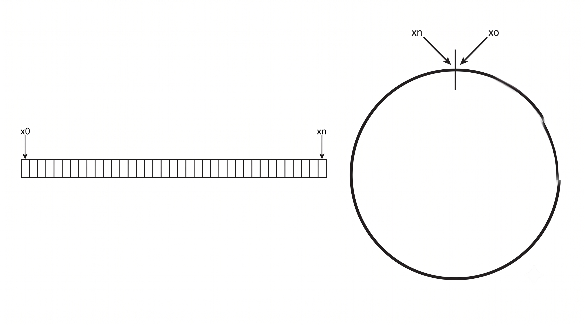
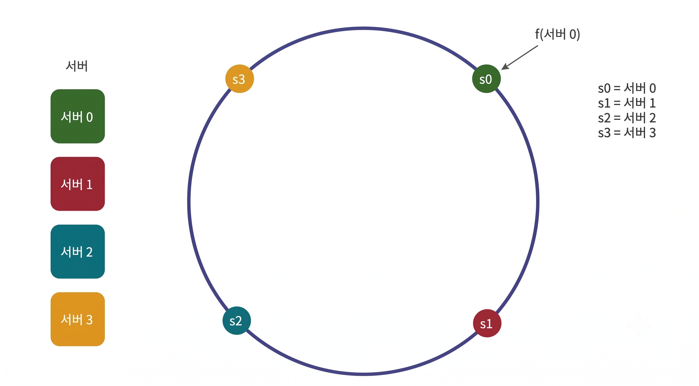
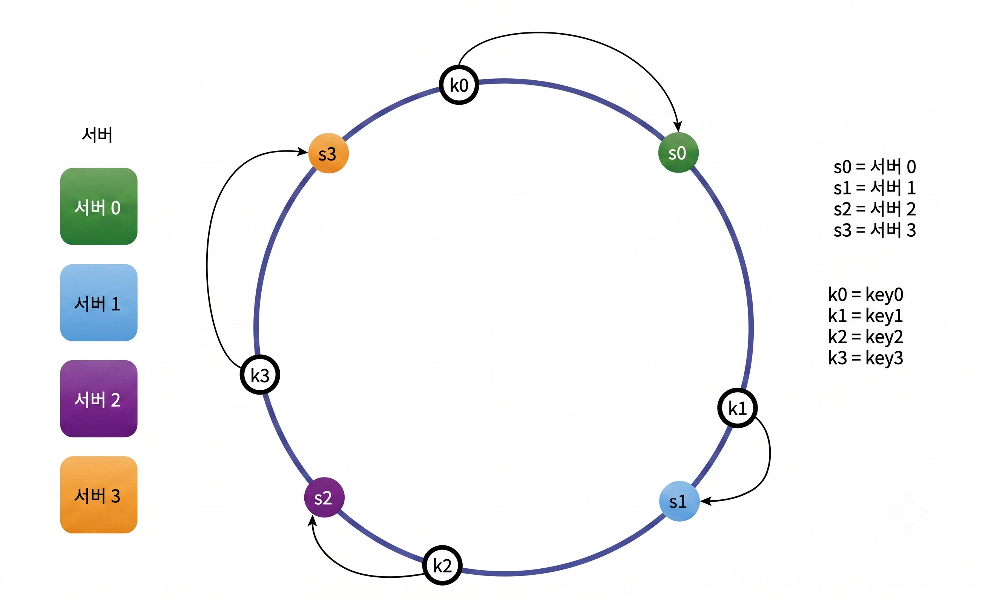
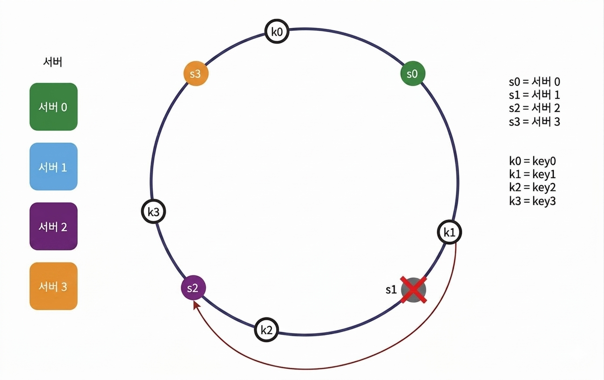
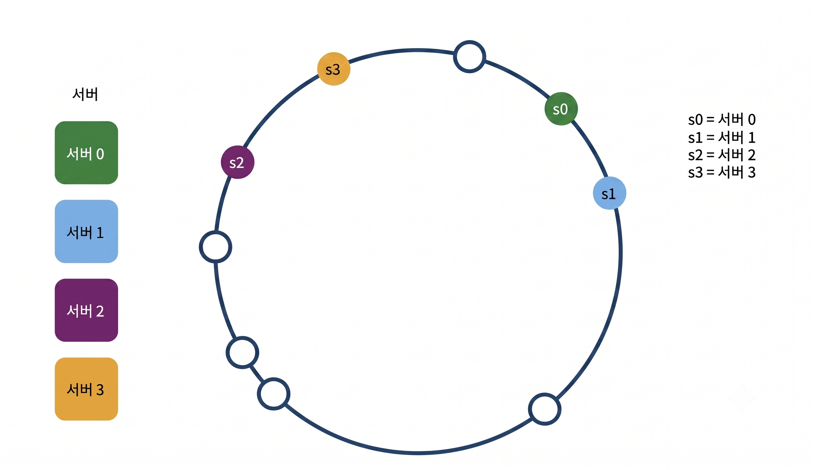
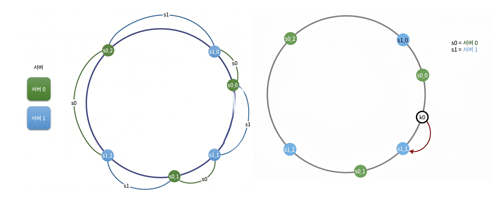
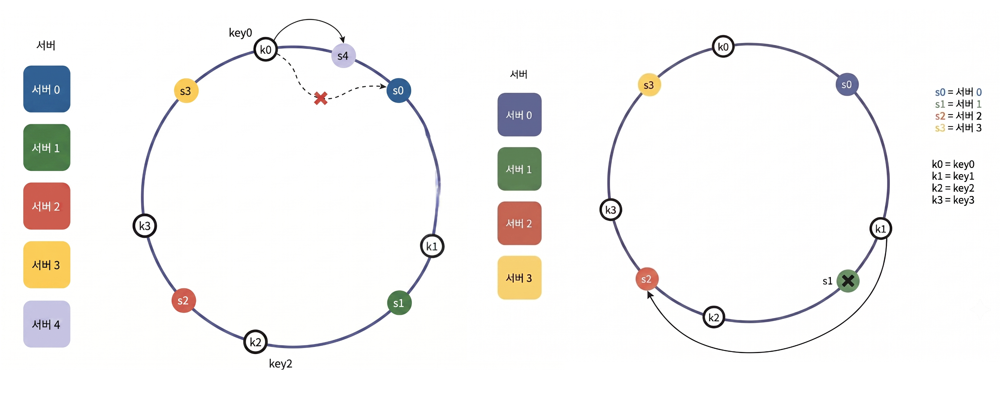

수평적 규모 확장성을 달성하기 위해서는 요청 또는 데이터를 서버에 균등하게 나누는 것이 중요하다. 안정 해시는 이 목표를 달성하기 위해 보편적으로 사용하는 기술이다.

## 해시 키 재배치(rehash) 문제

N개의 캐시 서버가 있을 때, 이 서버들에 부하를 균등하게 나누는 보편적인 방법은 다음과 같다.

> serverIndex = hash(key) % N (N = 서버의 개수)

총 4대의 서버를 사용할 때, 주어진 각각의 키에 대해서 해시 값과 서버 인덱스는 다음과 같이 계산한다.

| 키 | 해시 | 해시 % 4 (서버 인덱스) |
| :--- | :---: | :---: |
| key0 | 18358617 | 1 |
| key1 | 26143584 | 0 |
| key2 | 18131146 | 2 |
| key3 | 35863496 | 0 |
| key4 | 34085809 | 1 |
| key5 | 27581703 | 3 |
| key6 | 38164978 | 2 |
| key7 | 22530351 | 3 |

hash(key0) % 4 = 1 이면, 클라이언트는 캐시에 보관된 데이터를 가져오기 위해 서버 1에 접속해야 한다.

이 방법은 서버 풀(server pool)의 크기가 잘 고정되어 있고, 데이터 분포가 균등할 때 잘 동작한다. 단, 서버가 추가되거나 기존 서버가 삭제되면 문제가 생긴다.

예를 들어 Server1에 장애가 발생하여 동작이 중단하면 서버 풀의 크기는 3으로 변한다. 그 결과로, 키에 대한 해시 값은 변하지 않지만 나머지 연산을 적용하여 계산한 서버 인덱스 값은 달라진다. 그리고 Server1에 보관된 키 뿐만 아닌 대부분의 키가 재분배 되었다. 즉, 대부분의 키가 재분배되었다.

Server1이 죽으면 대부분의 클라이언트가 데이터가 없는 엉뚱한 서버에 접속하게 되며, 그 결과로 대규모 캐시 미스(cache miss)가 발생하게 된다. 안정 캐시는 이 문제를 효과적으로 해결하는 기술이다.

## 안정 캐시 (consistent hash)

> <b>안정 해시</b>: 해시 테이블의 크기가 조정될 때 평균적으로 오직 k/n개의 키만 재배치하는 해시 기술 (k = 키의 개수, n = slot의 개수)

이와는 달리 대부분의 해시 테이블은 슬롯의 수가 바뀌면 거의 대부분의 키를 재배치한다.

### 해시 공간과 해시 링

>가정
>  - 해시 함수 f: SHA-1
>  - f의 출력 값 범위: x0 ~ xn (SHA-1의 경우, 해시 공간의 범위는 0 ~ 2^{160} - 1)

해시 공간의 양쪽을 구부려 접으면 해시 링(hash ring)이 만들어진다.

### 해시 서버

서버 IP, 이름 등의 정보를 이용해 각 서버의 hash 값을 구한 후, 해시 링에 배치시킨다.
그림에서는 4개의 서버를 해시 링 위에 배치한 결과다.

### 해시 키

- 여기 사용된 해시 함수는 "해시 키 재배치 문제"에 언급된 함수 F와 다르다.
- 일관성 있는 해시 알고리즘에선 서버와 해시 키를 균등 분포 해시 함수(uniform distribution hash function)를 사용해서 해시 링에 배치하게 된다.
- 위 그림과 같이 캐시할 키 key0, key1, key2, key3 또한 해시 링 위의 어느 지점에 배치할 수 있다.

#### 균등 분포 해시 함수(Uniform Distribution Hash Function)

균등 분포 해시 함수는 <b>입력값이 무엇이든 관계없이, 출력값이 전체 해시 공간(Hash Space)에 무작위적이고 일정한 확률로 고르게 퍼지게 만드는 해시 함수</b>를 의미한다.

수학적으로 표현하면, 어떤 입력값이 들어왔을 때 결과가 A라는 지점에 떨어질 확률과 B라는 지점에 떨어질 확률이 거의 동일한 함수이다. 가상 자산이나 암호학, 대규모 시스템 설계에서 자주 쓰이는 MD5, SHA-1, SHA-256이나 비암호학적 함수인 MurmurHash 등이 대표적이다.

<b>일관성 해시에서 이게 왜 중요할까?</b>

일관성 해시는 서버와 데이터 키를 같은 해시 링 위에 올린 뒤, 키의 위치에서 시계 방향으로 가장 가까운 서버에 데이터를 저장하는 구조이다.

이때 균등 분포 해시 함수가 필요한 이유는 크게 두 가지다.

1. 서버의 고른 배치: 서버1, 서버2, 서버3 이라는 이름을 해시 함수에 넣었을 때, 링의 특정 구역에 옹기종기 모이지 않고 링 전체에 0도, 120도, 240도 같은 느낌으로 최대한 고르게 흩어져야 한다.
2. 데이터의 부하 분산(Load Balancing): 수백만 개의 유저 키가 들어왔을 때, 특정 서버 구역으로만 키가 몰리지 않고 링 전체에 파편처럼 고르게 뿌려져야 각 서버가 가져가는 데이터의 양(부하)이 평등해진다.

### 서버 조회

- 어떤 키가 저장되는 서버는, 해당 키의 위치로부터 시계 방향으로 링을 탐색해 나가면서 만나는 첫 번째 서버이다.
- 위 그림에서 key0은 서버0에 저장되고, key1은 서버1, key2은 서버2, key3은 서버3에 저장된다.

### 서버 추가

- 서버를 추가하더라도 키 가운데 일부만 재배치하면 된다.
- 위 그림에서 새로운 서버4가 추가된 뒤에 key0만 재배치 되었다. → 서버가 추가된다고 기존 서버의 해시 링 위의 위치가 바뀌지 않는다.
- 서버4가 추가되면, [서버4의 시계 반대 방향 반경 ~ 서버4] 사이에 위치했던 키들(예: key0)은 시계 방향으로 순회했을 때 처음 만나는 서버가 기존 서버(예: 서버1)에서 새로운 '서버4'로 변경된다. 따라서 이 구간의 키들만 서버4로 재배치된다.

### 서버 제거

- 하나의 서버가 제거되면 키 가운데 일부만 재배치된다.
- 위 그림을 보면 서버1이 삭제되었을 때, key1만이 서버2로 재배치됨을 알 수 있다. → 나머지 키에는 영향이 없다.

### 기본 구현법의 두 가지 문제점

안정 해시 알고리즘의 기본 절차는 다음과 같다.

- 서버와 키를 균등 분포(uniform distribution) 해시 함수를 사용해 해시 링에 배치한다.
- 키의 위치에서 링을 시계 방향으로 탐색하다 만나는 최초의 서버가 키가 저장될 서버이다.

이 접근법에는 두 가지 문제가 있다.

#### 1. 서버가 추가되거나 삭제되는 상황을 감안하면 파티션(partition)의 크기를 균등하게 유지하는 것이 불가능하다.

- 파티션은 인접한 서버 사이의 해시 공간인데, 어떤 서버는 작은 해시 공간을 할당받고, 어떤 서버는 큰 해시 공간을 할당받는 상황이 가능하다.
- 위 그림에서 s1이 삭제되어 s2 파티션이 다른 파티션 대비 거의 2배로 커지는 상황을 보여준다.

#### 2. 키의 균등 분포을 달성하기 어렵다.

- 해시 알고리즘이 균등 분포를 보장한다는 전제가 필요하다.
- 키의 균등 분포 달성에 실패하면, 대부분의 키가 특정 서버로 몰리게 될 수 있다.
- 위 그림에서 서버1과 서버3은 아무 데이터도 갖지 않지만 대부분의 key는 서버2에 보관된다.

위 두 문제를 해결하기 위해서는 가상 노드(virtual node) 또는 복제(replica)라는 기법을 사용해야 한다.

### 가상 노드 (virtual node)

가상 노드는 실제 서버(노드)를 가리키는 가상의 노드로, 하나의 실제 서버가 해시 링 위에 여러 개의 가상 노드를 가질 수 있다.

- 배치 방식: 예를 들어 '서버 0'을 링에 배치할 때 하나의 점(s0)만 쓰는 것이 아니라, s0_0, s0_1, s0_2와 같이 이름을 붙여 여러 개의 점으로 링 위에 흩뿌린다.
- 파티션 관리: 가상 노드가 늘어남에 따라 링이 더 잘게 쪼개지므로, 각 서버는 하나가 아닌 여러 개의 분산된 파티션(영역)을 나누어 관리하게 된다.

#### 가상 노드 환경에서의 데이터 저장(라우팅) 방식

- 데이터 키(Key)의 위치에서부터 시계 방향으로 링을 탐색하다가 가장 먼저 만나는 가상 노드를 찾는다. 
- 만약 가장 먼저 만난 가상 노드가 s1_1이라면, 이 가상 노드가 가리키는 실제 서버인 '서버 1'에 데이터를 저장한다.

#### 가상 노드의 효과 및 장단점 (Trade-off)

- 균등 분포 달성
  - 가상 노드의 개수를 늘릴수록 데이터 분포의 표준 편차(Standard Deviation)가 작아진다. 즉, 데이터가 특정 서버에 몰리지 않고 고르게 분산된다.
  - 가상 노드가 100개일 때 표준 편차는 평균의 약 10%, 200개일 때는 약 5%로 줄어든다. 개수를 더 늘리면 편차는 더 감소한다.
- 트레이드오프(Trade_off)
  - 장점: 데이터 분포가 점점 더 균등해져서 서버 간의 부하 불균형을 해결할 수 있다.
  - 단점: 가상 노드가 많아질수록 링의 형태와 가상 노드 정보를 저장하고 관리하기 위한 메모리(공간)가 더 많이 필요하게 된다.

### 재배치할 키 결정

서버가 추가되거나 제거되면 링 위의 데이터 중 일부는 새로운 서버나 이웃 서버로 재배치되어야 한다.

#### 서버 추가 시 재배치 범위

- 상황: 새로운 서버 s4가 추가된 경우
- 영향 범위: 새로 추가된 노드 s4부터 그 반시계 방향에 있는 첫 번째 서버 s3까지가 영향을 받는 구간
- 재배치 규칙: 원래 s3 다음에 위치하여 기존 서버로 가던 키들 중, s3과 s4 사이에 있는 키들을 새로 추가된 s4로 재배치해야 한다.

#### 서버 삭제 시 재배치 범위

- 상황: 기존 서버 s1이 삭제된 경우
- 영향 범위: 삭제된 노드 s1부터 그 반시계 방향에 있는 최초의 서버 s0까지가 영향을 받는 구간
- 재배치 규칙: 원래 s1에 저장되어 있던 s0과 s1 사이에 있던 키들을 시계 방향의 다음 서버인 s2로 재배치해야 한다.

## 안정 해시의 이점

- 서버가 추가되거나 삭제될 때 재배치되는 키의 수가 최소화된다.
- 데이터가 보다 균등하게 분포하게 되므로 수평적 규모 확장성을 달성하기 쉽다.
- 핫스팟(hotspot) 키 문제를 줄인다.(특정한 샤드(shard)에 대한 접근이 빈번하면 서버에 과부하가 발생할 수 있다) → 안정 해시는 데이터를 좀 더 균등하게 분배하므로 이런 문제가 생길 가능성을 줄인다.