키-값 저장소(key-value store)는 키-값 데이터베이스라고도 불리는 비 관계형(non-relational) 데이터베이스이다. 이 저장소에 저장되는 값은 고유 식별자(identifier)를 키로 가져야 한다. 키와 값 사이의 이런 연결 관계를 "키-값" 쌍(pair)이라고 지칭한다.

키는 텍스트나 해시 값일 수도 있고, 값은 문자열이나 리스트, 또는 객체일 수도 있다. 주로 레디스, 아마존 다이나모, memcached 등이 사용된다.

이 장에서는 다음 연산을 지원하는 키-값 저장소를 설계해본다.

- put(key, value): 키-값 쌍을 저장소에 저장한다.
- get(key): 인자로 주어진 키에 매핑된 값을 꺼낸다.

## 1. 문제 이해 및 설계 범위 확정

키-값 저장소를 설계할 때는 키-값 쌍의 크기, 데이터의 크기, 가용성, 확장성, 데이터 일관성, 응답 지연시간(latency) 등을 고려해야 한다. 이러한 요소들은 사용하려는 목적에 맞춰 균형을 찾고 타협하며 결정해야 한다.

## 2. 단일 서버 키-값 저장소

단일 서버 키-값 저장소를 설계하는 것은 쉬우며, 가장 직관적인 방법으로 키-값 쌍 전부를 메모리에 해시 테이블로 저장하는 것이다. 그러나 이 방법은 빠른 속도를 보장하긴 하지만 모든 데이터를 메모리 안에 두는 것이 불가능할 수도 있다는 문제가 있다. 이 문제를 해결하기 위한 개선책으로 데이터 압축(compression)과 자주 쓰이는 데이터만 메모리에 두고 나머지는 디스크에 저장하는 등의 방법이 있다.

그러나 이러한 개선에도 단일 서버는 한계가 있다. 많은 데이터를 저장하려면 분산 키-값 저장소(distributed key-value store)를 고려해야 한다.

## 3. 분산 키-값 저장소

분산 키-값 저장소는 키-값 쌍을 여러 서버에 분산시키기 때문에 분산 해시 테이블이라고도 불린다. 분산 시스템을 설계할 때는 CAP 정리(Consistency, Availability, Partition Tolerance theorem)를 이해하고 있어야 한다.

### CAP 정리

CAP 정리는 데이터의 일관성(consistency), 가용성(availability), 파티션 감내(partition tolerance)라는 세 가지 요구사항을 동시에 만족하는 분산 시스템을 설계하는 것은 불가능하다는 정리다.

- 데이터 일관성: 분산 시스템에 접속하는 모든 클라이언트는 어떤 노드에 접속했느냐에 관계없이 언제나 같은 데이터를 보게 되어야 한다.
- 가용성: 분산 시스템에 접속하는 클라이어느는 일부 노드에 장애가 발생하더라도 항상 응답을 받을 수 있어야 한다.
- 파티션 감내: 파티션은 두 노드 사이에 통신 장애가 발생하였음을 의미한다. 파티션 감내는 네트워크에 파티션이 생기더라도 시스템은 계속 동작해야 함을 의미한다.

CAP 정리는 이들 가운데 어떤 두 가지를 충족하려면 나머지 하나는 반드시 희생해야 한다는 것을 의미한다.

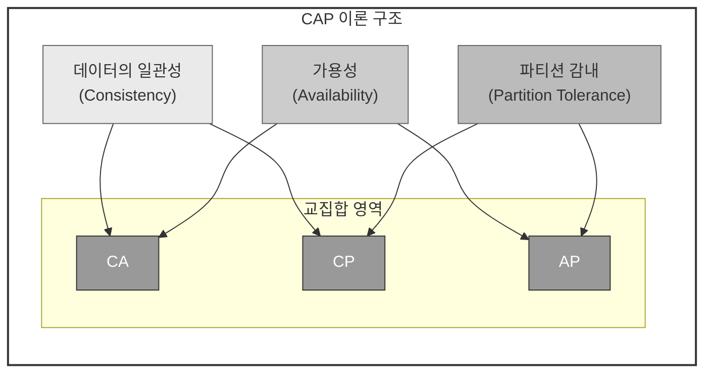

> CA 시스템은 일관성과 가용성을 지원하는 키-값 저장소로 파티션 감내는 지원하지 않는다. 그러나 통상 네트워크 장애는 피할 수 없는 일로 여겨지므로, 분산 시스템은 반드시 파티션 문제를 감내할 수 있도록 설계해야 한다. 즉, 실세계에 CA 시스템은 존재하지 않는다.

<b>이상적 상태</b>

<b>실세계의 분산 시스템</b>

### 시스템 컴포넌트

#### 데이터 파티션

대규모 애플리케이션의 경우 전체 데이터를 단일 서버에 넣는 것을 불가하여 가장 단순한 해결책으로 데이터를 작은 파티션들로 분할한 다음 여러 대의 서버에 저장하는 것이다. 파티션 단위로 나눌 때는 다음의 두 가지 문제를 고려해야 한다.

- 데이터를 여러 서버에 고르게 분산할 수 있는가?
- 노드가 추가되거나 삭제될 때 데이터의 이동을 최소화할 수 있는가

이러한 문제는 5장에서 정리한 [안정 해시](../design-consistent-hashing/#안정-캐시-consistent-hash)를 사용해 해결할 수 있다. 안정 해시를 사용하여 파티션하면 다음과 같은 이점이 있다.

- 규모 확장 자동화(automatic scaling): 시스템 부하에 따라 서버가 자동으로 추가되거나 삭제되도록 만들 수 있다.
- 다양성(heterogeneity): 각 서버의 용량에 맞게 가상 노드(virtual node)의 수를 조정할 수 있다. → 고성능 서버는 더 많은 가상 노드를 갖도록 설정할 수 있다.

#### 데이터 다중화

높은 가용성과 안정성을 확보하기 위해서는 데이터를 N개 서버에 비동기적으로 다중화(replication)할 필요가 있다. N(튜닝 가능한 값)개의 서버를 선정하는 방법은 어떤 키를 해시 링 위에 배치한 후, 그 지점으로 부터 시계 방향으로 링을 순회하면서 만나는 첫 N개 서버에 데이터 사본을 보관하는 것이다. 따라서 아래의 그림에서 N=3이면, key0은 s1, s3, s3에 저장된다.

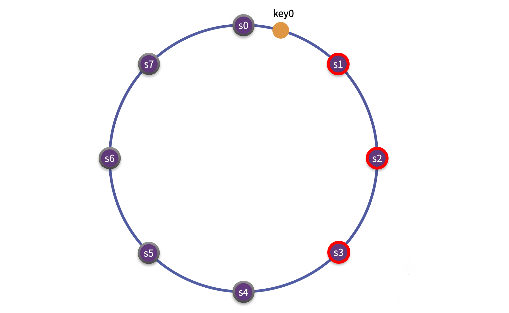

가상 노드를 사용한다면 위와 같이 선택한 N개의 노드가 대응될 때, 실제 물리 서버의 개수가 N보다 작아질 수 있다. 이러한 문제를 피하려면 노드를 선택할 때 같은 물리 서버를 중복 선택하지 않도록 해야 한다.

> 같은 데이터 센터에 속한 노드는 정전, 네트워크 이슈, 자연재해 등의 문제를 동시에 겪을 수 있으므로 안정성을 담보하기 위해 데이터의 사본은 다른 센터의 서버에 보관하고, 센터들은 고속 네트워크로 연결한다.

#### 데이터 일관성

여러 노드에 다중화된 데이터는 동기화가 필요하다. 정족수 합의(Quorum Consensus) 프로토콜을 사용하면 읽기/쓰기 연산 모두에 일관성을 보장할 수 있다.

> N = 사본 개수
> W = 쓰기 연산에 대한 정족수 (쓰기 연산이 성공한 것으로 간주되려면 적어도 W개의 서버로부터 쓰기 연산이 성공했다는 응답을 받아야 한다.)
> R = 읽기 연산에 대한 정족수 (읽기 연산이 성공한 것으로 간주되려면 적어도 R개의 서버로부터 응답을 받아야 한다.)

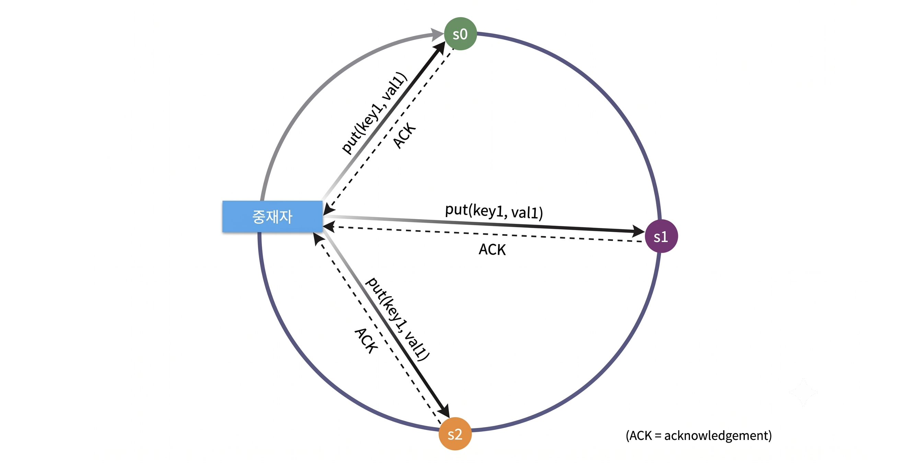

위 그림에서 N=3인 경우, 데이터가 s0, s1, s2에 다중화되는 상황을 예로 살펴보겠다.

W=1의 의미는, 쓰기 연산이 성공했다고 판단하기 위해 중재자(coordinator)는 최소 한 대 서버로 부터 쓰기 성공 응답을 받아야 한다는 의미이다. 따라서 s1으로부터 성공 응답을 받았다면 s0, s2로부터의 응답은 기다릴 필요가 없다. 중재자는 클라이언트와 노드 사이에서 proxy 역할을 한다.

W, R, N의 값을 정하는 것은 응답 지연과 데이터 일관성 사이의 타협점을 찾는 과정이다. 

- W나 R이 1인 경우: 중재자는 한 대의 서버로부터의 응답만 받으면 되니 응답속도는 빠를 것
- W나 R이 1보다 큰 경우: 데이터 일관성의 수준은 향상될 것이지만 중재자의 응답 속도는 느려질 것이다.
- W + R > N인 경우: 일관성을 보증할 최신 데이터를 가진 노드가 최소 하나는 겹치기 때문에 강한 일관성(strong consistency)이 보장된다.

> N, W, R 값에 대한 구성(요구되는 일관성 수준에 따라 W, R, N의 값을 조정하면 됨)
> - R = 1, W = N: 빠른 읽기 연산에 최적화된 시스템
> - W = 1, R = N: 빠른 쓰기 연산에 최적화된 시스템
> - W + R > N: 강한 일관성이 보장됨(보통 N = 3, W = R = 2)
> - W + R <= N: 강한 일관성이 보장되지 않음

##### 일관성 모델 (consistency model)

일관성 모델은 키-값 저장소를 설계할 때 고려해야 할 요소로 데이터 일관성 수준을 결정하는데 다음과 같은 종류가 있다.

- 강한 일관성(strong consistency): 모든 읽기 연산은 가장 최근에 갱신된 결과를 반환한다. 클라이언트는 절대로 낡은(out-of-date) 데이터를 보지 못한다.
- 약한 일관성(weak consistency): 읽기 연산은 가장 최근에 갱신된 결과를 반환하지 못할 수 있다.
- 최종 일관성(eventual consistency): 약한 일관성의 한 형태로, 갱신 결과가 결국에는 모든 사본에 반영(동기화)되는 모델이다.

강한 일관성을 달성하는 일반적인 방법은, 모든 사본에 현재 쓰기 연산의 결과가 반영될 때까지 해당 데이터에 대한 읽기/쓰기를 금지하는 것인데 이 방법은 새로운 요청의 처리가 중단되기 때문에 고가용성 시스템에는 적합하지 않다.

최종 일관성 모델을  따를 경우 쓰기 연산이 병렬적으로 발생하면 시스템에 저장된 값의 일관성이 깨질 수 있는데, 이 문제는 클라이언트 측에서 데이터의 버전 정보를 활용해 일관성이 깨진 데이터를 읽지 않도록 하는 기법을 적용해야 한다.(아래에서 설명)

##### 비 일관성 해소 기법: 데이터 버저닝

데이터를 다중화하면 가용성은 높아지지만 사본 간 일관성이 깨질 가능성도 높아진다. 버저닝(versioning)과 벡터 시계(vector clock)는 그 문제를 해소하기 위해 등장한 기술이다.

버저닝은 데이터를 변경할 때마다 해당 데이터의 새로운 버전을 만드는 것으로 각 버전의 데이터는 변경 불가능(immutable)하다.

> ###### 데이터 일관성이 어떻게 깨지는가?
>
> 
> 
> 왼쪽 그림과 같이 어떤 데이터의 사본이 노드 n1과 n2에 보관되어 있다고 할 때, 이 데이터를 > 가져오려는 서버1과 서버2는 get("name") 연산의 결과로 같은 값을 얻는다.
> 
> 이번에는 오른쪽 그림과 같이 서버1과 서버2의 "name"과 매핑되는 값을 다르게 바꾸고, 이 두 연산은 > 동시에 진행되며, 충돌(conflict)하는 두 값(각각의 버전을 v1, v2)을 가지는 상황이다. 이 상황에선 > 이전 값은 옛날 값이므로 원래 값은 무시할 수 있지만 마지막 두 버전(v1, v2) 사이의 충돌은 해소가 > 안된다. 이 문제를 해결하려면, 충돌을 발견하고 자동으로 해결해 낼 버저닝 시스템이 필요하며, 벡터 > 시계(vector clock)는 이런 문제를 푸는데 보편적으로 사용되는 기술이다. 

벡터 시계는 [서버, 버전]의 순서쌍을 데이터에 매단 것이다. 어떤 버전이 선행 버전인지, 후행 버전인지, 아니면 다른 버전과 충돌이 있는지 판별하는데 쓰인다.

데이터 D를 D([S1, v1], [S2, v2], ..., [Sn, vn])와 같이 표현한다고 할 때, 서버 Si에 기록하면, 시스템은 아래와 같은 작업을 수행한다. (vi: 버전 카운터, Si: 서버 번호)

- [Si, vi]가 있으면 vi를 증가시킨다.
- 그렇지 않으면 새 항목 [Si, 1]를 생성한다.
  
> 위 추상적 로직에 대한 사례
>
> 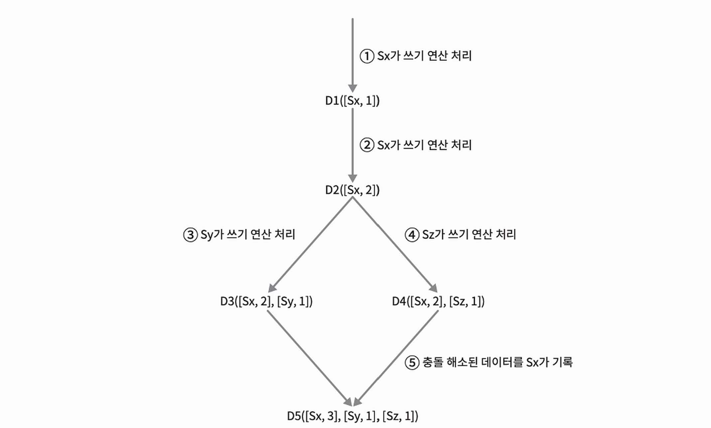
>
> 1. 클라이언트가 데이터 D1을 시스템에 기록한다. 이 쓰기 연산을 처리한 서버는 Sx이므로 벡터 시계는 D1[(Sx, 1)]으로 변한다.
> 2. 다른 클라이언트가 데이터 D1을 읽고 D2로 업데이트한 다음 기록한다. D2는 D1에 대한 변경이므로 D1을 덮어쓴다. 이때 쓰기 연산은 같은 서버 Sx가 처리한다고 하여 벡터 시계는 D2([Sx, 2])로 바뀐다.
> 3. 다른 클라이언트가 D2를 읽어 D3으로 갱신한 다음 기록한다. 이 쓰기 연산은 Sy가 처리한다고 가정하여 벡터 시계의 상태는 D3([Sx, 2], [Sy, 1])로 바뀐다.
> 4. 또 다른 클라이언트가 D2를 읽고 D4로 갱신한 다음 기록한다. 이 쓰기 연산은 Sz가 처리한다고 가정하여 벡터 시계의 상태는 D4([Sx, 2], [Sz, 1])로 바뀐다.
> 5. 어떤 클라이언트가 D3, D4를 읽었을 때, Sy와 Sz가 각기 다른 값으로 바꾸면서 데이터 간 충돌이 있다는 것을 알게 된다. 이 충돌은 클라이언트가 해소한 후 서버에 기록한다. 이 쓰기 연산을 처리한 서버는 Sx였다고 할 때, 벡터 시계는 D5([Sx, 3], [Sy, 1], [Sz, 1])로 바뀐다.

벡터 시계를 사용하면 어떤 버전이 이전 버전인지 쉽게 판단할 수 있다. 두 버전을 비교할 때는 한 버전에 포함된 모든 구성 요소의 값이 다른 버전에 포함된 모든 구성요소의 값보다 같거나 큰지만 보면 된다. 예를들어 벡터 시계 D([S0, 1], [S1, 1]) 은 D([S0, 1], [S1, 2]) 보다 이전 버전이다. 만약 두 버전 간의 충돌이 있는지 보려면 두 버전 간의 요소를 비교했을 때 큰 값과 작은 값들을 모두 포함하고 있는지를 보면 된다.

충돌을 감지하고 이를 해소하는 방법에는 단점이 있는데, 첫번째는 충돌 감지 및 해소 로직이 클라이언트에 들어가야한다는 것이다. 두 버전간의 충돌이 감지되는 경우 클라이언트는 이를 해소한 후에 서버에 기록하게 된다. 이때문에 클라이언트의 구현이 복잡해진다. 

두번째는 [서버, 버전]의 순서쌍이 굉장히 빠르게 늘어난다는 것이다. 이 문제를 해결하기 위해서는 크기에 대한 임계치(threshold)를 설정하고 임계치 이상으로 커지는 경우 오래된 순서썅을 벡터 시계에서 제거하도록 해야한다.

##### 장애 감지 (failure detection)

분산 시스템에서는 한 대의 서버A가 죽었을 때 바로 서버A를 장애처리하는 것이 아니라 보통 두 대 이상의 서버가 똑같이 서버 A의 장애를 보고해야 해당 서버에 실제로 장애가 발생했다고 간주하게 된다. 모든 노드 사이에 멀티캐스팅(multicasting) 채널을 구축하는 것이 서버 장애를 감지하는 쉬운 방법이지만 서버가 많을 때는 비효율적이다.

가십 프로토콜(gossip protocol) 같은 분산형 장애 감지(decentralized failure detection) 솔루션을 채택하는 편이 효율적이며 가십 프로토콜의 동작 원리는 다음과 같다.

- 각 노드는 멤버십 목록을 유지한다. 멤버십 목록은 각 멤버 ID와 그 박동 카운터 쌍의 목록이다.
- 각 노드는 주기적으로 자신의 박동 카운터를 증가시킨다.
- 각 노드는 무작위로 선정된 노드들에게 주기적으로 자기 박동 카운터 목록을 보낸다.
- 박동 카운터 목록을 받은 노드는 멤버십 목록을 최신 값으로 갱신한다.
- 어떤 멤버의 박동 카운터 값이 지정된 시간 동안 갱신되지 않으면 해당 멤버는 장애 상태인 것으로 간주한다.

> 가십 프로토콜 예제
>
> 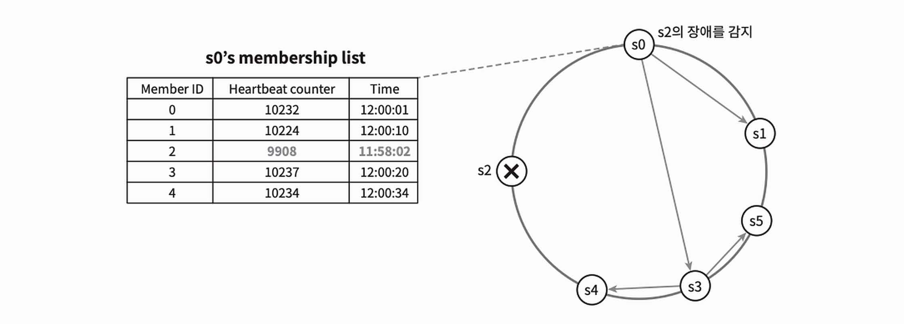
>
> - 노드 s0은 좌측 테이블과 같은 멤버십 목록을 가진 상태다.
> - 노드 s0은 노드 s3(멤버 ID = 2)의 박동 카운터가 오랫동안 증가되지 않았다는 것을 발견한다.
> - 노드 s0은 노드 s2를 포함하는 박동 카운터 목록을 무작위로 선택된 다른 노드에게 전달한다.
> - 노드 s2의 박동 카운터가 오랫동안 증가되지 않았음을 발견한 모든 노드는 해당 노드를 장애 노드로 표시한다.

##### 일시적 장애 처리

가십 프로토콜로 장애를 감지한 시스템은 가용성을 보장하기 위해 필요한 조치를 취해야 한다. 엄력한 정족수(strict quorum) 접근법을 쓴다면, 읽기와 쓰기 연산을 금지해야 할 것이다.

느슨한 정족수(sloppy quorum) 접근법은 이 조건을 완하한 방식으로 정족수 요구사항을 강제하는 대신, 쓰기 연산을 수행할 W개의 정상 서버와 읽기 연산을 수행할 R개의 정상 서버를 해시 링에서 고른다. 이때 장애 서버는 무시한다.

장애 상태인 서버로 가능 요청은 다른 서버가 잠시 맡아 처리한다. 이때 임시로 쓰기 연산은 처리한 서버는 그에 대한 단서(hint)를 남겨두어 후에 서버 복구시에 일괄 반영할 수 있어야 한다. 이러한 장애 처리 방안을 단서 후 임시 위탁(hinted handoff) 기법이라고 한다.

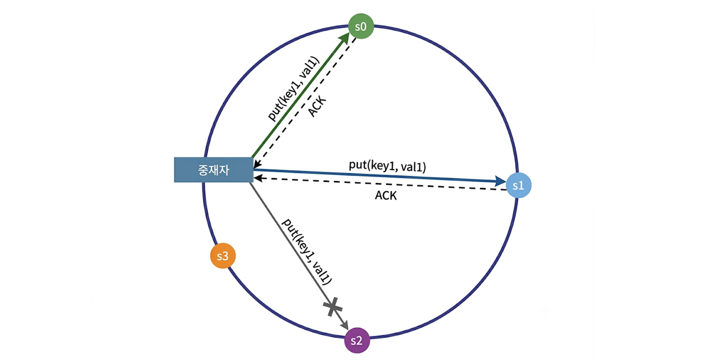

위 그림에서 장애 상태인 노드 s2에 대한 읽기 및 쓰기 연산은 일시적 노드 s3가 처리한다. s2가 복구되면 s3은 갱신된 데이터를 s2로 인계할 것이다.

##### 영구 장애 처리

영구적인 장애 처리를 위해서는 반-엔트로피(anti-entropy) 프로토콜을 사용한다. 반-엔트로피 프로토콜은 사본들을 비교하여 최신 버전으로 갱신하는 과정을 포함한다. 사본 간의 일관성이 망가진 상태를 탐지하고 전송 데이터의 양을 줄이기 위해서는 머클(Merkle) 트리를 사용할 것이다.

머클 트리는 해시 트리(hash tree)라고도 불리며, 각 노드에 자식 노드들에 보관된 값의 해시(자식 노드 = 리프 노드), 또는 자식 노드들의 레이블로부터 계산된 해시 값을 레이블로 붙여두는 트리이다. 해시 트리를 사용하면 대규모 자료 구조의 내용을 효과적이면서도 보안상 안전한 방법으로 검증(verification)할 수 있다.

아래는 키 공간(key space)이 1부터 12까지일 때 머슬 트리를 만드는 예제로 일관성이 망가진 데이터가 위치한 상자는 다른 색으로 표시한다.

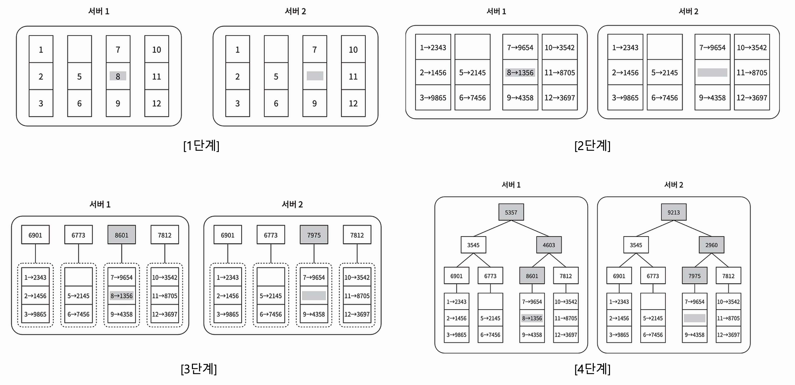

1. 키 공간을 [1단계]와 같이 버킷(bucket)으로 나눈다. (현재는 4개의 버킷으로 나뉨)
2. 버킷에 포함된 각각의 키에 균등 분포 해시(uniform hash) 함수를 적용하여 해시 값을 계산한다.
3. 버킷별로 해시값을 계산 후, 해당 해시 값을 레이블로 갖는 노드를 만든다.
4. 자식 노드의 레이블로부터 새로운 해시 값을 계산하여, 이진 트리를 상향식으로 구성해 나간다.

두 머클 트리의 비교는 루트 노드부터 시작하여 해시값이 다른 노드 들을 향해 값을 비교해 나간다. 이를 반복해서 아래쪽으로 탐색하다 보면 다른 데이터를 가진 버킷을 찾을 수 있다. 이렇게 탐색한 버킷의 값을 동기화 하면 된다.

##### 데이터 센터 장애 처리

데이터 센터 장애는 정전, 네트워크 장애, 자연재해 등 다양한 이유로 발생할 수 있다. 이에 대응할 수 있는 시스템을 만들려면 데이터를 여러 데이터 센터에 다중화하는 것이 중요하다. 

#### 시스템 아키텍처 다이어그램

키-값 저장소의 아키텍처는 다음과 같이 구성된다.

- 클라이언트는 키-값 저장소가 제공하는 두 가지 단순한 API, 즉 get(key) 및 put(key, value)와 통신한다.
- 중재자(coordinator)는 클라이언트에게 키-값 저장소에 대한 proxy를 하는 노드이다.
- 노드는 안정 해시(consistent hash)의 해시 링 위에 분포한다.
  - 노드를 자동으로 추가 또는 삭제할 수 있도록, 시스템은 완전히 분산된다(decentralized).
  - 데이터는 여러 노드에 다중화된다.
  - 모든 노드가 같은 책임을 지므로, SPOF(Single Point of Failure)는 존재하지 않는다.

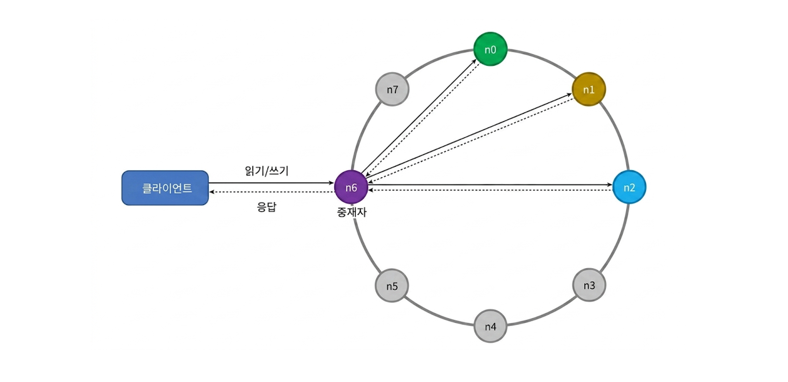

완전히 분산된 설계를 채택하였으므로, 모든 노드는 클라이언트 API, 장애 감지, 데이터 충돌 해소, 장애 복구 메커니즘, 다중화, 저장소 엔진 등의 기능을 모두 지원해야 한다.

#### 쓰기 경로

아래의 그림은 쓰기 요청이 특정 노드에 전달되면 무슨 일이 벌어지는지를 보여주며, 이 그림의 구조는 기본적으로 카산드라(Cassandra)의 사례를 참고한다.

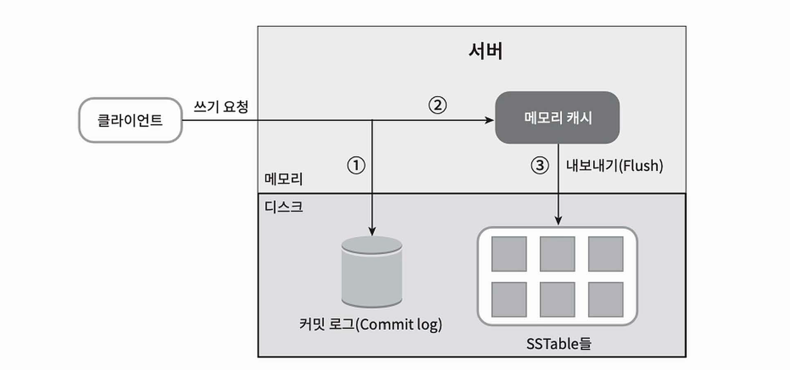

1. 쓰기 요청이 커밋 로그 파일에 기록된다.
2. 데이터가 메모리 캐시에 기록된다.
3. 메모리 캐시가 가득차거나 사전에 정의된 어떤 임계치에 도달하면 데이터는 디스크에 있는 SSTable에 기록된다. (SSTable(Sorted-String Table)은 <키, 값>의 순서쌍을 정렬된 리스트 형태로 관리하는 테이블)

#### 읽기 경로

읽기 요청을 받는 노드는 데이터가 메모리 캐시에 존재하는지부터 확인하고, 존재한다면 아래의 그림과 같이 해당 데이터를 클라이언트에게 반환한다.

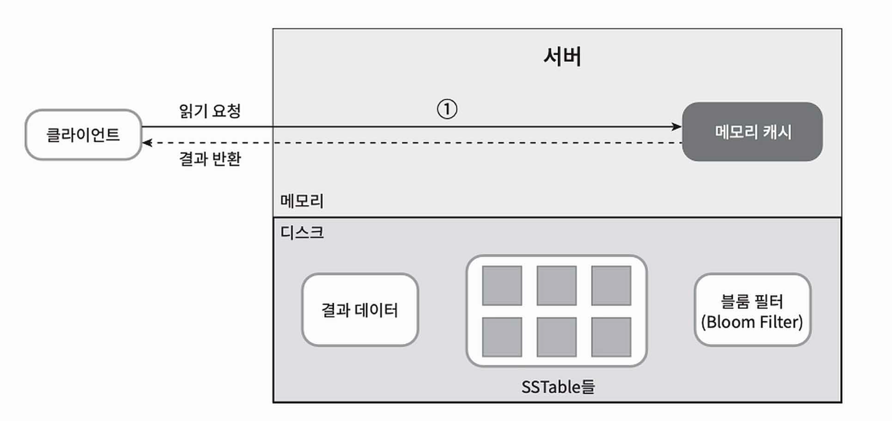

데이터가 메모리에 없는 경우에는 디스크에서 가져와야 한다. 어느 SSTable에 찾는 키가 있는지 알아낼 효율적인 방법으로 볼룸 필터(Bloom filter)가 흔히 사용된다. 아래 그림은 데이터가 메모리에 없을 때 읽기 연산이 처리되는 경로이다.

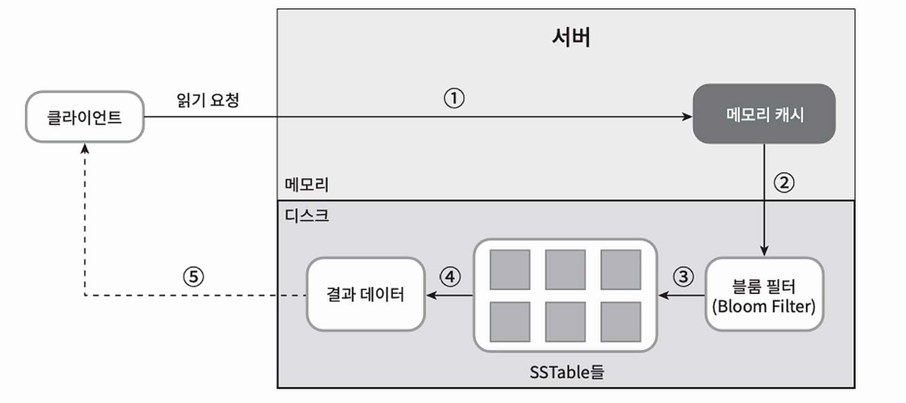

1. 데이터가 메모리에 있는지 검사하고, 없으면 2로 간다.
2. 데이터가 메모리에 없으므로 볼룸 필터를 검사한다.
3. 볼룸 필터를 통해 어떤 SSTable에 키가 보관되어 있는지 알아낸다.
4. SSTable에서 데이터를 가져온다.
5. 해당 데이터를 클라이언트에게 반환한다.

## 4. 요약

| 목표/문제 | 기술 |
| :--- | :--- |
| 대규모 데이터 저장 | 안정 해시를 사용해 서버들에 부하 분산 |
| 읽기 연산에 대한 높은 가용성 보장 | 데이터를 여러 데이터센터에 다중화 |
| 쓰기 연산에 대한 높은 가용성 보장 | 버저닝 및 벡터 시계를 사용한 충돌 해소 |
| 데이터 파티션 | 안정 해시 |
| 점진적 규모 확장성 | 안정 해시 |
| 다양성(heterogeneity) | 안정 해시 |
| 조절 가능한 데이터 일관성 | 정족수 합의(quorum consensus) |
| 일시적 장애 처리 | 느슨한 정족수 프로토콜(sloppy quorum)과 단서 후 임시 위탁(hinted handoff) |
| 영구적 장애 처리 | 머클 트리(Merkle tree) |
| 데이터 센터 장애 대응 | 여러 데이터 센터에 걸친 데이터 다중화 |