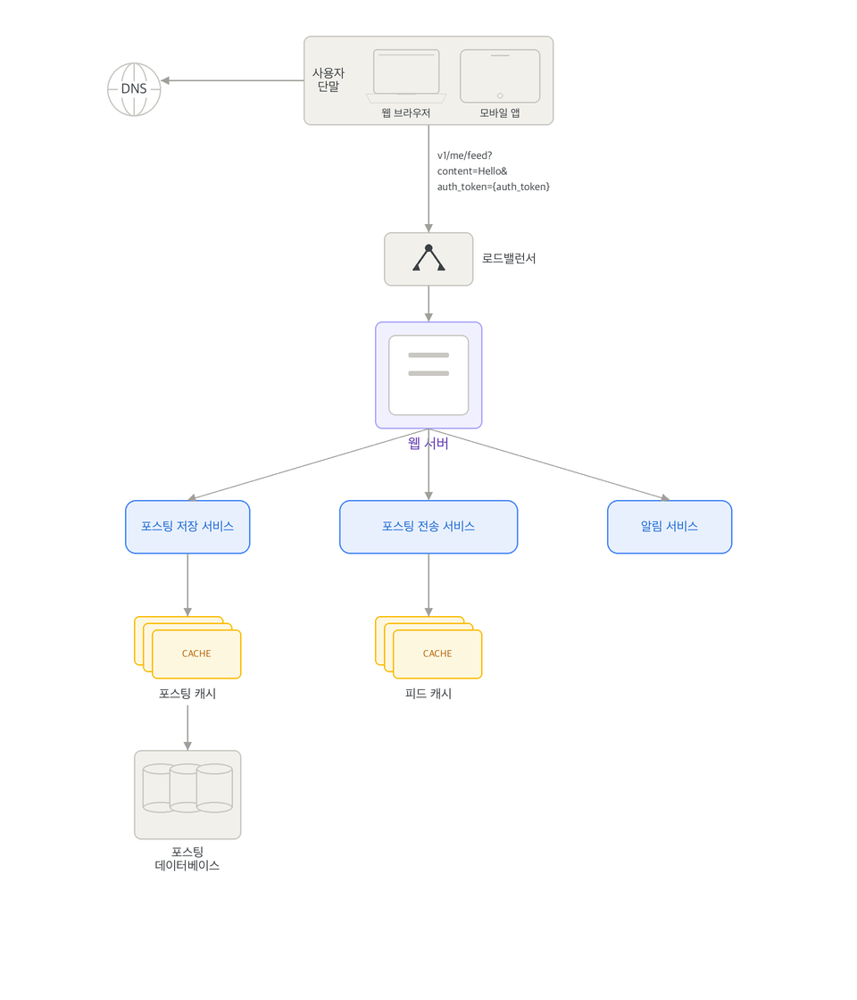
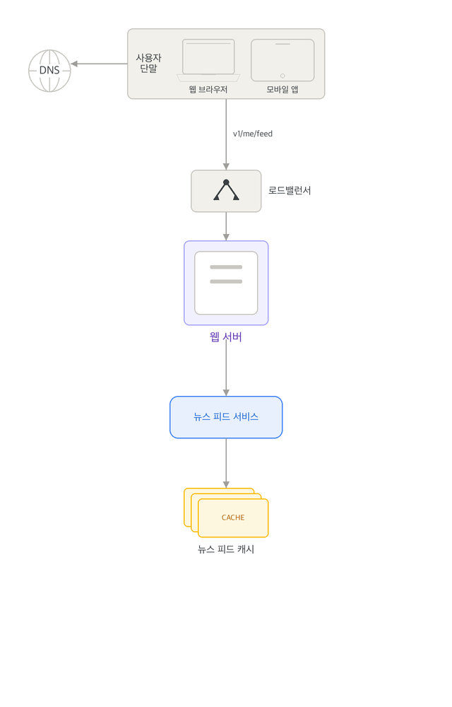
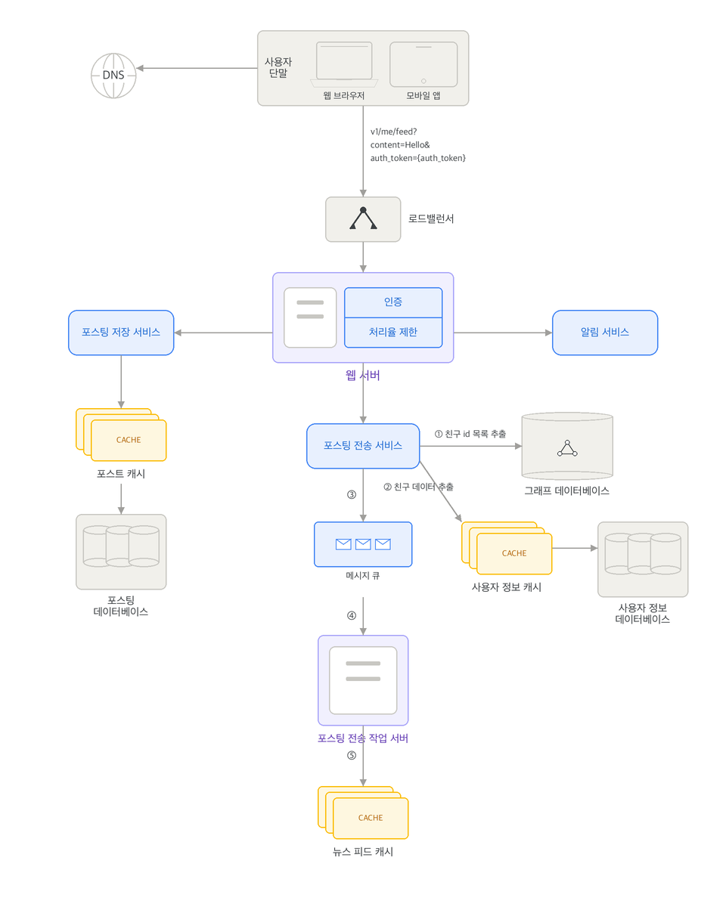
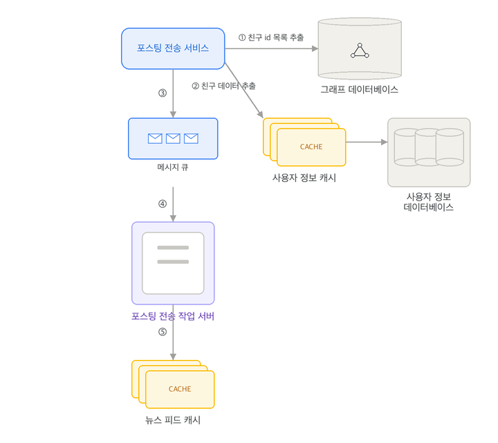
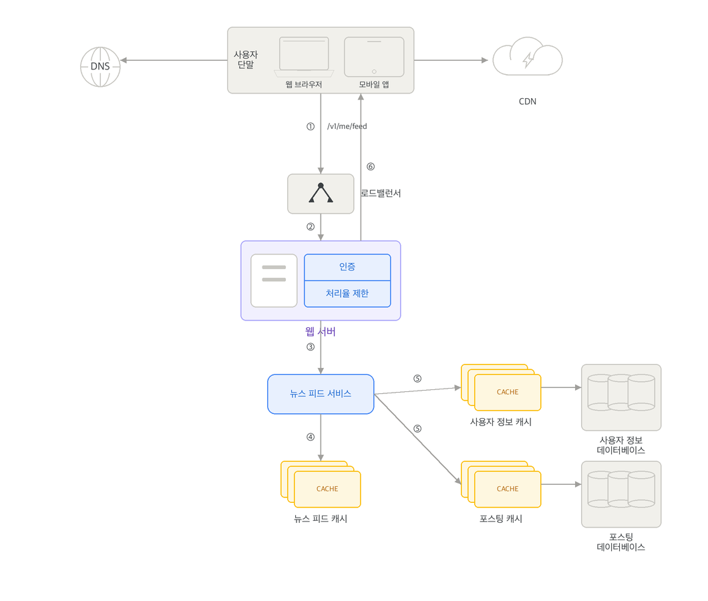
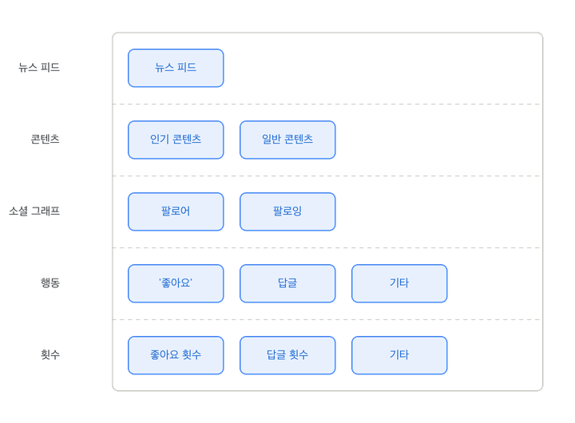

뉴스 피드(news feed)란 페이스북을 예시로 홈 페이지 중앙에 지속적으로 업데이트되는 스토리들로, 사용자 상태 정보 업데이트, 사진, 비디오, 링크, 앱 활동 그리고 페이스북에서 팔로우하는 페이지, 사람들, 좋아요 등을 모두 포함한다.

## 개략적 설계

뉴스 피드 시스템의 핵심 기능은 사용자가 새 스토리를 포스팅하는 '피드 발행(feed publishing)'과 친구들의 새 포스팅을 모아서 보여주는 '뉴스 피드 생성(읽기)(news feed building)'으로 나뉜다.

### 뉴스 피드 API

클라이언트가 상태를 업데이트하거나 뉴스 피드를 가져오기 위해 호출하는 HTTP 기반 API 스펙이다.

- 피드 발행 API(POST /v1/me/feed): 새 포스팅을 작성할 때 호출한다. HTTP Body에 포스팅 내용을 담고 Authorization 헤더를 통해 인증 정보를 전달한다.
- 피드 읽기 API(GET /v1/me/feed): 자신의 뉴스 피드를 조회할 때 호출한다. Authorization 헤더를 통해 요청자를 인증한다.

### 피드 발행 아키텍처

사용자가 포스팅을 업로드하면 시스템은 다음과 같은 흐름과 컴포넌트를 거쳐 처리를 진행한다.

{width=70% align=center}

- 사용자 및 로드밸런서: 모바일 앱이나 웹 브라우저에서 포스팅을 발행하면 로드밸런서가 해당 트래픽을 수신하여 다수의 웹 서버로 고르게 분산한다.
- 웹 서버: HTTP 요청을 수신하여 보안 및 속도 제한 등의 처리를 마친 뒤, 적절한 내부 마이크로서비스들로 중계한다.
- 포스팅 저장 서비스(Post Service): 업로드된 포스팅 데이터를 영구 저장하기 위해 포스팅 데이터베이스와 빠른 조회를 위한 포스팅 캐시에 기록한다.
- 포스팅 전송 서비스(Fanout Service): 작성된 포스팅을 사용자의 친구 목록에 포함된 각 사용자의 뉴스 피드 캐시(Feed Cache)로 즉시 푸시(Push)하여 빠르게 조회할 수 있도록 처리한다.
- 알림 서비스(Notification Service): 친구들에게 새로운 글이 등록되었음을 알리는 푸시 알림을 발송한다.

### 뉴스 피드 생성기(읽기) 아키텍처

사용자가 뉴스 피드를 조회하여 읽을 때 호출되는 구성 방식이다.

{width=50% align=center}

- 사용자 및 로드밸런서: 피드 읽기 API 요청을 보내고 로드밸런서가 이를 웹 서버로 라우팅한다.
- 웹 서버: 들어오는 읽기 요청 트래픽을 뉴스 피드 서비스로 라우팅한다.
- 뉴스 피드 서비스(News Feed Service): 뉴스 피드 캐시에서 미리 계산되어 적재된 피드 데이터 목록을 가져오는 중추 역할을 담당한다.
- 뉴스 피드 캐시(News Feed Cache): 뉴스 피드를 화면에 렌더링하기 위해 필요한 고유 피드 ID들을 보관하고 있다가 신속하게 응답한다.

## 상세 설계

### 피드 발행 흐름 상세 설계 및 팬아웃 서비스

#### 웹 서버의 역할 및 기능 확장

상세 설계안에서 웹 서버는 클라이언트와의 통신 중계 역할 외에 다음과 같은 엄격한 관리 기능을 추가로 전담한다.

- 인증(Authentication): 클라이언트가 올바른 인증 토큰을 Authorization 헤더에 담아 API를 호출했는지 검사하여 신뢰할 수 있는 사용자에게만 포스팅 작성을 허용한다.
- 처리율 제한(Rate Limiting): 스팸 전송을 막고 유해 콘텐츠의 대량 업로드를 차단하기 위해, 한 사용자가 특정 기간 동안 올릴 수 있는 포스팅의 최대 개수를 엄격하게 제한한다.

#### 포스팅 전송(팬아웃) 모델 분석

팬아웃(Fanout)은 사용자가 작성한 새 포스팅을 해당 사용자의 친구 목록에 포함된 모든 사람의 뉴스 피드로 전달하고 갱신하는 핵심 처리 과정이다. 시스템 설계 시 주로 두 가지 전송 모델의 장단점을 비교하여 장치한다.

{width=70% align=center}

##### 쓰기 시점에 팬아웃하는 모델 (Push 모델)

새 포스팅의 업로드가 완료되는 즉시 모든 친구의 뉴스 피드 캐시(Feed Cache)에 피드 데이터를 직접 밀어 넣어 기록하는 방식이다.

- 장점: 뉴스 피드가 실시간으로 즉각 갱신되며, 사용자가 피드를 조회할 때는 이미 연산이 완료되어 캐시에 적재된 데이터를 읽어오기만 하므로 피드 읽기 속도가 매우 빠르다.
- 단점: 팔로워나 친구가 매우 많은 인플루언서급 사용자의 포스팅 시점에는, 수천만 명에 달하는 팔로워의 뉴스 피드 캐시를 동시에 갱신하느라 심각한 쓰기 지연과 과부하가 동반된다. 이를 핫키(Hotkey) 문제라고 부른다. 또한 서비스를 거의 이용하지 않는 휴면 사용자의 피드까지 갱신하게 되므로 아까운 컴퓨팅 자원이 소모된다.

##### 읽기 시점에 팬아웃하는 모델 (Pull 모델)

사용자가 본인의 타임라인이나 홈페이지를 새로고침하여 직접 로딩하는 시점에 뉴스 피드를 실시간으로 긁어모아 갱신하는 온디맨드(On-demand) 요청 기반 방식이다.

- 장점: 비활성 사용자나 서비스에 거의 로그인하지 않는 사용자를 위한 불필요한 피드 연산이 발생하지 않아 자원을 효과적으로 아낄 수 있다. 친구 관계마다 데이터를 강제로 밀어 넣지 않으므로 핫키 문제 자체가 발생하지 않는다.
- 단점: 피드를 열어볼 때마다 실시간으로 친구들의 데이터를 전부 쿼리하여 정렬해야 하므로 피드를 조회하는 읽기 성능이 하락한다.

##### 하이브리드(Hybrid) 절충안 설계 

대다수의 일반 사용자들 간의 관계에는 피드 조회가 신속한 Push 모델을 활용해 실시간으로 뉴스 피드를 자동 갱신하고, 팔로워가 매우 많은 셀럽이나 인플루언서의 포스팅은 그 팔로워들이 필요할 때 직접 데이터를 읽어가는 Pull 모델을 결합하여 핫키 이슈와 과부하 현상을 사전에 방지한다. 아울러 안정 해시(Consistent Hashing) 기법을 통하여 요청과 데이터를 고르게 분배함으로써 시스템의 전반적인 안정성을 강화한다.

#### 팬아웃 서비스 동작 메커니즘

{width=60% align=center}

상세 설계안에 포함된 팬아웃 서비스의 세부 실행 프로세스는 다음과 같이 진행된다.

1. 친구 목록 조회: 친구 관계나 친구 추천 관리에 최적화된 그래프 데이터베이스(Graph Database)로부터 글 작성자의 친구 ID 리스트를 조회한다.
2. 뮤트 및 권한 필터링: 사용자 정보 캐시에서 추출된 친구들의 설정을 가져와 필터링을 진행한다. 특정 친구가 글 작성자의 소식을 무시(Mute)하도록 지정했거나, 해당 글이 특정 친구 그룹에만 한정적으로 공개되도록 공유 권한이 설정된 경우 등 발송 대상에서 제외할 대상을 신속하게 걸러낸다.
3. 이벤트 전달: 필터링을 통과해 최종 선별된 친구 ID 리스트와 새 포스팅 ID 정보를 묶어 비동기 처리를 위해 메시지 큐(Message Queue)에 삽입한다.
4. 캐시 업데이트: 팬아웃 작업 서버(Workers)들이 메시지 큐에서 대기 중인 이벤트를 꺼내어 뉴스 피드 캐시를 갱신한다.
   - 캐시 데이터 경량화: 메모리 절약을 위해 포스팅 전체 본문을 캐시하는 대신 <포스팅 ID, 사용자 ID>의 키 쌍만 맵핑 레코드로 보관한다.
   - 캐시 용량 제한: 메모리 자원을 적정 수준으로 관리하기 위해 뉴스 피드 캐시의 보관 용량 상한선을 지정한다. 대부분의 사용자는 최신 피드 영역만 집중적으로 읽기 때문에 최신 데이터를 제외한 오래된 영역의 캐시 미스(Cache Miss) 확률은 성능상 유의미한 영향을 주지 않는다.

### 뉴스 피드 읽기 작업 흐름

{width=70% align=center}

사용자가 자신의 뉴스 피드를 실시간으로 읽어가는 과정의 상세 처리 절차는 다음과 같이 진행된다.

1. 요청 전송: 사용자가 피드 조회 API인 /v1/me/feed를 호출하여 피드 읽기 요청을 보낸다.
2. 트래픽 분산: 로드밸런서가 해당 읽기 요청을 수신하여 웹 서버 그룹 중 하나로 고르게 분산한다.
3. 서비스 호출: 웹 서버는 인증 상태 및 처리율 제한 필터를 적용하여 요청의 유효성을 검증한 뒤, 뉴스 피드 서비스를 호출한다.
4. 포스팅 ID 목록 추출: 뉴스 피드 서비스는 뉴스 피드 캐시(News Feed Cache)에 접근하여 해당 사용자용으로 보관 중인 최신 포스팅 ID 목록을 신속하게 가져온다.
5. 피드 데이터 결합 (Hydration): 가져온 포스팅 ID 리스트를 기반으로, 피드에 채워 넣을 세부 메타데이터들을 수집한다. 사용자 정보 캐시(사용자 이름, 프로필 사진 등)와 포스팅 캐시(본문 콘텐츠, 이미지 링크 등)로부터 구체적인 데이터를 매핑하여 완전한 뉴스 피드 데이터 형태로 조립한다.
6. 클라이언트 응답: 완성된 뉴스 피드 데이터를 JSON 포맷으로 클라이언트에 전달하며, 단말은 이를 수신하여 화면에 렌더링한다. 이미지나 비디오와 같은 무거운 미디어 콘텐츠는 클라이언트가 지연을 최소화하기 위해 전용 CDN을 통하여 직접 내려받는다.

### 뉴스 피드 캐시 아키텍처

뉴스 피드 시스템의 지연 시간(Latency)을 낮추고 메모리 관리를 최적화하기 위하여 캐시를 역할별로 세분화하여 다섯 개의 계층(Layer)으로 분할 관리한다.

{width=50% align=center}

- 뉴스 피드 계층: 사용자의 뉴스 피드를 구성할 포스팅 ID 목록을 보관한다.
- 콘텐츠 계층: 실제 포스팅 본문 데이터를 보관한다. 효율성을 높이기 위해 트래픽이 몰리는 인기 콘텐츠와 일반 콘텐츠를 독립된 영역으로 분리하여 관리한다.
- 소셜 그래프 계층: 팔로어 및 팔로잉 목록 등 사용자 사이의 사회적 관계망 정보를 저장한다.
- 행동(Action) 계층: 포스팅에 행한 사용자의 개별 액션 정보를 보관한다. 특정 글에 대한 '좋아요' 누르기, 답글(댓글) 작성 등의 활동 정보가 포함된다.
- 횟수(Counter) 계층: 특정 포스팅의 '좋아요' 누적 수, 댓글 응답 수, 사용자의 팔로어 및 팔로잉 숫자 등 빈번하게 갱신되는 수치 메트릭들을 집중 보관한다.