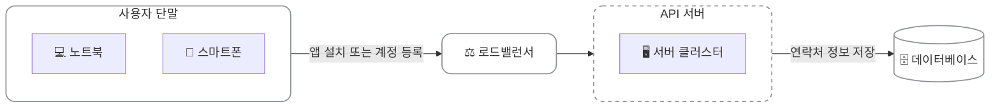
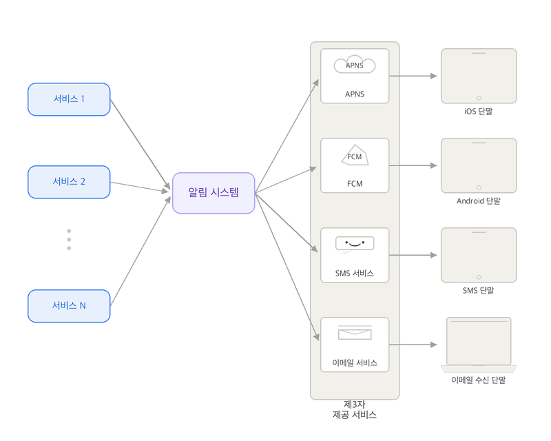
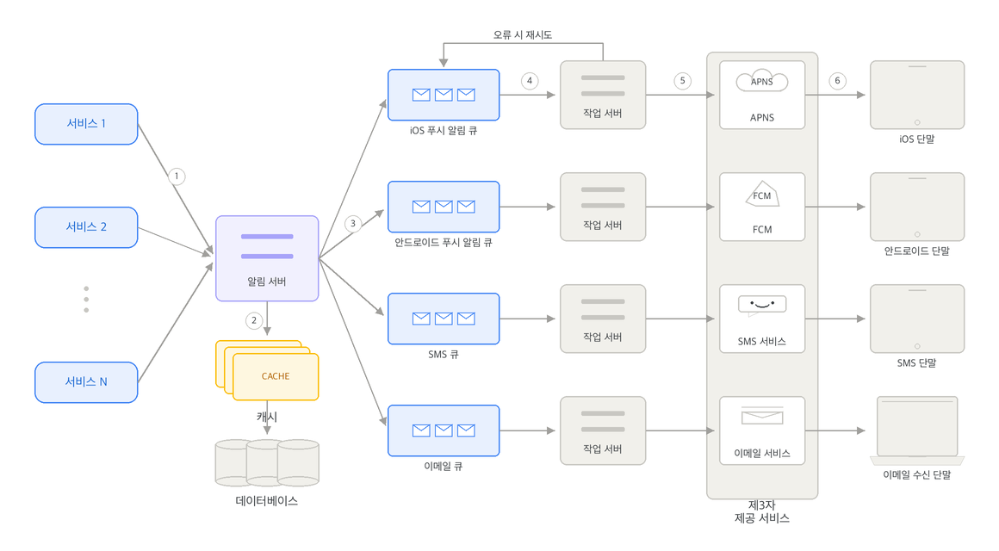
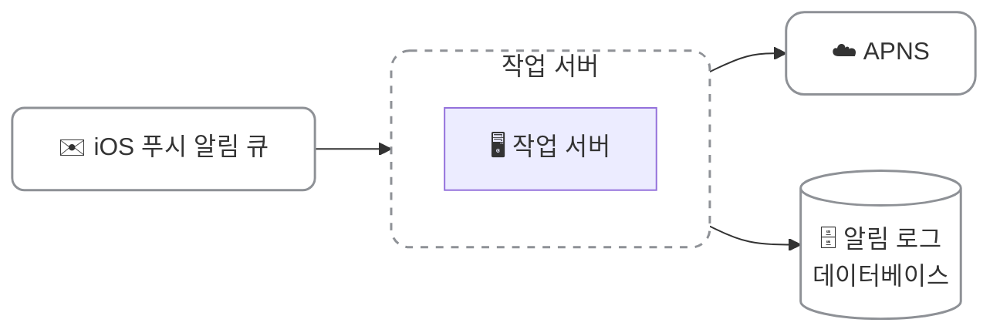
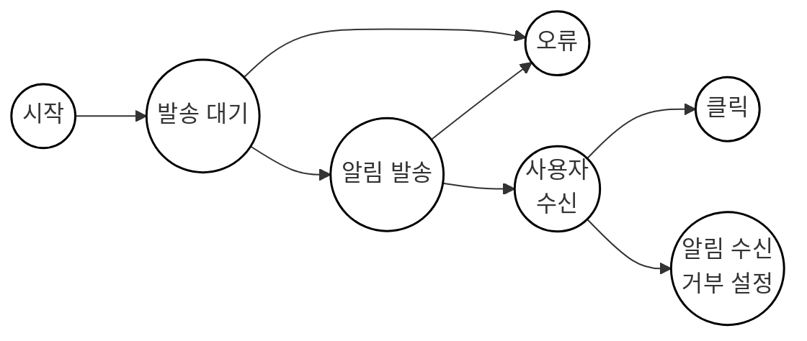
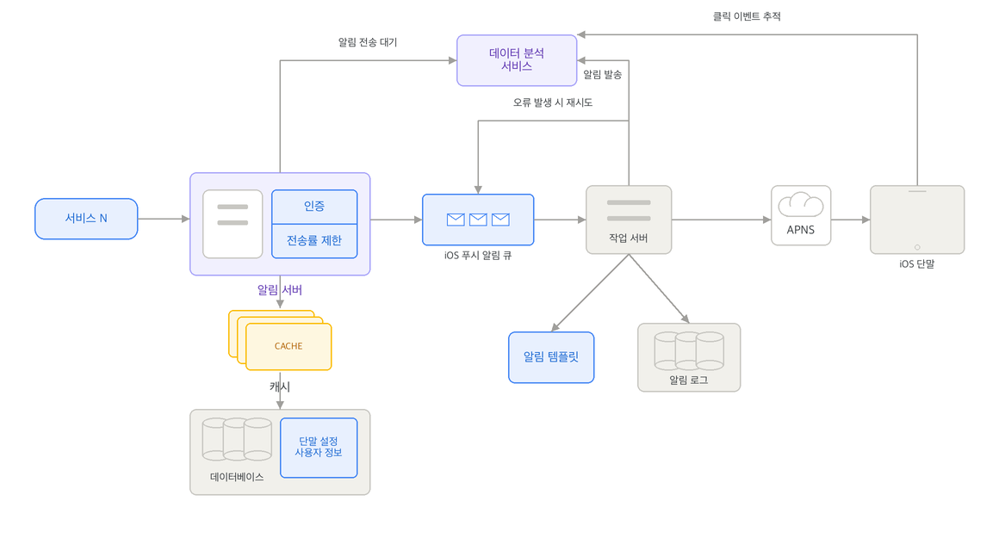

알림 시스템(notification system)은 많은 프로그램이 채택한 기능으로 이 기능을 갖춘 프로그램은 최신 뉴스, 제품 업데이트, 이벤트, 선물 등 고객에게 중요할 만한 정보를 비동기적으로 제공한다.

## 개략적 설계안

iOS 푸시 알림, 안드로이드 푸시 알림, SMS 메시지, 이메일을 지원하는 알림 시스템의 개략적 설계안을 살펴보겠다.

### 알림 유형별 지원 방안

#### iOS 푸시 알림

iOS에서 푸시 알림을 보내기 위해서는 세 가지 컴포넌트가 필요하다.

> provider → APNS → iOS device

- 알림 제공자(provider): 알림 요청(notification request)을 만들어 애플 푸시 알림 서비스(APNS)로 보내는 주체로, 다음과 같은 데이터로 알림 요청을 만든다.
  - 단말 토큰(device token): 알림 요청을 보내는 데 필요한 고유 식별자
  - 페이로드(payload): 알림 내용을 담은 JSON dictionary
    ```json
    {
        "aps": {
            "alert" {
                "title": "Game Request",
                "body": "Bob wants to play chess",
                "action-loc-key": "PLAY"
            },
            "badge": 5
        }
    }
    ```
- APNS(APNS: Apple Push Notification Service): 애플이 제공하는 원격 서비스로, 푸시 알림을 ios 장치로 보내는 역할을 담당한다.
- iOS device: 푸시 알림을 수신하는 사용자 단말

#### 안드로이드 푸시 알림

안드로이드 푸시 알림도 비슷한 절차로 전송된다. APNS 대신 FCM(Firebase Cloud Messaging)을 사용한다.

> provider → FCM → Android device

#### SMS 메시지

SMS 메시지를 보낼 때는 보통 Twilio, Nexmo 같은 제3 사업자의 서비스를 많이 이용한다. 이러한 서비스는 대부분 상용 서비스라서 이용 요금을 내야 한다.

> provider → SMS Service → SMS receive device

#### 이메일

대부분의 회사는 고유 이메일 서버를 구축할 역량을 갖추고 있지만 많은 회사가 상용 이메일 서비스를 이용한다. 그중 유명한 서비스로 Sendgrid, Mailchimp가 있다. 전송 성공률도 높고, 데이터 분석 서비스도 제공한다.

> provider → Email Service → Email receive device

### 연락처 정보 수집 절차

알림을 발송하려면 모바일 단말 토큰, 전화번호, 이메일 주소 등의 연락처 정보가 필요하다.



사용자가 앱을 설치하거나 최초로 계정을 등록할 때 정보 수집이 이루어진다.

1. 사용자 단말기에서 앱 설치 또는 계정 등록 요청을 전송한다.
2. 로드밸런서를 거쳐 API 서버로 요청이 전달된다.
3. API 서버는 해당 사용자의 연락처 정보를 수집하여 데이터베이스에 기록한다.

데이터베이스에 연락처 정보를 저장할 때, 한 사용자가 여러 대의 단말기를 가질 수 있으며 알림은 등록된 모든 단말기에 전송되어야 하므로, 사용자(user)와 단말기(device) 테이블을 일대다(1:N) 관계로 구성한다. 이메일 주소와 전화번호는 user 테이블에 저장하고, 단말 토큰은 device 테이블에서 개별적으로 관리한다.

### 알림 전송 및 수신 절차

#### 개략적 설계안 (초안)

초안 설계는 단일 알림 시스템을 중심으로 작동하며, 주요 구성 요소와 이에 따른 한계점은 다음과 같다.

{width=70% align=center}

##### 초안 컴포넌트의 구성

- 1부터 N까지의 서비스: 마이크로서비스, 크론잡, 혹은 일반 웹사이트 등 알림 전송 요청을 보내는 주체들이다.
- 알림 시스템: 알림 전송 및 수신 처리의 핵심 컴포넌트다. 서비스 1~N에 전송용 API를 제공하고 제3자 서비스에 전달할 페이로드(payload)를 생성하는 기능을 한다.
- 제3자 제공 서비스: 사용자에게 알림을 실제로 전달하는 외부 채널(APNS, FCM, SMS 서비스, 이메일 서비스)들이다. 각 플랫폼의 제약사항이나 지역별 가용성(예: FCM은 중국에서 사용 불가하여 Jpush 등으로 대체 필요)을 중요하게 고려해야 한다.
- 수신 단말: 사용자가 알림을 최종적으로 수신하는 단말기이다.

##### 초안 설계의 문제점

- SPOF(Single-Point-Of-Failure): 알림 서비스에 서버가 하나뿐이므로, 해당 서버에 장애가 발생하면 전체 시스템의 중단으로 이어진다.
- 규모 확장성 부족: 한 대의 서버로 모든 알림 관련 비즈니스 로직을 처리하기 때문에, 데이터베이스나 캐시 등 중요 컴포넌트의 규모를 독립적으로 확장할 방법이 없다.
- 성능 병목 현상: 웹 페이지를 생성하고 제3자 서비스의 응답을 기다리는 등의 작업은 대기 시간이 길어질 수 있다. 이를 단일 서버로 동기 처리하게 되면 트래픽이 집중되는 시간대에 시스템 과부하 상태에 빠질 위험이 크다.

#### 개략적 설계안 (개선된 버전)

초안의 단점을 보완하기 위해 데이터베이스와 캐시를 분리하고, 알림 서버의 수평적 확장을 도입하며, 메시지 큐를 활용해 컴포넌트 간 강한 결합을 끊은 아키텍처이다.

{width=70% align=center}

##### 개선된 버전 컴포넌트 구성

- 알림 서버: 스팸 방지를 위한 전송 API 인증 기능, 기본적인 데이터(이메일, 전화번호 등) 검증 기능, 알림에 포함할 데이터를 DB나 캐시에서 읽어오는 조회 기능, 그리고 데이터를 메시지 큐에 전달하는 기능을 수행한다.
- 캐시: 사용자 정보, 단말 정보, 알림 템플릿(template) 등을 보관하여 데이터베이스 조회 비용을 낮춘다.
- 데이터베이스(DB): 사용자, 알림, 설정 등의 다양한 비즈니스 메타데이터를 보관한다.
- 메시지 큐: 시스템 컴포넌트 간의 의존성을 제거하고 다량의 알림 발송 시 버퍼 역할을 담당한다. 알림 종류별(iOS, 안드로이드, SMS, 이메일)로 개별 메시지 큐를 구축하여 특정 외부 서비스에 장애가 발생해도 다른 종류의 알림은 지장 없이 동작하게 한다.
- 작업 서버(Workers): 메시지 큐에서 대기 중인 알림 이벤트를 꺼내어 외부 제3자 서비스로 전달하는 독립된 서버 집합이다.
- 제3자 서비스 및 단말: 전달받은 이벤트를 바탕으로 최종 수신 단말에 메시지를 전송한다.

##### 전송 작업 흐름

1. 각 서비스가 API를 호출하여 알림 서버로 전송을 요청한다.
2. 알림 서버는 사용자 정보, 단말 토큰, 알림 설정 등의 메타데이터를 캐시 또는 데이터베이스에서 조회한다.
3. 알림 서버는 알림 유형에 적합한 이벤트를 만들어 대응하는 메시지 큐에 삽입한다.
4. 작업 서버가 메시지 큐에서 처리할 알림 이벤트를 꺼낸다.
5. 작업 서버가 알림을 제3자 서비스로 전송하며, 에러가 발생한 경우에는 재시도를 위해 이벤트를 다시 큐로 돌려보낸다.
6. 제3자 서비스가 최종 수신 단말로 알림을 전송한다.

## 상세 설계

개략적 설계에서는 알림의 종류, 연락처 정보 수집 절차, 알림 전송/수신 절차에 대해서 살펴보았고, 상세 설계에서는 안정성, 추가로 필요한 컴포넌트 및 고려사항, 개선된 설계안에 대해 좀 더 자세히 알아보겠다.

### 안정성 (reliability)

분산 환경에서 운영될 알림 시스템을 설계할 때는 안정성을 확보하기 위한 사항 몇 가지를 고려해야 한다.

#### 데이터 손실 방지

알림 시스템의 가장 중요한 요구사항 중 하나는 어떤 장애 상황에도 알림 데이터가 유실되지 않도록 보장하는 것이다. 알림 발송이 다소 지연되거나 순서가 어긋나는 것은 허용될 수 있지만, 알림 자체가 완전히 소실되는 것은 방지해야 한다.



- 알림 로그 데이터베이스 구축: 작업 서버가 알림 이벤트를 처리할 때 알림 로그(notification log)를 보관하는 데이터베이스를 별도로 유지하여 알림의 성공 및 실패 이력을 지속적으로 기록한다.
- 재시도 메커니즘: 외부 제3자 서비스 전송에 실패하거나 컴포넌트 오류 발생 시, 영구 저장된 알림 로그 데이터를 바탕으로 재시도를 수행하여 데이터 유실을 방지한다.

#### 알림 중복 전송 방지

분산 시스템의 구조적 특성상 알림이 중복하여 발송되는 현상을 완전히 차단하는 것은 불가능하다. 하지만 중복 탐지 메커니즘을 도입하고 에러를 적절히 제어하여 중복 전송 빈도를 최소화해야 한다.

- 이벤트 ID 검사: 새로운 알림 요청이 도착하면 고유한 이벤트 ID를 확인하여 이미 처리된 이력이 존재하는 이벤트인지 사전에 검사한다.
- 중복 필터링: 검사 결과 이미 처리된 적이 있는 중복 이벤트라면 해당 요청을 즉시 폐기하고, 처음 유입된 고유 ID인 경우에만 실제 발송 단계로 전달한다.

<details>
<summary><b>중복 전송을 100% 방지하는 것이 왜 불가능한가?</b></summary>
<div>
분산 환경(웹 브라우저와 서버, 서버와 데이터베이스, 서버와 메시지 큐 등)에서는 물리적으로 '정확히 한 번 메시지를 전송하고 처리하는 것'이 불가능하며, 이에 대한 세부 논리는 다음과 같다.

<b>1. 분산 시스템의 세 가지 전송 모델 (Delivery Semantics)</b>

분산 환경에서 메시지를 전송할 때 선택할 수 있는 세맨틱스는 다음과 같으며, 이 중 현실 세계에서 보장할 수 있는 모델은 앞의 두 가지뿐이다.

- At-most-once (최대 한 번): 메시지를 보낸 직후 처리 결과와 상관없이 바로 확인 응답(ACK)을 처리한다. 만약 수신 측이 메시지를 받아 처리하다가 다운되면 데이터는 영구 유실된다.
- At-least-once (최소 한 번): 메시지가 안전하게 완전히 처리된 후에 ACK를 보낸다. 전송 중 네트워크 결함 등으로 ACK가 유실되면 송신자는 동일 메시지를 재전송하므로 데이터 중복이 발생한다.
- Exactly-once (정확히 한 번): 어떠한 장애나 지연 상황에서도 데이터의 유실이나 중복 없이 정확하게 단 한 번만 메시지가 전달되고 실행됨을 보장하는 이상적인 모델이다.

<b>2. Exactly-Once가 물리적으로 불가능한 컴퓨터 과학적 이유</b>

Exactly-Once 보장은 설계의 정밀함이나 기술력 부족의 문제가 아니라, 분산 시스템이 지닌 태생적인 한계(Impossibility Results)에 기인한다.

- Two Generals Problem: 메시지 전송과 확인 응답(ACK)의 신뢰성을 담보할 수 없는 채널 환경에서는, 양측이 완벽한 상호 신뢰를 가진 합의에 이르는 것이 불가능하다. 즉, 응답을 받지 못한 송신자는 메시지가 유실된 것인지, 상대가 처리하고 보낸 ACK가 유실된 것인지 절대 판단할 수 없다.
- FLP 정리 (FLP Impossibility Result): 아주 미미한 결함(Faulty 프로세스)이 단 하나라도 발생할 수 있는 비동기 분산 시스템 환경이라면, 시스템의 프로세스들이 완전하게 동일한 결정에 동의(Consensus)할 수 없다는 이론적 증명이다.
- 결론: 통신 중 유실, 지연, 서버 다운 등의 원인이 복합적으로 일어날 때, 송수신 양측이 단 한 번만 온전하게 처리되었음을 100% 확신하고 통신을 끝내는 것은 불가능하다.

<b>3. 현실 세계에서의 우회 구현 방법 (Faking Exactly-Once)</b>

그렇기에 '정확히 한 번'을 지원한다고 표방하는 현실의 메시지 엔진들은 실제로 이를 완벽하게 전송하는 것이 아니라, '최소 한 번 전송(At-least-once)'을 기저에 두고 수신부에서 중복을 무효화하여 마치 정확히 한 번만 처리된 것처럼 속이는(Faking) 전략을 쓴다.

멱등성 설계 (Idempotency): 메시지가 중복 수신되어 여러 번 동일 연산이 반복 실행되더라도 상태의 불일치나 부작용(Side effect)이 발생하지 않도록 비즈니스 로직을 구성한다.
중복 제거 (Deduplication): 메시지에 이벤트 ID와 같은 고유 식별자(UUID)를 부여하여, 이미 수신 처리된 이력이 확인되면 추가 연산을 무시하고 버리는 방식을 취한다.

출처: https://bravenewgeek.com/you-cannot-have-exactly-once-delivery/
</div>
</details>

### 추가로 필요한 컴포넌트 및 고려사항

알림 시스템을 구축할 때는 단순히 알림 전송 기능 외에도 알림 템플릿, 사용자 설정, 처리율 제한, 재시도 제어, 보안, 모니터링, 이벤트 추적 등 비즈니스 요구사항을 지원하기 위한 여러 추가 컴포넌트와 보안 장치를 고려해야 한다.

#### 알림 템플릿

하루에 발송되는 수백만 건 이상의 알림 메시지는 대부분 유사한 형식을 띤다. 모든 메시지를 매번 처음부터 새로 만드는 대신, 템플릿을 활용해 알림 작성 시간과 오류 가능성을 최소화하고 일관된 디자인 형식을 유지한다.

- 템플릿은 고정된 텍스트 양식에 인자(Parameter), 스타일, 추적 링크(Tracking link) 등을 매핑하여 최종 알림 메시지를 동적으로 생성한다.
- 예시: 본문과 타이틀(CTA)에 [item_name] 및 [date] 등의 매개변수 필드를 두고 호출 시점에 동적으로 데이터를 주입하여 발송 문구를 완성한다.

#### 알림 설정

사용자가 과도한 알림으로 피로감을 느끼고 수신 거부를 설정하는 상황을 방지하기 위해, 사용자가 채널별 수신 여부를 세부적으로 조정할 수 있는 설정 관리 기능이 필요하다.

- 사용자 식별자(user_id), 수신 채널(channel - 푸시, 이메일, SMS 등), 수신 동의 여부(opt_in) 등의 데이터를 별도의 알림 설정 테이블로 보관하고 관리한다.
- 알림 서버는 알림을 최종적으로 발송하기 전에 수신자가 해당 채널에 대한 수신 설정(opt_in)을 허용해 두었는지 조회하고 확인하는 절차를 반드시 거친다.

#### 전송률 제한 (Rate Limiting)

한 사용자에게 너무 빈번하게 알림이 도달하지 않도록 특정 기간 동안 1인당 수신할 수 있는 알림의 최대 빈도를 제한한다. 이는 사용자가 알림 과부하로 인해 알림 기능 자체를 완전히 차단하거나 앱을 삭제하는 부정적인 경험을 방지하기 위함이다.

#### 재시도 방법

제3자 제공 서비스로의 알림 전송 시도가 실패하는 경우, 해당 이벤트를 유실시키지 않고 즉시 재시도 전용 큐에 삽입하여 순차적으로 재발송을 시도한다. 만약 재시도 큐에서도 오류가 지속적으로 발생하여 최종 실패할 경우에는 모니터링 시스템을 통해 개발자 경고(alert) 통지를 가동하여 인지할 수 있도록 돕는다.

#### 푸시 알림과 보안

모바일 환경에서의 알림 발송은 중요도가 높은 작업이므로 전송 API의 보안 수준을 유지해야 한다. 일반적으로 appKey와 appSecret 정보의 매핑 구조를 도입하여 API 요청을 인증하며, 오직 사전 승인되고 인증을 통과한(verified) 신뢰할 수 있는 클라이언트만 알림 전송 API를 호출할 수 있도록 제한한다.

#### 큐 모니터링 및 스케일 아웃

시스템 운영 상황을 모니터링할 때 가장 주의 깊게 확인해야 하는 메트릭은 메시지 큐에 쌓여 대기 중인 알림 이벤트의 누적 개수이다. 대기 중인 큐의 개수가 비정상적으로 치솟는다면 작업 서버(Workers)들의 처리 속도가 병목 상태에 있음을 의미하므로, 신속하게 작업 서버를 증설(Scale-out)하여 처리 성능을 확보한다.

#### 이벤트 추적 (Analytics)

알림 확인율, 클릭율, 그리고 실제 앱 활성화나 전환으로 이어지는 비율 등의 메트릭은 사용자 행동을 이해하고 비즈니스 성과를 파악하기 위해 필수적인 요소이다. 이를 효과적으로 추적하기 위해 알림 시스템 설계 시 다양한 데이터 분석 서비스(Analytics)와의 연동 및 이벤트 추적 기술의 결합을 기본 사양으로 통합한다.



### 수정된 설계안

지금까지 설명한 내용을 모두 반영하여 수정한 설계안이다.

{width=70% align=center}

초안 설계안과 비교하여 시스템의 안정성, 보안성, 모니터링 편의성을 극대화하기 위해 상세 설계 단계에서 다음과 같은 핵심 기능과 컴포넌트가 추가되었다.

- 인증 및 전송률 제한 추가: 알림 서버에 API 호출 인증(Authentication) 체계를 적용하여 인가된 서비스만 알림을 보낼 수 있도록 제한하며, 전송률 제한(Rate-limiting) 기능을 추가하여 특정 사용자가 과도한 수의 알림을 받거나 서버가 공격당하는 현상을 미연에 방지한다.
- 전송 실패 재시도 메커니즘 도입: 외부 제3자 제공 서비스의 일시적인 문제 등으로 발송 실패가 일어났을 때 유연하게 대응하기 위해 재시도 기능을 확보한다. 실패한 알림을 다시 메시지 큐에 넣어 정해진 임계 횟수만큼 재발송을 시도한다.
- 알림 템플릿 활용: 고정된 레이아웃 양식을 재사용하여 알림 메시지 빌드 프로세스를 단순화하며, 메시지의 규격과 형태의 일관성을 상시 유지한다.
- 모니터링 및 추적 시스템 결합: 대기 큐의 부하를 실시간 모니터링하여 가용성 지표를 추적하고, 발송 성공 여부나 클릭율 같은 비즈니스 데이터를 추적함으로써 향후 아키텍처의 지속적인 개선을 용이하게 만든다.