처리율 제한 장치(rate limiter)는 클라이언트 또는 서비스가 보내는 트래픽의 처리율(rate)을 제어하기 위한 장치이다. (ex. API 요청 횟수가 제한 장치에 정의된 임계치(threshold)를 넘어서면 모든 호출은 처리가 중단(block)된다.)

API에 처리율 제한 장치를 두면 다음과 같은 좋은 점이 있다.

- DoS(Denial of Service) 공격에 의한 자원 고갈(resource starvation) 방지 
- 비용 절감 : 추가 요청에 대한 처리를 제한 → 서버를 많이 두지 않아도 되고, 우선순위가 높은 API에 더 많은 자원 할당 가능 
- 서버 과부하 방지 : 봇(bot)에서 오는 트래픽이나 사용자의 잘못된 이용 패턴으로 유발된 트래픽 걸러내는데 활용 가능

## 1단계. 문제 이해 및 설계 범위 확정

처리율 제한 장치를 구현하는 데는 여러 알고리즘을 사용할 수 있는데, 질문을 통해서 어떤 제한 장치를 구현해야할 지 명확히 할 필요가 있다.

- 서버측 제한장치 or 클라이언트 제한장치인지?(서버측 제한 장치라 가정)
- IP주소를 기준으로? 사용자ID를 기준으로 API호출을 제한해야할지? 또 다른 기준이 있는지?
- 시스템 규모는 스타트업 정도인지? 사용자가 많은 큰 기업인지?
- 분산 환경에서도 작동해야하는지?
- 처리율 제한 장치는 독립된 서비스인지? 애플리케이션 코드에 포함 되는지?
- 처리율 제한에 걸리면 사용자에게 알려야하는지?

## 2단계. 개략적 설계안 제시 및 동의 구하기

### 처리율 제한 장치의 위치 (server or client)

클라이언트 요청은 쉽게 위변조가 가능하기 때문에 일반적으로 클라이언트는 처리율 제한을 안정적으로 걸 수 있는 장소가 못된다.

서버 측에는 다음과 같이 둘 수 있다.

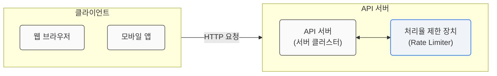

또한 아래와 같이 처리율 제한 장치를 API 서버에 두는 대신, 처리율 제한 미들웨어(middleware)를 만들어 해당 미들웨어로 하여금 API 서버로 가는 요청을 통제한다.

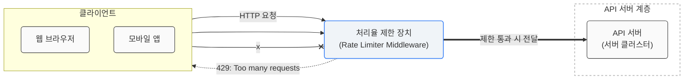

위 상황은 초당 2개의 요청으로 제한된 상황에서 클라이언트가 3번째 요청을 앞의 두 요청과 같은 초 범위 내에 전송 경우이다. 앞선 두 요청은 API 서버로 전송이 되지만 세 번째 요청은 처리율 제한 미들웨어에 막혀서 클라이언트로 HTTP 상태코드 429(Too many requests)가 반환된다.

> <b>클라우드 마이크로서비스</b>
> 
> 처리율 제한 장치를 보통 API Gateway(처리율 제한, SSL 종단(termination), 사용자 인증(authentication), IP 허용 목록(whitelist) 관리 등을 지원하는 완전 위탁관리형 서비스(클라우드 업체))에 구현. 

고려 사항

- 프로그래밍 언어, 캐시 서비스 등 현재 사용하고 있는 기술스택이 서버에서 처리율 제한을 구현할 정도로 효율이 좋은지 확인해야 한다.
- 처리율 제한 알고리즘을 정하고, 제 3사업자가 제공하는 게이트웨이가 해당 알고리즘을 지원하는지 확인해야한다. 서버측에서 모든걸 구현하기로 했다면 알고리즘은 자유롭게 선택할 수 있다.

> 처리율 제한 서비스를 직접 만드는 데는 시간이 많이 들기 때문에 충분한 인력이 없다면 상용 API 게이트웨이를 사용하는 것이 바람직하다.

### 처리율 제한 알고리즘

#### 토큰 버킷(token bucket) 알고리즘

토큰 버킷 알고리즘은 처리율 제한에 폭넓게 이용되고 있으며, 아마존과 스트라이프가 API 요청을 통제하기 위해 이 알고리즘을 사용한다.

동작 원리는 다음과 같다.

토큰 버킷은 지정된 용량을 갖는 컨테이너이며, 이 버킷에는 사전 설정된 양의 토큰이 주기적으로 채워진다. 토큰이 꽉 찬 버킷에는 더 이상 토큰이 채워지지 않는다.

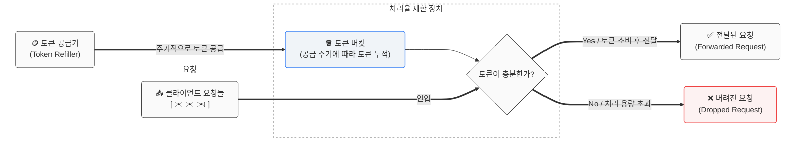

예를 들어 용량이 4인 버킷일 때, 토큰 공급기(refiller)는 이 버킷에 매초 2개의 토큰을 추가한다. 버킷이 가득 차면 추가로 공급된 토큰은 버려진다(overflow).

각 요청은 처리될 때마다 하나의 토큰을 사용한다. 요청이 도착하면 버킷에 충분한 토큰이 있는지 검사하고, 토큰이 충분하면 버킷에서 토큰 하나를 꺼낸 후 요청을 시스템에 전달하고, 충분한 토큰이 없으면 해당 요청은 버려진다(dropped).

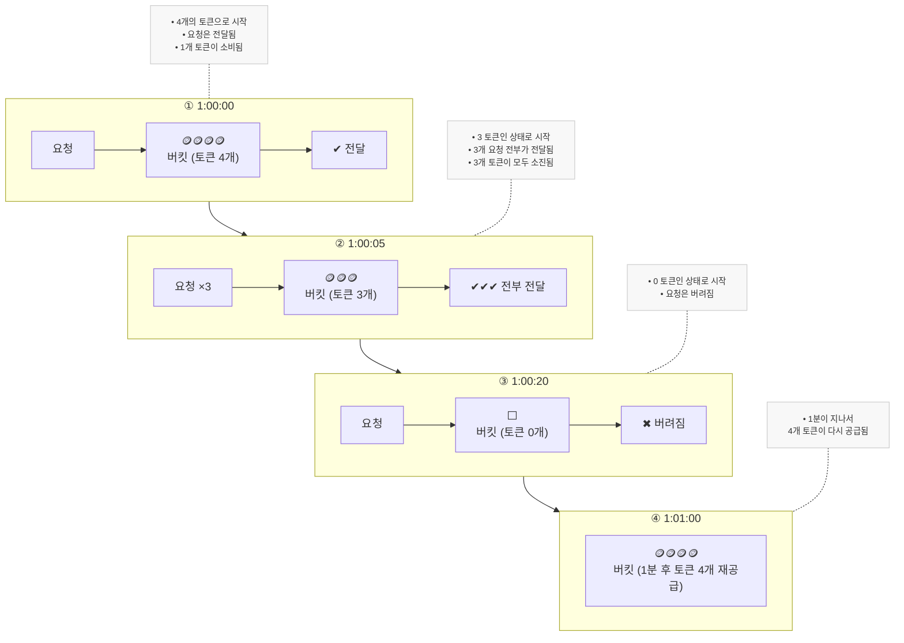

위 예시의 토큰 버킷의 크기는 4이고, 토큰 공급률(refill rate)은 분당 4이다.
이 토큰 버킷 알고리즘은 2개의 인자(parameter)를 받는다.

- 버킷 크기: 버킷에 담을 수 있는 토큰의 최대 개수
- 토큰 공급률(refill rate): 초당 몇 개의 토큰이 비킷에 공급되는가

이 때, 비킷을 몇 개나 사용해야 하는지는 공급 제한 규칙에 따라 달라진다.

- 통상적으로, API 엔드포인트마다 별도의 버킷을 둔다. 사용자마자 하루에 한 번 포스팅을 할 수 있고, 하루에 한 번 댓글을 달 수 있고, 150명의 친구를 추가할 수 있다고 하면 사용자마다 3개의 버킷을 두어야할 것이다.(포스팅API, 댓글API, 친구추가API)
- IP 주소별로 처리율을 제한해야 한다면 IP 주소마다 하나의 버킷을 둬야할 것이다.
- 시스템 처리율을 초당 10,000개 요청으로 제한하고 싶다면, 모든 요청이 하나의 버킷을 공유해야 할 것이다.

장점으로는 구현이 쉽고, 메모리 사용 측면에서 효율적이며, 짧은 시간에 집중되는 트래픽도 처리가 가능하다. 단점으로는 버킷 크기와 토큰 공급률을 적절하게 튜닝하는 것이 까다로운 일이 된다.

#### 누출 버킷(leaky bucket) 알고리즘 

누출 버킷 알고리즘은 토큰 버킷 알고리즘과 비슷하지만 <b>요청 처리율이 고정</b>되어 있다는 점이 다르다. 보통 FIFO(First-In-First-Out) 큐로 구현한다. 동작 원리는 다음과 같다.

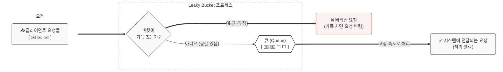

1. 요청이 도착하면 큐가 가득 차 있는지 확인하고, 빈 자리가 있는 경우에는 요청을 추가한다.
2. 큐가 가득 차 있는 경우에는 새 요청은 버린다.
3. 지정된 시간마다 큐에서 요청을 꺼내어 처리한다.

누출 버킷 알고리즘은 다음의 두 인자를 사용한다.

- 버킷 크기: 큐 사이즈와 같은 값. 큐에는 처리될 항목들을 보관
- 처리율(outflow rate): 지정된 시간당 몇 개의 항목을 처리할지 지정하는 값.(보통 초 단위로 표현)

큐의 크기가 제한되어 있어 메모리 사용량 측면에서 효율적이며, 고정된 처리율을 갖고 있기 때문에 안정적 출력(stable outflow rate)이 필요한 경우에 적합하다. 단, 단시간에 많은 트래픽이 몰리는 경우, 큐에는 오래된 요청이 쌓이게 되고, 그 요청들이 제때 처리 못하면 최신 요청들은 버려지게 된다. 또한, 두 개의 인자를 갖고 있는데, 이들을 올바르게 튜닝하기 어려울 수 있다.

#### 고정 윈도우 카운터 (fixed window counter) 알고리즘

고정 윈도우 카운터 알고리즘은 정해진 시간 단위(윈도우)마다 처리할 수 있는 최대 요청 수를 제한하는 처리율 제한(Rate Limiting) 알고리즘이다. 동작 원리는 다음과 같다.

1. 타임라인(timeline)을 고정된 간격의 윈도우(window)로 나누고, 각 윈도우마다 카운터(counter)를 붙인다.
2. 요청이 접수될 때마다 이 카운터의 값은 1씩 증가한다.
3. 이 카운터의 값이 사전에 설정된 임계치(threshold)에 도달하면 새로운 요청은 새 윈도우가 열릴 때까지 버려진다.

```mermaid
gantt
    title [고정 윈도우 카운터] 시간대별 트래픽 처리 현황 (초당 제한: 3개)
    dateFormat  ss
    axisFormat  1:00:%S
    tickInterval 1s

    %% ========================================================
    %% 💡 처음 보는 분을 위한 가이드:
    %% :active = 시스템이 허용한 정상 요청 (최대 3개까지만 파란색으로 표시)
    %% :crit   = 임계치를 초과하여 버려진 요청 (초과분이 빨간색으로 표시)
    %% ========================================================

    section 총 3개 인입
    정상 통과 (3개 허용)       :active,  p0, 00, 01s

    section 총 6개 인입 (폭발)
    정상 통과 (3개 한도)       :active,  p1, 01, 02s
    초과분 폐기 (3개 버림)     :crit,    d1, 01, 02s

    section 총 4개 인입
    정상 통과 (3개 한도)       :active,  p2, 02, 03s
    초과분 폐기 (1개 버림)     :crit,    d2, 02, 03s

    section 총 2개 인입 (여유)
    정상 통과 (2개 허용)       :active,  p3, 03, 04s

    section 총 5개 인입
    정상 통과 (3개 한도)       :active,  p4, 04, 05s
    초과분 폐기 (2개 버림)     :crit,    d4, 04, 05s
```

위 예제에서 타임라인의 시간 단위는 1초다. 시스템은 초당 3개까지의 요청만을 허용한다. 매초마다 열리는 윈도우에 3개 이상의 요청이 밀려오면 초과분은 버려진다. 위 차트에서는 1:00:01에 3개, 1:00:02에 1개, 1:00:04에 2개가 버려진다.

<b>문제점</b>

이 알고리즘의 가장 큰 문제는 윈도우의 경계 부근에 순간적으로 많은 트래픽이 집중되는 경우, 윈도우에 할당된 양보다 더 많은 요청이 처리될 수 있다는 것이다.

```mermaid
flowchart LR
    %% 1. 눈이 편하고 직관적인 디자인 시스템 세팅
    classDef timeStyle fill:#ffffff,stroke:#333,stroke-width:1px,rx:3,ry:3;
    classDef normal fill:#f5f5f5,stroke:#aaa,stroke-width:1px,rx:5,ry:5;
    classDef burst fill:#fdf2f2,stroke:#ef4444,stroke-width:2px,rx:5,ry:5;
    classDef warning fill:#fffde7,stroke:#fbc02d,stroke-width:1.5px,rx:5,ry:5;

    %% 2. 가로 타임라인 축 배치 (2:00:00 -> 2:01:00 -> 2:02:00)
    Time00["⏰ 2시 00분 00초"]:::timeStyle
    Time01["⏰ 2시 01분 00초 <br>(윈도우 경계선)"]:::timeStyle
    Time02["⏰ 2시 02분 00초"]:::timeStyle

    %% 3. 시간대별 실제 트래픽 발생 상태 가로 나열
    Request1["앞단 30초<br>⬜ 요청 0개"]:::normal
    Request2["뒷단 30초<br>🚨 요청 5개 몰림"]:::burst
    Request3["앞단 30초<br>🚨 요청 5개 몰림"]:::burst
    Request4["뒷단 30초<br>⬜ 요청 0개"]:::normal

    %% --- 타임라인 연결 흐름 ---
    Time00 ---> Request1 ---> Request2 ---> Time01 ---> Request3 ---> Request4 ---> Time02

    %% 4. 대형 과부하 구간 시각화 (가장 헷갈리던 '그 1분'을 통째로 묶음)
    subgraph DangerZone ["⚠️ 2시 00분 30초 ~ 2시 01분 30초 (실제 흘러간 1분 동안)"]
        direction LR
        Request2
        Time01
        Request3
        
        Overload["🔥 총 10개 처리됨! <br>(1분 한도인 5개를 초과하여 서버 마비)"]:::warning
    end
    style DangerZone fill:#fffdf7,stroke:#ef4444,stroke-width:1.5px,stroke-dasharray: 5 5;

    %% 위험 구간과 경고 메세지 연결
    Request2 & Request3 -.-> Overload
```

위 예시는 분당 최대 5개의 요청만을 허용하는 시스템이며, 카운터는 매분마다 초기화된다.
2:00:00 ~ 2:01:00에 5개의 요청이 들어왔고, 2:01:00 ~ 2:02:00에 5개의 요청이 들어왔다.
윈도우를 옮겨서 2:00:30 ~ 2:01:30에 들어온 요청을 보면 1분동안 시스템이 처리한 요청은 10개로 허용 한도의 2배이다.

이렇게 고정 윈도우 카운터 알고리즘은 메모리 효율이 좋고, 이해하기 쉬우며, 윈도우가 닫히는 시점에 카운터를 초기화하는 방식으로 특정한 트래픽 패턴을 처리하는데에 적합하다.

하지만, 위 예시와 같이 윈도우 경계 부근에서 일시적으로 많은 트래픽이 몰리는 경우, 기대했던 시스템 처리 한도보다 많은 양의 요청을 처리하게 되는 문제가 있다.

#### 이동 윈도우 로그 (sliding window log) 알고리즘

이동 윈도우 로그 알고리즘은 고정 윈도우 카운터 알고리즘의 문제점을 해결한 알고리즘이다. 이 알고리즘의 요청은 타임스탬프(timestamp)를 추격하며, 타임스탬프 데이터는 보통 Redis의 정렬 집합(sorted set) 같은 캐시에 보관한다. 동작 원리는 다음과 같다.

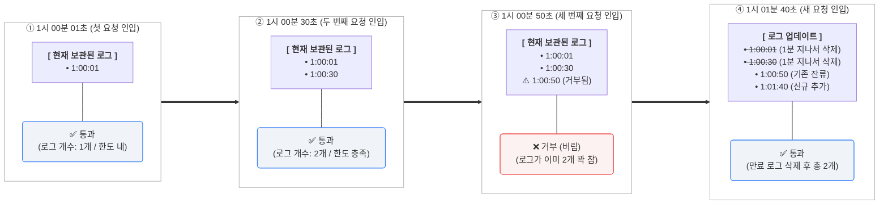

1. 새 요청이 오면 만료된 타임스템프는 제거한다. (만료된 타임스탬프: 그 값이 현재 윈도우의 시작 시점보다 오래된 타임스탬프)
2. 새 요청의 타임스탬프를 로그(log)에 추가한다.
3. 로그의 크기가 허용치보다 같거나 작으면 요청을 시스템에 전달하고, 그렇지 않은 경우에는 처리를 거부한다.

위 예제의 처리율 제한기는 분당 최대 2회의 요청만을 처리되도록 설정되었다.

1. 요청이 1:00:01에 도착했을 때, 로그는 비어있는 상태 → 요청 허용
2. 새로운 요청이 1:00:30에 도착 → 해당 타임스탬프가 로그에 추가. 추가된 직후의 로그의 크기 = 2 <= 허용 한도(2) → 요청 허용
3. 새로운 요청이 1:00:50에 도착 → 해당 타임스탬프가 로그에 추가. 추가된 직후의 로그의 크기 = 3 > 허용 한도(2) → 요청 거부
4. 새로운 요청이 2:01:40에 도착 → 1:01:40 이전의 타임스탬프 만료. 해당 타임스탬프 로그에 추가 → 추가된 직후의 로그의 크기 = 3+1-2 = 2 <= 허용 한도(2) → 요청 허용 

이 알고리즘의 처리율 제한 메커니즘은 어느 순간의 윈도우를 보더라도, 허용되는 요청의 개수는 시스템의 처리한도를 넘지 않는다.
단, 거부된 요청의 타임스탬프도 보관하기 때문에 다량의 메모리를 사용하게 된다.

#### 이동 윈도우 카운터 (sliding window counter) 알고리즘

이동 윈도우 카운터 알고리즘은 고정 윈도우 카운터 알고리즘과 이동 윈도우 로깅 알고리즘을 결합한 것이다.
이 알고리즘을 구현하는 데는 두 가지 접근법이 있다. 다음은 알고리즘의 동작 원리를 보여준다.

<b>가중치 기반 이동 윈도우 카운터 (Sliding Window Counter)</b>

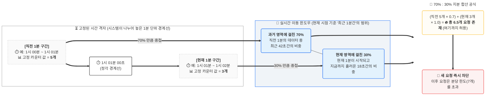

처리율 제한 장치의 한도가 분당 7개의 요청으로 설정되었고, 이전 1분동안 5개의 요청이, 현재 1분동안 3개의 요청이 왔다. 현재 1분의 30% 시점에 도착한 새 요청의 경우, 현재 윈도우에 몇 개의 요청이 온 것으로 보고 처리해야 할까?

> 현재 윈도우에 들어있는 요청 = 직전 1분간의 요청 수 x 이동 윈도우와 직전 1분이 겹치는 비율 + 현재 1분간의 요청 수 = 5 x 70% + 3 = 6.5개 (반올림, 내림 모두 가능)

처리율 제한 한도가 분당 7개 요청이므로, 현재 1분의 30% 시점에 도착한 신규 요청은 시스템으로 전달될 것이다. 단, 그 직후에는 한도에 도달하므로 더 이상 요청을 받을 수 없을 것이다.

해당 방식은 이전 시간대의 평균 처리율에 따라 현재 윈도우의 상태를 계산하므로 짧은 시간에 몰리는 트래픽에도 잘 대응하며, 메모리 효율이 좋다. 단, 직전 시간대에 도착한 요청이 균등하게 분포되어 있다고 가정한 상태에서 추정치를 계산하기 때문에 다소 느슨하다.

<b>하위 윈도우/버킷 세분화 방식 (Window/Bucket Granularity)</b>

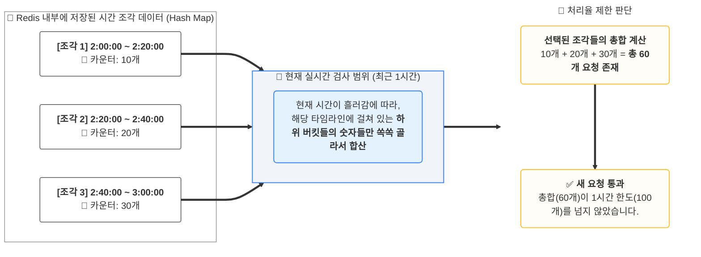

처리율 제한 장치의 한도가 시간당 100개의 요청으로 설정되었고, 1시간을 20분 단위의 하위 버킷 3개 조각으로 쪼개서 관리한다. 최근 1시간(이동 윈도우) 범위 안에 걸쳐 있는 3개 시간 조각들의 카운터 값을 확인해 보니 각각 10개, 20개, 30개가 들어있다. 이 시점에 도착한 새 요청의 경우, 현재 윈도우에 몇 개의 요청이 온 것으로 보고 처리해야 할까?

> 현재 윈도우에 들어있는 요청 = 최근 1시간 범위 내에 포함된 모든 하위 버킷의 요청 수 총합 = 10 + 20 + 30 = 총 60개 요청

처리율 제한 한도가 시간당 100개 요청이므로, 현재 범위 내의 요청 수 총합(60개)은 임계치를 넘지 않은 상태이다. 따라서 이 시점에 도착한 신규 요청은 시스템으로 안전하게 전달될 것이다. 단, 이후 트래픽이 지속해서 유입되어 각 하위 버킷 카운터의 총합이 100개에 도달하면 그 즉시 요청이 차단되기 시작할 것이다.

### 개략적인 아키텍처

<b>얼마나 많은 요청이 접수되었는지를 추적할 수 있는 카운터의 위치</b>

데이터베이스는 디스크 접근 때문에 느려서 사용하면 안되기에 메모리상에서 동작하는 캐시가 빠르고, 시간에 기반한 만료 정책을 지원하기에 적합하다.

> Redis → 처리율 제한 장치를 구현할 때 자주 사용되는 메모리 기반 저장장치 
>
> - INCR: 메모리에 저장된 카운터의 값을 1만큼 증가시킨다.
> - EXPIRE: 카운터에 타임아웃 값을 설정한다. 설정된 시간이 지나면 카운터는 자동으로 삭제된다.

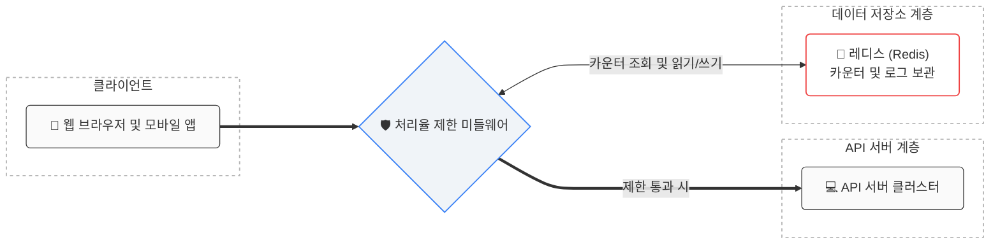

위 도식은 처리율 제한 장치의 개략적 구조이며, 동작 원리는 다음과 같다.

1. 클라이언트가 처리율 제한 미들웨어(rate limiting middleware)에게 요청을 보낸다.
2. 처리율 제한 미들웨어는 Redis의 지정 버킷에서 카운터를 가져와서 한도에 도달했는지의 여부를 검사한다.
   1. 한도에 도달한 경우: 요청 거부
   2. 한도에 도달하지 않은 경우: 요청은 API 서버로 전달되고, 미들웨어는 카운터 값을 증가시킨후 다시 Redis에 저장한다.

## 3단계. 상세 설계

### 처리율 제한 규칙

Lyft는 처리율 제한에 오픈소스를 사용하고 있다. [Envoy Proxy](https://github.com/envoyproxy/ratelimit)와 함께 사용하면 분산 환경에서도 중앙 집중형으로 요청 제한을 관리할 수 있다.

### 처리율 한도 초과 트래픽의 처리

어떤 요청이 한도 제한에 걸리면 API는 HTTP 429(Too many requests) 응답을 클라이언트에게 보낸다. 경우에 따라 한도 제한에 걸린 메시지를 나중에 처리하기 위해 큐에 보관할 수 있다. (Request, Delay, Backoff Queue)

#### 처리율 제한 장치가 사용하는 HTTP 헤더

클라이언트가 자신의 요청이 처리율 제한에 걸리고 있는지를(throttle) 확인하기 위해 쓰이는 HTTP 응답 헤더가 있다.

- X-Ratelimit-Remaining: window 내에 남은 처리 가능 요청의 수
- X-Ratelimit-Limit: window 마다 클라이언트가 전송할 수 있는 요청의 수
- X-Ratelimit-Retry-After: 한도 제한에 걸리지 않으려면 몇 초 뒤에 요청을 다시 보내야 하는지 알림

사용자가 너무 많은 요청을 보내면 429 too many requests 오류를 X-Ratelimit-Retry-After 헤더와 함께 반환하도록 한다.

### 상세 설계 도면

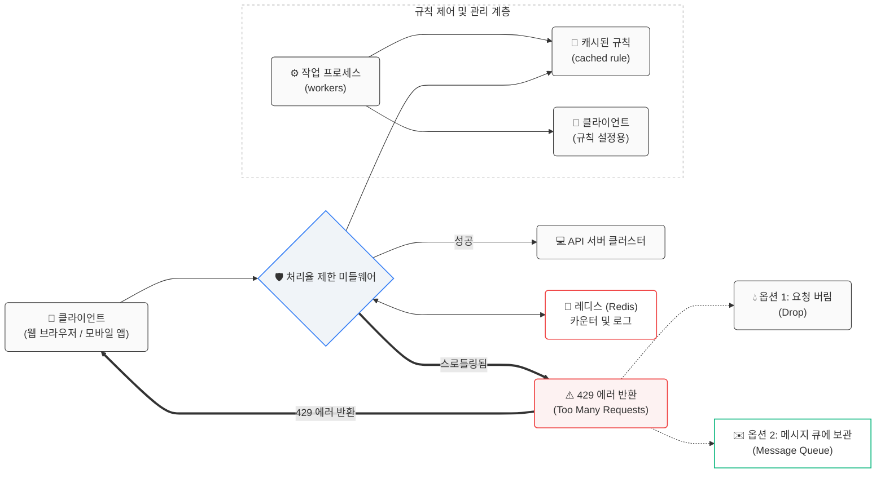

처리율 제한 규칙은 디스크에 보관한다. 작업 프로세스(workers)는 수시로 규칙을 디스크에서 읽어 캐시에 저장한다.

1. 클라이언트가 요청을 서버에 보내면 요청은 먼저 처리율 제한 미들웨어에 도달한다.
2. 처리율 제한 미들웨어는 제한 규칙을 캐시에서 가져온다. 아울러 카운터 및 마지막 요청의 timestamp를 Redis 캐시에서 가져온다. 가져온 값들에 근거하여 해당 미들웨어는 다음과 같은 결정을 내린다.
   1. 해당 요청이 처리율 제한에 걸리지 않은 경우: API 서버로 요청을 보낸다.
   2. 해당 요청이 처리율 제한에 걸린 경우: 옵션1) 요청을 버림. 옵션2) 메시지 큐에 보관

### 분산 환경에서의 처리율 제한 장치의 구현

처리율 제한 장치는 대략적으로 Redis에서 카운터의 값을 읽고(counter), counter+1의 값이 임계치를 넘는지 본 후, 넘지 않는다면 Redis에 보관된 conter의 값을 1만큼 증가시키는 방식으로 동작한다.

분산 환경에서는 아래 두 가지 상황을 고려해야 한다.

#### 경쟁 조건 (race condition)

병행성이 심한 환경에서는 경쟁 조건 이슈가 발생할 수 있다. 가장 쉬운 방법는 lock 이지만 lock은 시스템의 성능을 상당히 떨어뜨린다. 따라서 lock 대신 사용할 수 있는 방법으로 2가지가 있다.

- 루아 스크립트(Lua script): 여러 명령을 하나로 묶어 원자적(Atomic) 실행
  - 해결 방식: Redis는 싱글 스레드로 작동하므로, 루아 스크립트가 실행되는 동안 다른 요청이 중간에 끼어들 수 없다. 읽기-수정-쓰기 과정이 단 한 번에 처리되어 값이 꼬이지 않습니다.
- 정렬 집합(sorted set): 일단 타임스탬프를 다 저장한 후 범위 밖의 데이터 삭제
  - 해결 방식: 값을 먼저 검사하지 않고, 요청이 오면 무조건 현재 시간(타임스탬프)을 정렬 집합에 기록한다. 그 후 원자적 명령(ZREMRANGEBYSCORE)으로 1분 전의 낡은 데이터를 지운 뒤, 남은 개수만 세어서 허용 여부를 판단한다.

#### 동기화 (synchronization)

수백만 사용자를 지원하기 위해 처리율 제한 장치 서버를 여러 대 두게 되면 동기화가 필요해진다.
웹 계츠은 stateless 이므로 요청마다 각기 다른 처리율 제한 장치로 요청을 보낼 수 있다.

고정 세션(sticky session)을 사용하여 클라이언트로부터의 요청은 항상 같은 처리율 제한 장치로 보낼 수 있지만 규모면에서 확장 가능하지도 않고 유연하지도 않다. 이를 해결하기 위해 중앙 집중형 저장소를 활용할 수 있다.

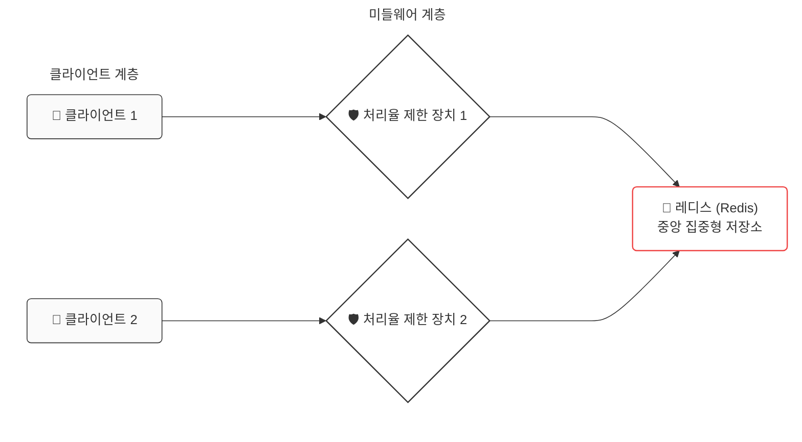

#### 성능 최적화

1. 여러 데이터센터를 지원하는 문제(데이터센터에서 멀리 떨어진 사용자를 지원하면서 지연시간(latency)이 증가) → 대부분의 클라우드 서비스 사업자는 세계 곳곳에 edge-server를 두고 있으며, 사용자의 트래픽을 가장 가까운 edge-server로 전달하여 지연시간을 줄인다.
2. 제한 장치 간에 데이터를 동기화 할 때, 최종 일관성 모델(eventual consistency model)을 사용 

#### 모니터링

모니터링은 채택된 처리율 제한 알고리즘이 효과적인지, 정의한 처리율 제한 규칙이 효과적인지 확인하기 위해 사용

## 마무리

- 경성(hard) 또는 연성(soft) 처리율 제한
  - 경성 처리율 제한: 요청 개수는 임계치를 절대 넘어설 수 없다.
  - 연성 처리율 제한: 요청 개수는 잠시 동안은 임계치를 넘어설 수 있다.
- 다양한 계층에서의 처리율 제한이 가능
- 처리율 제한을 회피하는 방법
  - 클라이언트 측 캐시를 사용하여 API 호출 횟수를 줄인다.
  - 처리율 제한의 임계치를 이해하고, 짧은 시간 동안 너무 많은 메시지를 보내지 않도록 한다.
  - 예외나 에러를 처리하는 코드를 도이바여 클라이언트가 예외적 상황으로부터 우아하게 복구될 수 있도록 한다.
  - 재시도(retry) 로직을 구현할 때는 충분한 백오프(back-off) 시간을 둔다.