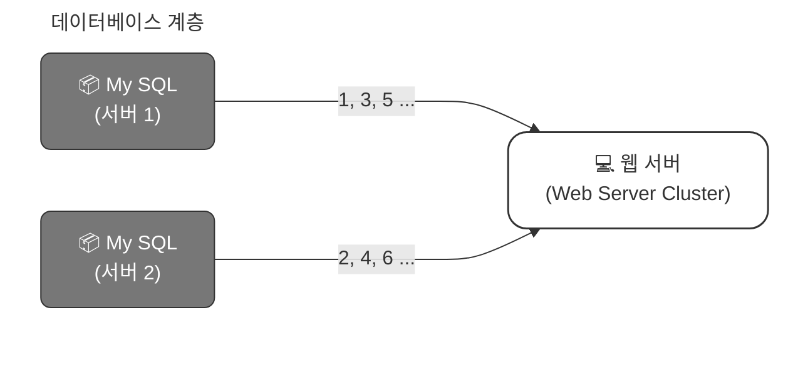
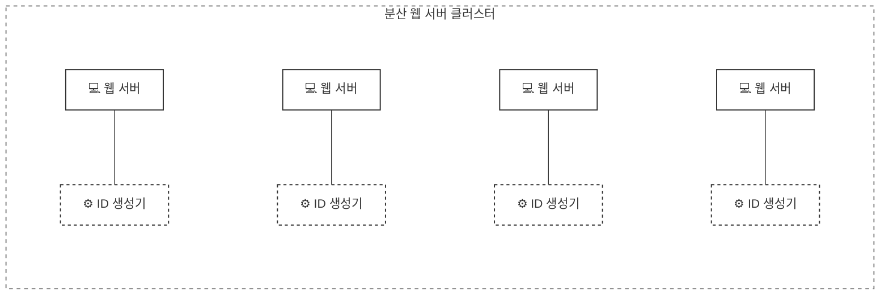
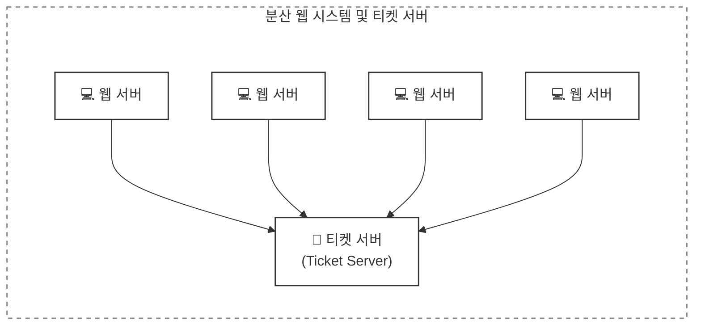
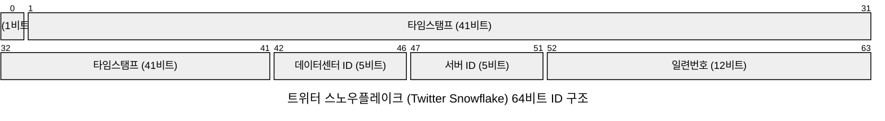
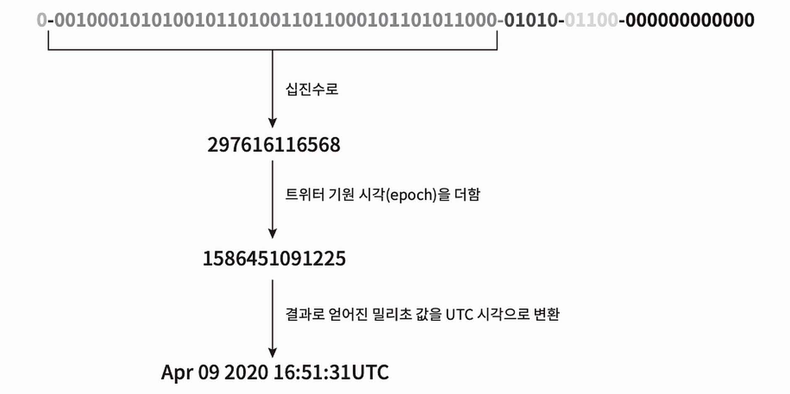

개인 프로젝트나 간단한 프로젝트처럼 단일 환경에서는 'auto_increment' 속성이 설정된 기본키를 사용하곤 했다. 하지만 분산 환경에서는 사용할 수 없는데, 데이터베이스 서버 한 대로는 그 요구를 감당할 수 없다. 여러 데이터베이스 서버를 사용하는 경우에는 지연 시간(delay)을 낮추기 어려울 것이고, 여러 서버가 동시에 'auto_increment' 값을 생성한다면 중복된 값이 발생할 수 있기 때문이다.

## 개략적 설계안

분산 시스템에서 유일성이 보장되는 ID를 만드는 방법으로 다음과 같은 선택지들이 있다.

- 다중 마스터 복제(multi-master replication)
- UUID(Universally Unique Identifier)
- 티켓 서버(ticket server)
- 트위터 스노플레이크(twitter snowflake) 접근법

### 다중 마스터 복제 (multi-master replication)

다중 마스터 복제는 데이터베이스의 auto_increment 기능을 활용하는 것인데, 다음 ID 값을 구할 때 1만큼 증가시켜 얻는 것이 아니라, k(현재 사용 중인 데이터베이스 서버의 수)만큼 증가시킨다.

위 예제를 보면, 어떤 서버가 만들어 낼 다음 ID는 해당 서버가 생성한 이전 ID 값에 전체 서버의 수 2를 더한 값이다. 데이터베이스 수를 늘리면 초당 생산 가능한 ID 수도 늘릴 수 있기 때문에 규모 확장성 문제를 어느 정도 해결할 수 있지만 다음과 같은 중대한 문제점이 존재한다.

- 여러 데이터 센터에 걸쳐 규모를 늘리기 어렵다.
- ID의 유일성은 보장되겠지만 그 값이 시간 흐름에 맞춰 커지도록 보장할 수는 없다.
- 서버를 추가하거나 삭제할 때도 잘 동작하도록 만들기 어렵다.

#### UUID (Universally Unique Identifier)

UUID는 유일성이 보장되는 ID를 만드는 간단한 방법이다.
UUID는 컴퓨터 시스템에 저장되는 정보를 유일하게 식별하기 위한 128비트의 고유 식별자이다.
UUID 값은 충돌 가능성이 지극히 낮은데 위키피디아를 인용하면 "중복 UUID가 1개 생길 확률을 50%로 끌어 올리려면 초당 10억 개의 UUID를 100년 동안 계속해서 만들어야 한다."고 한다.

UUID 값은 09c93e62-50b4-468d-bf8a-c07e1040bfb2 와 같은 형태이며, 서버 간 조율 없이 독립적으로 생성 가능하다. 다음은 UUID를 사용하는 시스템의 구조이다.

이 구조에서 각 웹 서버는 별도의 ID 생성기를 사용해 독립적으로 ID를 만들어낸다.

UUID를 만드는 것은 단순하며, 서버 사이의 조율이 필요없으므로 동기화 이슈도 없다. 또한, 각 서버가 자기가 사용할 ID를 알아서 만드는 구조이므로 규모 확장성도 쉽다.

단, ID가 128비트로 길고, 시간순으로 정렬할 수 없으며, 숫자(numeric)가 아닌 값이 포함될 수 있다는 단점이 있다.

### 티켓 서버 (ticket server)

티켓 서버는 유일성이 보장되는 ID를 만들어낸든 데 사용할 수 있는 또 하나의 방법이다.

플리커(Flickr)는 분산 기본 키(distributed primary key)를 만들어 내기 위해 티켓 서버 기술을 사용하고 있다.

티켓 서버의 핵심은 auto_increment 기능을 갖춘 데이터베이스 서버(티켓 서버)를 중앙 집중형으로 하나만 사용하는 것이다.

> #### [Ticket Servers: Distributed Unique Primary Keys on the Cheap](https://code.flickr.net/2010/02/08/ticket-servers-distributed-unique-primary-keys-on-the-cheap/)
>
> <b>1. 도입 배경</b>
> - 샤딩(Sharding)과 이중화: Flickr는 대용량 데이터를 처리하기 위해 여러 DB로 분산(샤딩)하고, Master-Master 복제 구조를 사용한다.
> - MySQL 자체 기능의 한계: DB가 물리적/논리적으로 쪼개져 있기 때문에, MySQL의 기본 기능인 auto-increment 만으로는 전체 DB 통틀어 중복되지 않는 고유 ID를 보장할 수 없다.
>
> <b>2. 다른 대안들을 제외한 이유</b>
> - GUID/UUID를 쓰지 않은 이유: GUID는 크기가 크고 MySQL에서 인덱싱 효율이 떨어진다. MySQL 성능을 유지하려면 인덱스를 메모리에 올릴 수 있어야 하는데 GUID는 불리하며, 순차적(Sequential)인 ID가 디버깅, 캐싱, 통계 측면에서 훨씬 유리하다.
> - 일반적인 중앙 집중형 테이블을 쓰지 않은 이유: 하나의 중앙 DB에 행을 계속 추가하며 ID를 발급하면 데이터가 너무 빠르게 쌓여 관리가 불가능해진다.
>
> <b>3. 티켓 서버의 동작 원리</b>
> Flickr는 데이터를 계속 쌓지 않고 하나의 행만 지속적으로 업데이트하면서 ID를 증가시키는 방법은 고안했다. 여기에는 MySQL의 비표준 확장 구문인 REPLACE INTO가 사용된다.
>
> - 동작 방식: REPLACE는 동일한 고유 키(stub)를 가진 데이터가 이미 존재하면 기존 행을 삭제하고 새 행을 삽입한다. 이 과정에서 auto_increment로 설정된 ID 값이 원자적(Atomic)으로 1씩 증가한다.
> - ID 발급 쿼리: REPLACE INTO Tickets64 (stub) VALUES ('a'); SELECT LAST_INSERT_ID(); (이 방법 사용 시, 테이블에는 항상 단 1개의 행만 유지되므로 용량 부담이 전혀 없다.)
>
> <b>4. SPOF 극복 및 고가용성 보장</b>
> 티켓 서버가 하나만 있으면, 그 서버가 다운될 때 서비스 전체가 ID를 발급하지 못하는 문제가 생기는데 Flickr는 이를 해결하기 위해 2대의 티켓 서버를 두고 홀수/짝수로 나누어 운영한다.
>
> - 서버1 (홀수 생성): auto-increment-increment = 2, auto-increment-offset = 1 → (1, 3, 5, ...)
> - 서버2 (짝수 생성): auto-increment-increment = 2, auto-increment-offset = 2 → (2, 4, 6, ...)
>
> 웹 서버들은 이 두 대의 티켓 서버에 라운드 로빈(Round-Robin) 방식으로 요청을 분산하여 한쪽 서버가 다운되더라도 다른 쪽 서버가 계속 ID를 발급할 수 있어 시스템이 멈추지 않도록 한다.(두 서버의 ID 생성 속도가 달라 약간의 차이가 발생할 수 있으나 시스템상 무해함)

유일성이 보장되는 오직 숫자로만 구성된 ID를 쉽게 만들 수 있고, 구현하기 쉬우며, 중소 규모 애플리케이션에 적합하다.

단, 티켓 서버가 SPOF(Single-Point-of-Failure)가 된다. 이 서버에 장애가 발생하면, 해당 서버를 이용하는 모든 시스템이 영향을 받는다. 이 이슈를 피하려면 티켓 서버를 여러 대 준비해야 하는데 그렇게 하면 데이터 동기화 같은 새로운 문제가 발생할 것이다.

### 트위터 스노플레이크 접근법

트위터는 스노플레이크(snowflake)라고 부르는 독창적인 ID 생성 기법을 사용한다.
아래는 스노플레이크를 통해 생성할 64비트 ID의 구조이다.

- 사인(sign) 비트: 1비트를 할당한다. 음수/양수 구분하는 데 사용할 수 있다.
- 타임스탬프(timestamp): 41비트를 할당한다. 기원 시각(epoch) 이후 몇 밀리초(millisecond)가 경과했는지를 나타내는 값이다.
- 데이터센터 ID: 5비트를 할당한다. → 2^5 = 32개의 데이터센터를 지원할 수 있다.
- 서버 ID: 5비트를 할당한다. → 데이터센터 당 32개의 서버를 사용할 수 있다.
- 일련번호: 12비트를 할당한다. 각 서버에서 ID를 생성할 때마다 일련번호를 1만큼 증가시킨다.

## 상세 설계

개략적 설계에서는 우리가 분산 시스템에서 사용할 수 있는 유일성 보장 ID 생성기를 설계하는 데 쓰일 수 있는 다양한 기술적 선택지를 살펴보았다. 그 가운데 트위터 스노플레이커 접근법을 사용하여 보다 상세한 설계를 진행해 보겠다.

### 타임스탬프

타임스탬프는 시간이 흐름에 따라 점점 큰 값을 갖게 되므로, ID는 시간순으로 정렬 가능하게 될 것이다.

위 그림은 ID 구조를 따르는 값의 이진 표현 형태로부터 UTC 시각을 추출하는 예제로, 이 방법을 역으로 적용하면 어떤 UTC 시각도 상술한 타임스탬프 값으로 변환할 수 있다.

41비트로 표현할 수 있는 타임스탬프의 최댓값은 2^{41} - 1 = 2199023255551 밀리초로, 이 값은 대략 69년에 해당한다. 따라서 이 ID 생성기는 69년 동안만 정상 동작하는데, 이 기간이 지나면 기원 시각을 바꾸거나 ID 체계를 다른 것으로 이전(migration) 하여야 한다.

### 일련번호

일련번호는 12비트이므로 2^{12} = 4096개의 값을 가질 수 있다. 어떤 서버가 같은 밀리초 동안 하나 이상의 ID를 만들어 낸 경우에만 0보다 큰 값을 갖게 된다.

## 추가 Etc

### 시계 동기화 (clock synchronization)

위에서 설계를 진행하면서 ID 생성 서버들이 전부 같은 시계를 사용한다고 가정했다. 하지만 이런 가정은 하나의 서버가 여러 코어에서 실행될 경우 유효하지 않을 수 있으며, 여러 서버가 물리적으로 독립된 여러 장비에서 실행되는 경우에도 마찬가지다.

NTP(Network Time Protocol)은 이 문제를 해결하는 가장 보편적인 수단이다.

### 각 절(section)의 길이 최적화

예를 들어 동시성(concurrency)이 낮고 수명이 긴 애플리케이션이라면 일련번호 절의 길이를 줄이고 타임스탬프 절의 길이를 늘리는 것이 효과적일 수도 있을 것이다.

[Network time protocol](https://en.wikipedia.org/wiki/Network_Time_Protocol)

### 고가용성 (high availability)

ID 생성기는 필수 불가결(mission critical) 컴포넌트이므로 아주 높은 가용성을 제공해야 할 것이다.