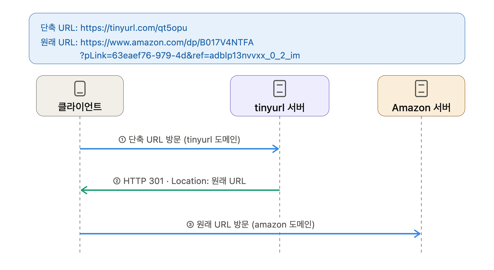
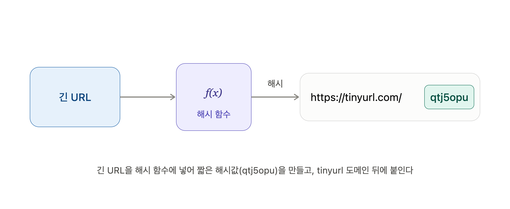
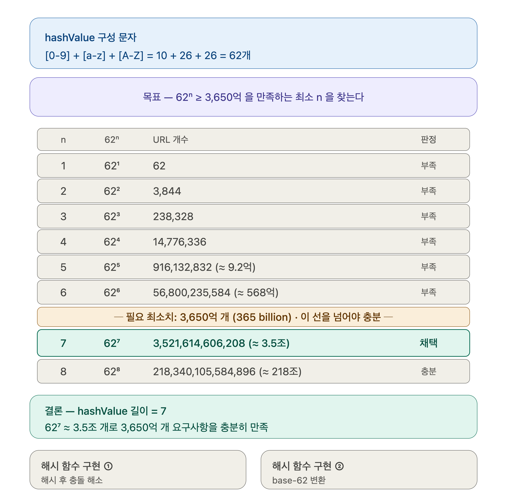
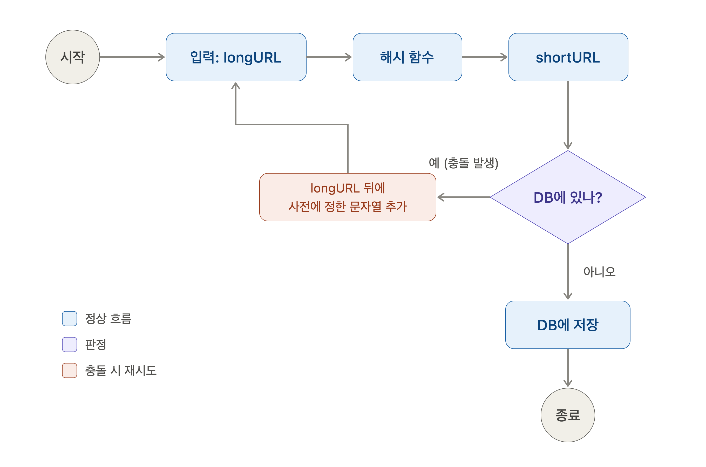
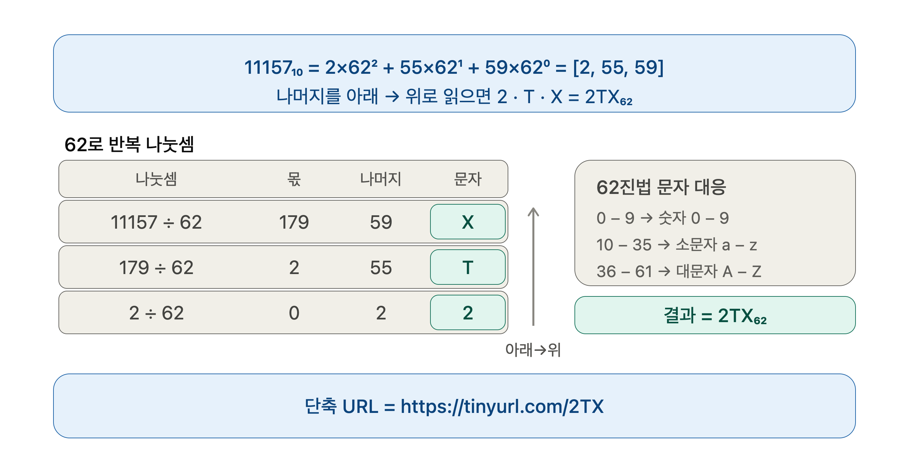
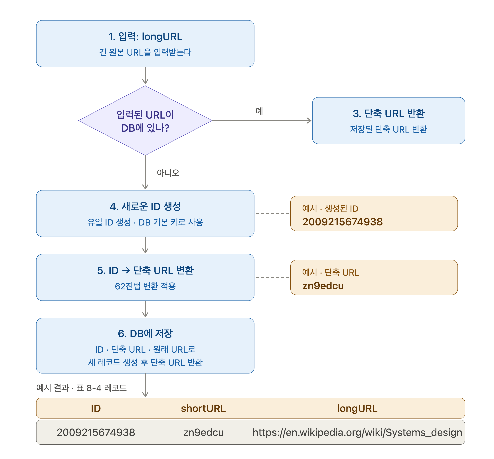
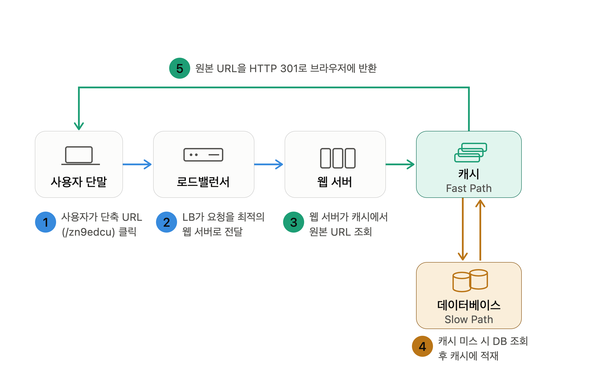

## 개략적 설계안

### API 엔드포인트

클라이언트는 서버가 제공하는 API 엔드포인트를 통해 서버와 통신한다. 이 글에선 엔드포인트를 REST 스타일로 설계할 것이다. URL 단축키는 기본적으로 두 개의 엔드포인트를 필요로 한다.

1. URL 단축용 엔드포인트

   새 단축 URL을 생성하고자 하는 클라이언트는 이 엔드포인트에 단축할 URL을 인자로 실어서 POST 요청을 보내야 한다. 이 엔드포인트는 다음과 같은 형태를 띤다.

   > POST /api/v1/data/shorten
   > - 인자: {longUrl: longURLstring}
   > - 반환: 단축 URL
2. URL Redirection 용 엔드포인트
   
   단축 URL에 대해서 HTTP 요청이 오면 원래 URL로 보내주기 위한 용도의 엔드포인트로 다음과 같은 형태를 띤다.

   > GET /api/v1/shortUrl
   > - 반환: HTTP Redirection 목적지가 될 원래 URL

### URL Redirection

단축 URL을 받은 서버는 그 URL을 원래 URL로 바꾸어서 301 응답의 Location 헤더에 넣어서 반환한다. 여기서 유의할 것은 301 응답과 302 응답의 차이이다.

- 301 Permanently Moved

    이 응답은 해당 URL에 대한 HTTP 요청의 처리 책임이 영구적으로 Location 헤더에 반환된 URL로 이전되었다는 응답이다. 영구적으로 이전되었으므로, 브라우저는 이 응답을 캐시(cache)한다. 따라서 추후 같은 단축 URL에 요청을 보낼 필요가 있을 때 브라우저는 캐시된 원래 URL로 요청을 보내게 된다.
- 302 Found
    
    이 응답은 주어진 URL로의 요청이 '일시적으로' Location 헤더가 지정하는 URL에 의해 처리되어야 한다는 응답이다. 따라서 클라이언트의 요청은 언제나 단축 URL 서버에 먼저 보내진 후에 원래 URL로 리디렉션 되어야 한다.

이 두 방법은 각기 다른 장단점을 가지고 있다. 

- 서버 부하를 줄이는 것이 중요한 경우: 301 Permanent Moved를 사용하는 것이 좋은데 첫 번째 요청만 단축 URL 서버로 전송될 것이기 때문이다.
- 트래픽 분석(analytics)이 중요한 경우: 302 Found를 사용하는 측이 클릭 발생률이나 발생 위치를 추적하는 데 좀 더 유리할 것이다.

URL 리디렉션을 구현하는 가장 직관적인 방법은 <b>해시 테이블</b>을 사용하는 것으로 해시 테이블에 <단축 URL, 원래 URL>의 쌍을 저장한다고 가정한다면, URL 리디렉션은 다음과 같이 구현될 수 있을 것이다.

- 원래 URL = hashTable.get(단축 URL)
- 301 or 302 응답 Location 헤더에 원래 URL을 넣은 후 전송

### URL 단축

단축 URL이 www.tinyurl.com/{hashValue} 같은 형태일 때, 중요한 것은 긴 URL을 이 해시 값으로 대응시킬 해시 함수 fx를 찾는 일이 될 것이다.

해시 함수는 다음 요구사항을 만족해야 한다.

- 입력으로 주어지는 긴 URL이 다른 값이면 해시 값도 달라야 한다.
- 계산된 해시 값은 원래 입력으로 주어졌던 긴 URL로 복원될 수 있어야 한다.

## 상세 설계

상세 설계에서는 보다 구체적인 설계를 진행하겠다.

### 데이터 모델

개략적 설계에서는 모든 정보를 해시 테이블에 두었지만 이 접근법은 초기 전략으로는 괜찮지만 메모리는 유한적이고 비싸기 때문에 실제 시스템에서 사용하기엔 부적합하다.

더 나은 방법은 <단축 URL, 원래 URL>의 순서쌍을 관계형 데이터베이스에 저장하는 것이다. 이 관계형 데이터베이스 테이블에는 id(PK), shortUrl, longUrl 세 개의 컬럼이 존재한다.(더 가질 수 있지만 중요한 컬럼만 추린 것)

### 해시 함수 (hash function)

#### 해시 값 길이

- hashValue(해시 함수가 계산하는 단축 URL 값)가 사용 가능한 문자의 개수 = 62
  - [0-9, a-z, A-Z]
- 62ⁿ이 필요치인 3,650억을 넘는 최소 n을 찾는 문제
- n=6은 약 568억으로 부족, n=7은 약 3.5조로 기준선을 넘어 채택 → 그래서 hashValue 길이는 7

#### 해시 후 충돌 해소

긴 URL을 줄이려면, 원래 URL을 7글자 문자열로 줄이는 해시 함수가 필요하다. 손쉬운 방법으로 다음과 같은 해시 함수들이 있으며, 이들 함수를 사용하여 <i>https://en/wikipedia.org/wiki/Systems_design</i>을 축약한 결과이다.

- CRC32 - 5cb54054
- MD5 - 5a62509a84df9ee03fe1230b9df8b84e
- SHA-1 - Oeeae7916c06853901d9ccbefbfcaf4de57ed85b

CRC32가 계산한 가장 짧은 해시값조차도 7보다는 길다. 따라서 이를 해결하기 위한 첫 번째 방법은 해시 값에서 처음 7개의 글자만 이용하는 것이다. 하지만 이렇게 하면 해시 결과가 서로 충돌할 확률이 높아지는데 이 문제를 해소하기 위해 아래 그림의 절차를 따른다.

1. longURL을 해시 함수로 돌려 앞 7글자로 shrotURL을 만듦
2. 그 값이 DB에 이미 있으면(충돌) longURL 뒤에 사전에 정한 문자열을 덧붙여 다시 해시 - 충돌이 없을 때까지 반복
3. 충돌이 없으면 DB에 저장하고 종료

이 방식은 충돌을 확실히 해소하지만, 단축 URL을 만들 때마다 최소 한 번은 DB 조회를 해야 해서 오버헤드가 크다. 그래서 DB 대신 [블룸 필터](https://en.wikipedia.org/wiki/Bloom_filter)(어떤 원소가 집합에 있는지 확률적으로 검사하는 공간 효율적 기법)로 존재 여부를 먼저 걸러내면 성능을 높일 수 있다.

#### base-62 변환

진법 변환(base conversion)은 URL 단축기를 구현할 때 흔히 사용되는 접근법 중 하나이다. 이 기법은 수의 표현 방식이 다른 두 시스템이 같은 수를 공유하여야 하는 경우 유용하다.

62진법을 사용하는 이유는 hashValue에 사용할 수 있는 문자(character) 개수가 62개이기 때문이며, base-62 변환은 아래와 같이 이루어진다.

- 10진수 11157을 62로 계속 나누면서 매번 나머지를 기록: 나머지 59, 55, 2
- 62진법 문자 대응 규칙(0–9는 숫자, 10–35는 a–z, 36–61은 A–Z)에 따라 59→X, 55→T, 2→2
- 나머지를 마지막 나눗셈부터(아래→위) 읽으면 2·T·X = 2TX₆₂, 따라서 단축 URL은 https://tinyurl.com/2TX

앞서 본 "해시 후 충돌 해소" 방식과 비교하면, base-62 변환은 유일 ID만 확보되면 DB 조회 없이 곧바로 짧은 URL을 만들 수 있어 충돌 검사 오버헤드가 없다는 게 큰 장점이다. 대신 ID 생성기(유일성 보장)가 별도로 필요하다는 트레이드오프가 있다.

### URL 단축기 상세 설계

URL 단축기는 시스템의 핵심 컴포넌트이므로, 그 처리 흐름이 논리적으로는 단순해야 하고 기능적으로는 언제나 동작하는 상태를 유지해야 한다. 그림에서는 처리 흐름을 정리한다.

처리 흐름을 예시와 함께 정리하면 다음과 같다.

1. longURL을 입력받아 DB에 이미 있는지 검사 — 있으면 저장된 단축 URL을 바로 반환(3번), 없으면 아래로 진행
2. 새 URL이므로 유일 ID를 생성(DB 기본 키로 사용) → 예시에선 2009215674938
3. 그 ID에 62진법 변환을 적용해 단축 URL 생성 → zn9edcu
4. ID·단축 URL·원래 URL을 한 레코드로 DB에 저장하고 단축 URL을 클라이언트에 반환 (표 8-4)

여기서 ID 생성기는 **전역적 유일성(globally unique)**을 보장해야 하는데, 고도로 분산된 환경에서 이런 생성기를 만드는 건 까다로운 문제이다. 이전의 7장에서 다룬 분산 ID 생성기(예: 스노플레이크 방식 등)를 이 용도로 재사용한다고 언급한 적이 있다.

### URL 리디렉션 상세 설계

그림은 URL 리디렉션(redirection) 메커니즘의 상세한 설계를 그리고 있다. 쓰기보다 읽기를 더 자주하는 시스템이라, <단축 URL, 원래 URL> 의 쌍을 캐시에 저장하여 성능을 높였다.

1. 요청은 사용자 단말 → 로드밸런서 → 웹 서버로 흐르고(①②)
2. 웹 서버는 캐시(Fast Path)를 먼저 조회(③) — 히트하면 그대로 반환
3. 캐시 미스일 때만 아래 데이터베이스(Slow Path)로 내려가 조회하고 그 결과를 캐시에 적재(④)
4. 최종적으로 원본 URL을 HTTP 301로 브라우저에 반환(⑤)

