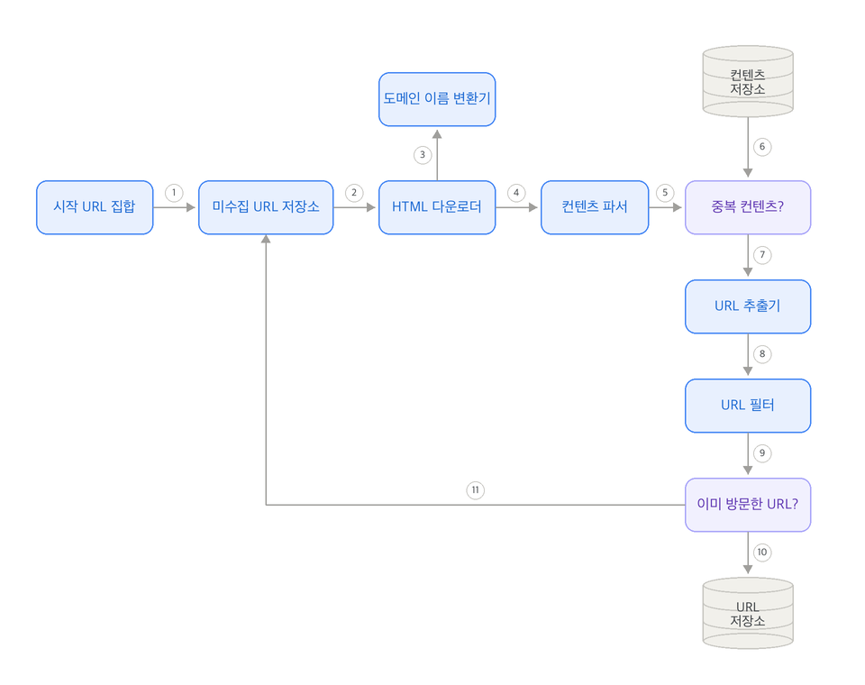
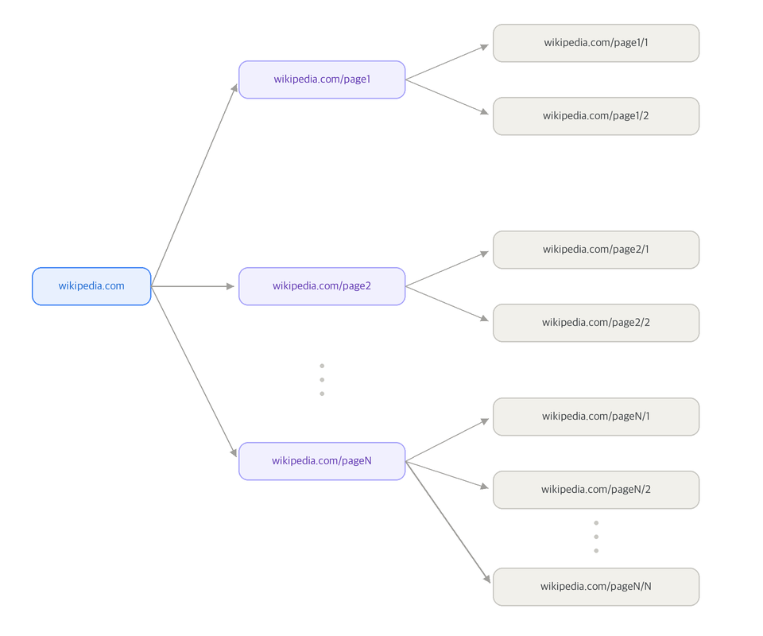
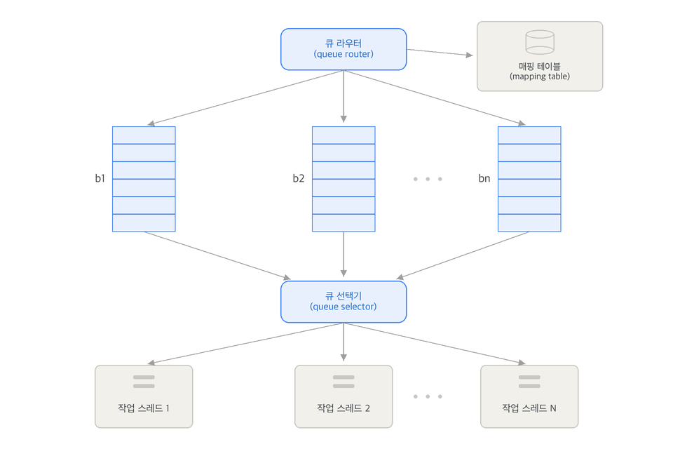
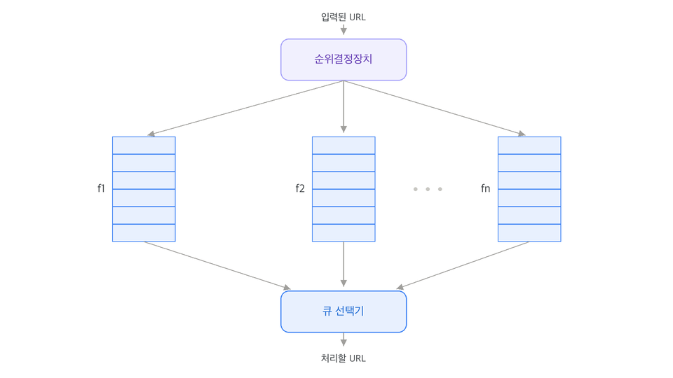
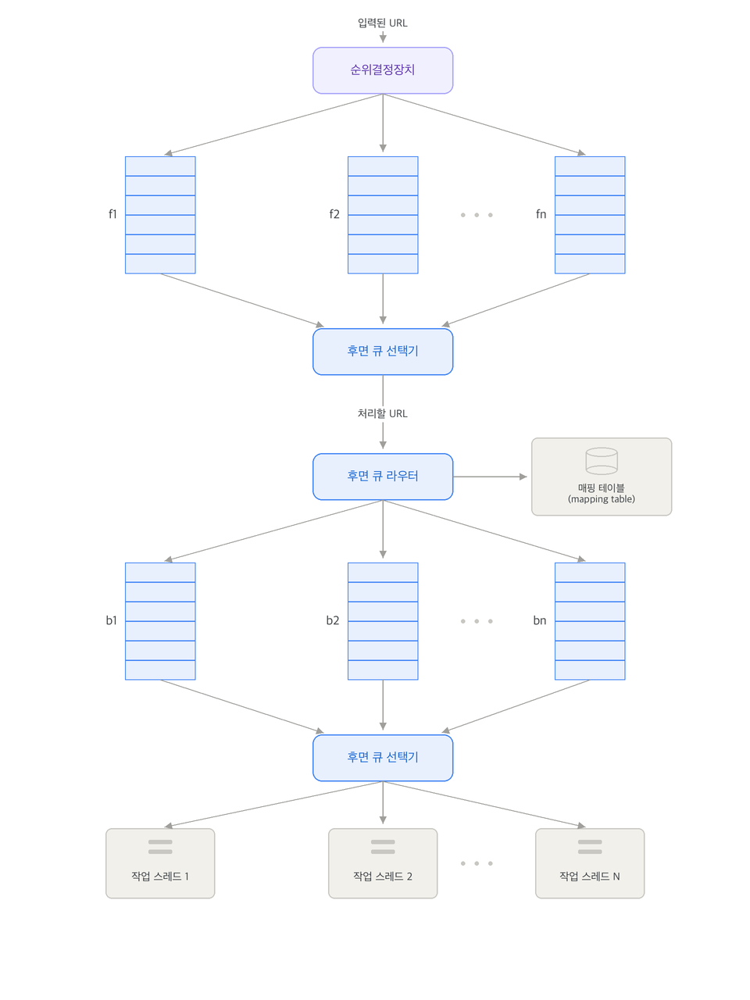
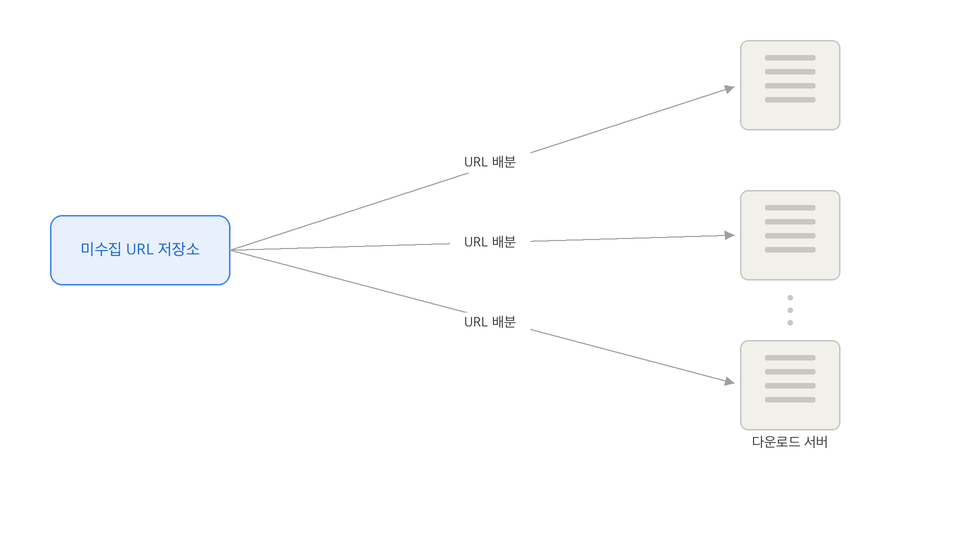
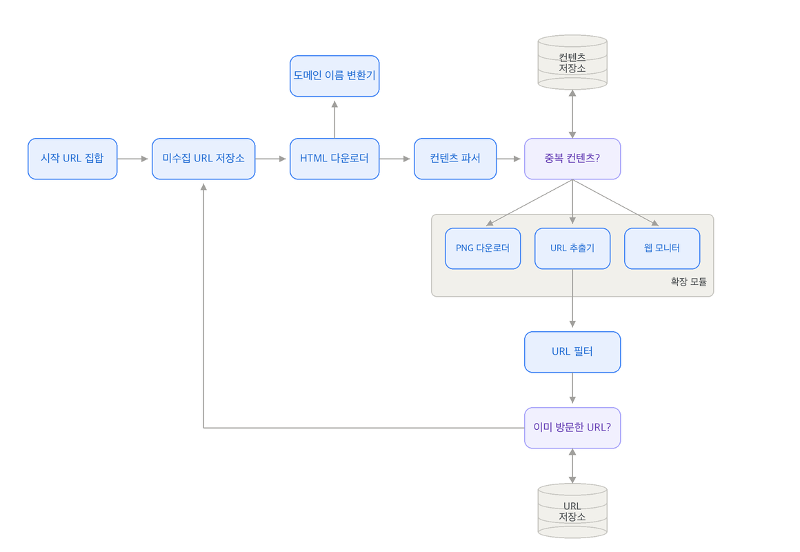

웹 크롤러(web crawler)는 로봇(robot)이나 스파이더(spider)라고도 부르며 검색 엔진에서 널리 사용되는 기술로, 웹에 새로 올라오거나 갱신된 콘텐츠(웹 페이지, 이미지, 비디오, 파일 등)를 찾아내는 것이 주된 목적이다. 웹 크롤러는 몇 개의 웹 페이지에서 시작하여 그 링크를 따라 나가면서 새로운 콘텐츠를 수집한다.

크롤링은 여러 목적으로 이용된다.

- 검색 엔진 인덱싱(search  engine indexing)
  - 크롤러의 가장 보편적인 용례로 웹 페이지를 모아 검색 엔진을 위한 로컬 인덱스(local index)를 만든다.
  - e.g. Googlebot
- 웹 아카이빙(web archiving)
  - 나중에 사용할 목적으로 장기보관하기 위해 웹에서 정보를 모으는 절차
  - 많은 국립 도서관이 크롤러를 돌려 웹 사이트를 아카이빙하고 있다.
  - e.g. 미국 국회 도서관(US Library of Congress), EU 웹 아카이브 
- 웹 마이닝(web mining)
- 웹 모니터링(web monitoring)

웹 크롤러의 기본 알고리즘은 다음과 같다.

1. URL 집합이 입력으로 주어지면, 해당 URL들이 가리키는 모든 웹 페이지를 다운로드한다.
2. 다운받은 웹 페이지에서 URL들을 추출한다.
3. 추출된 URL들을 다운로드할 URL 목록에 추가하고 위의 과정을 처음부터 반복한다.

하지만 웹 크롤러는 이처럼 단순하지 않으며, 엄청난 규보 확장성을 갖는 웹 크롤러를 설계하는 것은 엄청나게 어려운 작업이다.

다음은 좋은 웹 크롤러가 만족시켜야 하는 속성들이다.

- 규모 확장성
  - 오늘날 웹에는 수십억 개의 페이지가 존재하는데, 이를 하나씩 순서대로 조회하는 것은 비효율적
  - 병행성(paralleism)을 활용하는 것이 효과적
- 안정성(robustnes)
  - 잘못 작성된 HTML, 아무 반응이 없는 서버, 장애, 악성 코드가 붙어 있는 등의 환경이나 비정상적 입력에 잘 대응할 수 있어야 한다.
- 예절(politeness)
  - 수집 대상 웹 사이트에 짧은 시간동안 너무 많은 요청을 보내면 안된다.
- 확장성(extensibility)
  - 새로운 형태의 콘텐츠를 지원하기가 쉬워야 한다.

## 개략적 설계안

{width=70% align=center}

### 개략적 설계안의 주요 컴포넌트

#### 시작 URL 집합

웹 크롤러가 크롤링을 시작하는 출발점이다. 특정 대학 웹사이트처럼 범위가 좁다면 해당 대학 도메인의 모든 URL을 시작 URL로 쓸 수 있지만, 전체 웹을 크롤링해야 하는 경우에는 좀 더 창의적으로 시작 URL을 골라야 한다. 일반적으로는 전체 URL 공간을 작은 부분집합으로 나누는 전략을 쓴다. 나라별로 인기 있는 웹사이트가 다르다는 점에 착안하거나, 쇼핑, 스포츠, 건강 등 주제별로 세분화하여 각각 다른 시작 URL을 사용하는 식이다. 시작 URL로 무엇을 쓸지에 대한 완벽한 답안은 없으므로 설계의 의도를 정확히 전달하는 데 집중해야 한다.

#### 미수집 URL 저장소 (URL Frontier)

현대적인 웹 크롤러는 크롤링 상태를 '다운로드할 URL'과 '다운로드된 URL'의 두 가지로 나누어 관리한다. 이 중 '다운로드할 URL'을 저장 및 관리하는 컴포넌트를 미수집 URL 저장소라 부르며, 기본적으로 FIFO(First-In-First-Out) 큐(queue) 구조로 동작한다.

#### HTML 다운로더(Downloader)

인터넷에서 웹 페이지를 실제로 다운로드하는 컴포넌트다. 다운로드할 페이지의 URL은 미수집 URL 저장소로부터 제공받아 작업을 수행한다.

#### 도메인 이름 변환기 (DNS Resolver)

웹 페이지를 다운로드하기 위해 URL을 IP 주소로 변환하는 데 사용하는 컴포넌트이다. HTML 다운로더는 도메인 이름 변환기를 호출하여 URL에 매핑되는 IP 주소를 획득한다. (예: www.wikipedia.org ➔ 198.35.26.96)

#### 콘텐츠 파서 (Content Parser)

다운로드한 웹 페이지에 대해 파싱(parsing) 및 검증(validation) 절차를 수행하는 컴포넌트이다. 비정상적인 웹 페이지로 인한 저장 공간 낭비와 시스템 오류를 막기 위해 필요하며, 크롤링 속도 저하를 방지하기 위해 독립된 컴포넌트로 설계한다.

#### 중복 콘텐츠 판별 (Content Duplication)

연구 결과에 따르면 웹 콘텐츠의 약 29%가 중복이므로 시스템에 이미 저장된 콘텐츠인지 알아내는 판별 절차가 필요하다. 수십억 개의 HTML 문서를 문자열로 직접 비교하는 것은 느리고 비효율적이므로, 웹 페이지의 해시(Hash) 값을 비교하여 중복 여부를 효과적으로 판별한다.

#### 콘텐츠 저장소 (Content Storage)

HTML 문서를 보관하는 시스템이다. 저장 기술을 선택할 때는 데이터 유형, 크기, 접근 빈도, 유효 기간 등을 종합적으로 고려해야 한다. 데이터 양이 너무 많으므로 대부분의 콘텐츠는 디스크에 저장하고, 인기 있는 콘텐츠는 메모리에 두어 지연 시간(latency)을 줄이는 방식을 함께 사용한다.

#### URL 추출기 (Link Extractor)

HTML 페이지를 파싱하여 본문에 포함된 링크(URL)들을 수집하는 역할을 담당한다. 파싱 시 상대 경로(relative path)로 되어 있는 링크는 접두어를 붙여 절대 경로(absolute path) 링크로 일괄 변환하여 처리한다.

#### URL 필터

특정 콘텐츠 타입이나 파일 확장자, 접속 오류가 발생하는 URL, 접근 제외 목록(deny list)에 포함된 URL 등 크롤링 대상에서 배제할 URL을 걸러내는 역할을 수행한다.

#### 이미 방문한 URL 판별 및 URL 저장소

이미 방문한 URL이나 미수집 URL 저장소에 보관된 URL을 추적하여 같은 URL을 중복 처리하지 않도록 방지한다. 이를 통해 서버 부하를 줄이고 무한 루프 발생을 막는다. 주로 블룸 필터(Bloom Filter)나 해시 테이블(Hash Table)을 자료 구조로 활용하며, 수집이 완료된 URL은 URL 저장소에 보관한다.

### 웹 크롤러 작업 흐름

1. 시작 URL들을 미수집 URL 저장소에 저장한다.
2. HTML 다운로더가 미수집 URL 저장소에서 대상 URL 목록을 가져온다.
3. HTML 다운로더는 도메인 이름 변환기를 사용하여 URL의 IP 주소를 알아내고, 해당 IP 주소로 접속하여 웹 페이지를 다운로드한다.
4. 콘텐츠 파서가 다운로드된 HTML 페이지를 파싱하여 올바른 형식을 갖춘 웹 페이지인지 검증한다.
5. 파싱과 검증 단계가 끝나면 해당 콘텐츠가 이미 수집된 적이 있는 중복 콘텐츠인지 확인하는 절차를 시작한다.
6. 해당 페이지가 이미 콘텐츠 저장소에 있는지 대조하여 확인한다. 이미 저장소에 존재하는 콘텐츠인 경우에는 더 이상 처리하지 않고 버리며, 저장소에 없는 새로운 콘텐츠인 경우에는 저장소에 보관한 뒤 URL 추출기로 전달한다.
7. URL 추출기가 전달받은 HTML 페이지 내부에서 새로운 링크들을 골라낸다.
8. 추출하여 골라낸 링크들을 URL 필터로 전달한다.
9. 필터링을 거치고 남은 유효한 URL들만 중복 URL 판별 단계로 보낸다.
10. 이미 처리한 URL인지 확인하기 위해 URL 저장소에 보관된 URL 목록을 대조하며, 저장소에 이미 존재하는 URL은 그대로 버린다.
11. 저장소에 없는 새로운 URL은 URL 저장소에 기록하는 동시에 미수집 URL 저장소에도 전달하여 다음 크롤링 대상으로 등록한다.

## 상세 설계

### DFS(Depth-First Search) vs BFS(Breath-First Search)

웹은 페이지를 노드(node)로, 하이퍼링크(URL)를 에지(edge)로 하는 유향 그래프(directed graph)와 같다. 크롤링은 이 유향 그래프를 탐색하는 과정이며, 탐색에는 주로 깊이 우선 탐색(DFS)과 너비 우선 탐색(BFS)을 사용한다.

그래프 크기가 매우 큰 웹 환경에서는 DFS를 쓸 경우 탐색이 얼마나 깊숙이 진행될지 가늠하기 어려워 좋은 선택이 아니다. 이에 따라 웹 크롤러는 보통 FIFO(First-In-First-Out) 큐 구조를 활용하여 탐색할 URL을 관리하는 BFS를 사용한다. 하지만 일반적인 BFS 구현법은 다음과 같은 두 가지 문제점을 지닌다.

#### 동일 호스트 대상 요청 집중 (예의 없는 크롤러)

특정 웹 페이지에서 추출한 링크의 상당수는 동일한 호스트(서버)를 참조하는 내부 링크이다. 이 링크들을 한 번에 병렬로 처리하게 되면 대상 서버가 수많은 요청을 받게 되어 과부하에 걸리며, 이는 예의 없는(impolite) 크롤러로 간주된다.

{width=70% align=center}

#### 우선순위 부재

표준 BFS 알고리즘은 모든 URL을 동일한 중요도로 취급하여 공평하게 대우한다. 하지만 실제 웹 페이지의 가치와 품질은 서로 다르므로, 페이지 순위(Page Rank)나 사용자 트래픽 양, 업데이트 빈도 등을 고려하여 처리 우선순위를 차등적으로 적용해야 한다.

### 미수집 URL 저장소

미수집 URL 저장소는 다운로드할 URL을 보관하는 컴포넌트이며, 이를 통해 예의(politeness)를 갖춘 크롤러, 우선순위와 신선도(freshness)를 구별하는 크롤러를 구현할 수 있다.

#### 예의 (Politeness)

웹 크롤러는 수집 대상 서버에 단시간 동안 너무 많은 요청을 보내지 말아야 한다. 무계획적인 요청 집중은 DoS(Denial-of-Service) 공격으로 간주될 수 있으며, 대상 사이트를 마비시킬 수도 있다.

예의 바른 크롤러의 핵심 원칙은 동일한 웹 사이트(호스트)에 대해 한 번에 하나의 페이지만 요청하는 것이다. 이를 위해 호스트 이름과 다운로드를 수행하는 작업 스레드(worker thread) 사이의 관계를 맵핑하여 관리한다.

{width=70% align=center}

- 각 작업 스레드는 전용 FIFO 큐를 가지며, 해당 큐에서 꺼낸 URL만 다운로드한다.
- 큐 라우터는 같은 호스트에 속한 URL이 언제나 동일한 큐(b1, b2, ..., bn)로 들어가도록 보장한다.
- 매핑 테이블을 통해 호스트 이름과 각 큐의 관계를 기록하고 보관한다.
- 큐 선택기는 여러 큐를 순회하며 URL을 꺼내고, 이를 담당 작업 스레드에 배정한다.
- 작업 스레드는 할당된 URL을 순차적으로 다운로드하며, 작업 간에 일정한 지연 시간(delay)을 두고 실행한다.

#### 우선순위 (Priority)

웹 페이지의 중요도와 유용성은 페이지마다 서로 다르다. 이에 따라 크롤러는 중요도가 높은 페이지(예: 대형 포털이나 공식 웹사이트 홈)를 우선적으로 수집해야 한다.

우선순위를 결정할 때는 페이지랭크(PageRank), 트래픽 양, 갱신 빈도 등의 다양한 척도를 기준으로 삼는다.

{width=70% align=center}

- 순위결정장치(prioritizer)는 입력받은 URL의 우선순위를 계산한다.
- 계산된 우선순위별로 각각 전용 큐가 할당된다. 우선순위가 높을수록 해당 큐가 선택될 확률이 증가한다.
- 큐 선택기는 우선순위가 높은 큐에서 URL을 더 자주 꺼내도록 동작한다.

이러한 예의와 우선순위를 모두 반영한 설계는 전면 큐와 후면 큐의 두 가지 모듈로 나뉜다.

{width=70% align=center}

- 전면 큐 (Front Queue): 우선순위를 결정하고 관리하는 영역이다.
- 후면 큐 (Back Queue): 호스트별 큐 할당과 작업 스레드 배정을 통해 예의 바른 크롤링을 보장하는 영역이다.

#### 신선도 (Freshness)

웹 페이지는 지속적으로 추가, 삭제, 변경되므로 데이터의 신선함을 유지하려면 이미 다운로드한 페이지라도 주기적으로 재수집(recrawl)해야 한다. 하지만 모든 URL을 재수집하는 것은 비효율적이므로 다음과 같은 최적화 전략을 활용한다.

- 웹 페이지의 변경 이력(update history)을 기록하고 활용한다.
- 페이지의 중요도에 따른 우선순위를 반영하여 중요한 페이지는 더 자주 재수집한다.

#### 미수집 URL 저장소를 위한 지속성 저장장치

처리해야 할 URL의 수가 수억 개에 달하므로 모든 데이터를 메모리에 보관하는 방식은 확장성과 안정성 측면에서 불가능하다. 반면 전체를 디스크에만 저장하면 I/O 성능 저하로 병목 현상이 발생한다.

이 문제를 해결하기 위해 메모리와 디스크를 함께 쓰는 절충안(hybrid approach)을 채택한다. 대부분의 URL 정보는 디스크에 저장하여 안정성을 확보하고, I/O 비용을 줄이기 위해 메모리 버퍼에 큐를 두고 데이터를 관리한다. 메모리 버퍼의 데이터는 주기적으로 디스크에 기록(flush)한다.

### HTML 다운로더

HTML 다운로더는 HTTP 프로토콜을 사용해 웹 페이지를 다운로드하는 컴포넌트다.

#### 로봇 제외 프로토콜 (Robots.txt)

웹사이트가 크롤러와 소통하는 표준적인 방법으로, 크롤러가 수집해도 되는 페이지 목록을 정의한다. 크롤러는 웹 사이트를 크롤링하기 전에 해당 규칙을 반드시 확인해야 한다.

- 캐시 활용: 동일한 Robots.txt 파일을 반복해서 다운로드하는 오버헤드를 피하기 위해, 주기적으로 파일을 다운받아 캐시에 보관하고 활용한다.
- 예시 규칙: 구글봇(Googlebot)의 경우 /creatorhub/* 이나 /rss/people/*/reviews 등의 디렉터리 경로 수집이 금지(Disallow)되어 있음을 확인할 수 있다.

#### 성능 최적화 기법

HTML 다운로더의 성능을 극대화하기 위해 다음과 같은 네 가지 최적화 기법을 적용할 수 있다.

1. 분산 크롤링: 크롤링 작업을 여러 대의 서버에 분산하여 실행하고, 각 서버가 여러 스레드를 구동해 다운로드를 분할 처리하는 방법이다. URL 공간을 작은 단위로 쪼개어 각 서버가 담당 영역을 나누어 맡는다.
   {width=50% align=center}
2. DNS 결과 캐시: 도메인 이름 변환(DNS Resolver)은 동기적 특성 때문에 성능 병목의 원인이 된다. DNS 요청이 끝날 때까지 다른 스레드의 DNS 요청이 전부 블록(block)되기 때문이다. 이를 방지하기 위해 DNS 조회 결과를 캐시에 보관하고, 크론 잡(cron job) 등을 통해 주기적으로 갱신하여 활용한다.
3. 지역성 (Locality): 크롤링 서버를 크롤링 대상 서버와 지리적으로 가까운 지역에 분산 배치하여 페이지 다운로드 시간을 단축하는 방법이다. 이 지역성 전략은 크롤링 서버뿐만 아니라 캐시, 큐, 저장소 등 대부분의 핵심 컴포넌트에 유효하다.
4. 짧은 타임아웃: 응답이 매우 느리거나 응답하지 않는 서버 대기로 인해 크롤링이 지체되는 것을 방지하기 위해 최대 대기 시간(timeout)을 짧게 설정한다. 제한 시간 내에 응답이 없으면 다운로드를 중단하고 다음 페이지로 넘어간다.

#### 안정성 확보 기법

HTML 다운로더를 설계할 때는 시스템의 안전성과 무중단 운영을 보장하기 위해 다음과 같은 네 가지 요소를 고려해야 한다.

- 안정 해시 (Consistent Hashing): 다운로더 서버들에 부하를 고르게 분산하며, 서버의 추가 및 삭제가 매우 쉬운 환경을 제공한다.
- 크롤링 상태 및 수집 데이터 저장: 장애가 발생하는 경우에 대비하여 현재의 크롤링 상태 정보와 다운로드 완료된 데이터를 지속적 저장장치에 기록한다. 이를 통해 복구 이후 크롤링을 중단된 지점부터 신속하게 재시작할 수 있다.
- 예외 처리 (Exception Handling): 대규모 시스템 운영 중 예외 상황은 항상 발생할 수 있으므로, 에러 발생 시 전체 크롤링 프로세스가 멈추지 않고 시스템이 안정적으로 연쇄 동작을 지속할 수 있도록 우아하게 구현한다.
- 데이터 검증 (Data Validation): 다운로드한 콘텐츠 데이터의 이상 여부를 사전에 검사하여 발생 가능한 시스템 오류를 방지한다.

#### 확장성 설계

시스템이 향후 새로운 포맷의 데이터나 다양한 목적의 모듈을 쉽게 수용할 수 있도록 유연한 플러그인(Plug-in) 구조로 설계해야 한다.

{width=70% align=center}

- 본 아키텍처는 중복 콘텐츠 여부 판별 컴포넌트 이후에 확장 모듈들을 끼워 넣을 수 있는 구조를 제공한다.
- 대표적인 확장 사례로는 이미지 파일 수집을 위한 PNG 다운로더, 저작권 및 상표권 침해 여부를 감시하기 위한 웹 모니터 등을 유연하게 추가할 수 있다.

#### 문제 있는 콘텐츠 감지 및 회피 전략

크롤러 성능을 저하시키고 무한 루프를 발생시키는 비정상적이거나 가치 없는 콘텐츠를 가려내어 시스템을 보호해야 한다.

- 중복 콘텐츠: 웹 전체 콘텐츠 중 대략 30% 수준의 높은 비율을 차지한다. 중복 데이터를 피하기 위해 해시(Hash)나 체크섬(Checksum) 값을 구하여 기존 보관 자료와 비교해 중복을 탐지하고 차단한다.
- 거미 덫 (Spider Trap): 크롤러를 무한 루프에 빠뜨려 시스템을 마비시킬 목적으로 만들어진 웹 페이지이다. 기이할 정도로 많은 깊이의 디렉터리 경로(예: spidertrapexample.com/foo/bar/foo/...)를 포함한다.
  - URL의 최대 입력 길이를 제한하여 임시 조치가 가능하지만, 모든 종류의 덫을 피할 수 있는 만능 해결책은 없다.
  - 덫이 탐지되면 사람이 직접 확인한 후에 해당 사이트의 주소를 크롤러 탐색 대상에서 영구 제외하거나 URL 필터에 추가하여 대응한다.
- 데이터 노이즈: 웹 문서에 포함된 광고, 스크립트 코드, 스팸 URL 등 가치가 극히 낮거나 무의미한 콘텐츠는 시스템 리소스를 낭비하지 않도록 수집 과정에서 배제한다.