## 단일 서버

단일 서버 시스템이란, 모든 컴포넌트가 단 한 대의 서버에서 실행되는 간단한 시스템으로 웹, 앱, 데이터베이스, 캐시 등이 전부 서버 한 대에서 실행되는 구조를 말한다.

아래의 예시를 참고하면 사용자가 <i>api.mysite.com</i> 이라는 도메인 주소를 입력하여 사이트에 접근하고자 할 때, 웹 서버의 동작 과정(사용자의 요청이 처리되는 흐름)이다.

```mermaid
flowchart LR
    %% 1. 기존 디자인 시스템 스타일 세팅
    classDef layer fill:none,stroke:#b5b5b5,stroke-width:1.5px,stroke-dasharray: 4 4;
    classDef component fill:#fafafa,stroke:#333,stroke-width:1px,rx:5,ry:5;

    %% 2. 외부 계층 및 진입점
    DNS((DNS))

    %% 3. 사용자 단말 계층 (세로 정렬로 컴팩트하게 배치)
    subgraph Client [사용자 단말]
        direction TB
        Browser[웹 브라우저]:::component
        App[모바일 앱]:::component
    end
    class Client layer;

    %% 4. 백엔드 인프라 계층 (단일 웹 서버)
    subgraph WebLayer [웹 계층]
        direction TB
        Server["웹 서버"]:::component
    end
    class WebLayer layer;

    %% --- 데이터 흐름 연결 (번호 순서 및 라벨 반영) ---

    %% 1단계 & 2단계: DNS 조회 및 응답
    Client ---> |"① api.mysite.com"| DNS
    DNS ---> |"② 15.125.23.214"| Client

    %% 3단계 & 4단계: 웹 서버 요청 및 응답 (선 꼬임 방지를 위해 정돈)
    Client ---> |"③ 15.125.23.214<br>(HTTP Request)"| Server
    Server ---> |"④ HTML 페이지<br>(HTTP Response)"| Client
 ```

 1. 사용자는 도메인 이름(*api.mysite.com*) 을 이용해 웹사이트에 접속한다. DNS(Domain Name Service)를 통해 도메인 이름은 IP 주소로 변환되는 요청이 우선적으로 일어난다. (이때 DNS는 제 3 사업자, third party가 제공하는 유료 서비스를 이용하므로, 우리 시스템의 일부가 아니다.)
2. DNS의 결과로 IP 주소가 반환된다.
3. 해당 IP 주소로 HTTP 요청이 전달된다.
4. 요청 받은 웹 서버는 HTML 페이지나 JSON 형태의 응답을 반환한다.

## 데이터베이스

사용자가 늘어남에 따라 여러 서버를 두어야 한다. 아래와 같이 하나는 웹/모바일(클라이언트) 트래픽 처리 용도로, 다른 하나는 데이터베이스용으로 서버를 분산할 수 있고, 각각은 독립적으로 확장해 나갈 수 있게 된다.

```mermaid
flowchart LR
    %% 1. 기존 디자인 시스템 스타일 세팅
    classDef layer fill:none,stroke:#b5b5b5,stroke-width:1.5px,stroke-dasharray: 4 4;
    classDef component fill:#fafafa,stroke:#333,stroke-width:1px,rx:5,ry:5;

    %% 2. 외부 서비스 진입점
    DNS((DNS))

    %% 3. 사용자 단말 계층 (세로 정렬로 컴팩트하게 배치)
    subgraph Client [사용자 단말]
        direction TB
        Browser[웹 브라우저]:::component
        App[모바일 앱]:::component
    end
    class Client layer;

    %% 4. 백엔드 인프라 계층 (웹 서버 & 데이터베이스 수평 전개)
    subgraph WebLayer [웹 계층]
        direction TB
        Server["웹 서버"]:::component
    end
    class WebLayer layer;

    subgraph DBLayer [데이터 계층]
        direction TB
        DB[("데이터베이스")]:::component
    end
    class DBLayer layer;

    %% --- 데이터 흐름 연결 (좌 -> 우) ---

    %% 사용자 단말 <-> DNS 조회 및 응답
    Client ---> |"api.mysite.com"| DNS
    DNS ---> |"IP 주소"| Client

    %% 사용자 단말 -> 웹 서버 라우팅
    Browser ----> |www.mysite.com| Server
    App ----> |api.mysite.com| Server

    %% 웹 서버 -> 데이터베이스 트랜잭션 및 응답 (상호 작용 교차 정렬)
    Server ---> |"read / write / update"| DB
    DB ---> |"데이터 반환"| Server
```

### 어떤 데이터베이스를 사용할 것인가?

전통적인 관계형 데이터베이스(RDB)와 비-관계형 데이터베이스(NoSQL) 사이에서 시스템에 적절한 DB를 선택할 수 있다.

**RDBMS**는 MySQL, Oracle, PostgreSQL을 포함하며, 데이터 자료를 테이블과 열, 컬럼으로 표현한다. SQL을 이용해 여러 테이블에 있는 데이터를 관계에 따라 조인(join)하여 합칠 수 있고, insert, update, delete 문 등을 이용해 데이터를 생성 및 조작할 수 있다.

**NoSQL DBMS**로는 Amazon DynoDB, HBase 등이 있으며, NoSQL은 다시 크게 4가지 종류, 키-값 저장소(key-value store), 그래프 저장소(graph store), 칼럼 저장소(column store), 문서 저장소(document store)로 나눌 수 있다. NoSQL 데이터베이스가 적절한 경우는 다음과 같다.

- 아주 낮은 응답 지연시간(latency)이 요구되는 시스템
- 다루는 데이터가 관계형이 아닌, 비정형(unstructured)인 경우
- 데이터(json, yaml, xml 등)을 직렬화하거나(serialize) 역직렬화(deserialize) 할 수 있기만 하면 되는 경우
- 아주 많은 양의 데이터를 저장할 필요가 있는 경우

## 수직적 규모 확장(Scale-up) vs 수평적 규모 확장(Scale-out)

**수직적 규모 확장(vertical scaling, scale-up)** 프로세스는 서버에 고사양 자원 (고사양 CPU, 많은 RAM) 을 추가하는 행위를 말한다.

**수평적 규모 확장(horizontal scaling, scale-out)** 프로세스는 더 많은 서버를 추가하여 성능을 개선하는 행위이다.

서버로 유입되는 트래픽의 양이 많을 때는 수직적 확장이 좋은 선택이지만, 많은 **단점**이 존재한다.

- 한 대의 서버에 CPU나 메모리를 무한대로 증설할 수 없다는 한계 존재
- 자동복구(failover) 방안이나 다중화(redundancy) 방안을 제시할 수 없다는 점

따라서, 대규모 애플리케이션을 지원하는 데는 수펑젹 규모 확장법이 보다 적절하다.

### 로드밸런서

웹 서버가 다운되거나 많은 사용자의 접속으로 인해 응답 속도가 느려지거나 서버 접속이 불가능해질 수 있는 경우가 있는데, 이는 부하 분산기 또는 <b>로드밸런서(load balancer)</b>을 도입하는 것이 최선이다.

로드밸런서는 부하 분산 집합(load balancing set)에 속한 웹 서버들에게 트래픽 부하를 고르게 분산하는 역할을 한다.


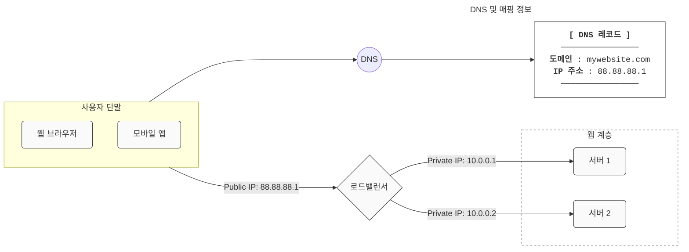

사용자는 로드밸런서의 <b>공개 IP 주소(public IP address)</b>로 접속하고, 로드밸런서는 웹 서버와 통신하기 위해 <b>사설 IP 주소(private IP address)</b>를 이용하게 된다. 이 때 사설 IP 주소는, 보안을 위해 서버 간 통신에서 사용되는데 이는 같은 네트워크에 속한 서버 사이의 통신에서만 쓰일 수 있는 IP 주소이며, 인터넷을 통해서는 접속할 수 없다.

웹 서버의 증설로 <b>장애를 자동복구</b>하지 못하는 문제(no failover)가 해소되며, 웹 계층의 <b>가용성(high availability)</b>이 향상된다.

구체적으로, 서버 1이 다운되면 모든 트래픽은 서버 2로 전송되어 웹 사이트 전체가 다운되는 일을 막을 수 있다. 유입 트래픽이 가파르게 증가하는 경우 두 대의 서버로 트래픽을 감당할 수 없는 시점이 오면, 웹 서버 계층에 더 많은 서버를 추가하기만 하면 로드밸런스가 자동적으로 트래픽을 분산하게 된다.

### 데이터베이스 다중화

웹 계층의 서버를 다중화 했다면, 데이터 계층의 DB 서버 또한 장애의 자동복구를 위해 다중화할 필요가 있다.

DB 다중화는 DB 서버 사이에 주(master)-부(slace) 관계를 설정하고 데이터 원본은 master 서버에, 사본은 slave 서버에 저장하는 방식이다. 쓰기 연산(write operation - insert, update, delete 등)은 matster에만 지원하고, slave는 master로부터 사본을 전달 받아 읽기 연산(read operation)만을 지원하게 된다.

대부분의 어플리케이션은 읽기 연산의 비중이 쓰기 연산보다 훨씬 높기 때문에, slave 서버의 수가 master 수보다 많다.

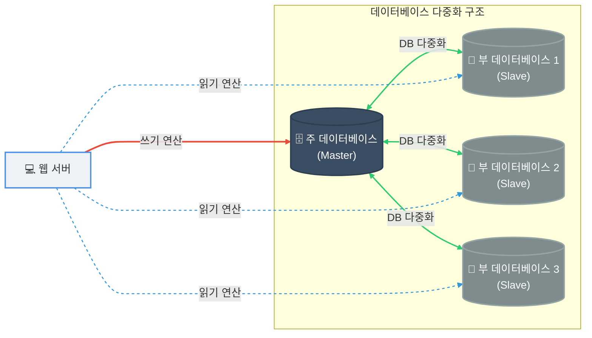

<b>데이터 다중화의 장점</b>

- 더 나은 성능 : 주-부 다중화 모델에서 모든 데이터 변경 연산은 master로 읽고, 읽기 연산은 slave로 분산되어 병렬로 처리할 수 있는 질의(query)의 수가 늘어나 성능이 향상된다.
- 안정성(reliability): 자연 재해 등의 이유로 DB 서버 일부가 파괴되어도, 데이터가 보존된다. 데이터를 지역적, 물리적으로 떨어진 장소에 다중화시켜 놓을 수 있기 때문
- 가용성(availability): 데이터를 여러 곳에 복제해 두어, 하나의 DB 서버에 장애가 발생하더라도 다른 서버의 데이터를 가져와 계속 서비스할 수 있게 된다.

<b>DB 서버 하나가 다운되면 어떤 일이 발생되는가?</b>

- slave 서버가 한 대 뿐인데 다운된 경우 : 해당 slave 서버가 새로운 master 서버 역할을 할 것이며, 모든 db 연산은 일시적으로 새로운 master 서버 상에서 수행될 것이다. 
- slave 서버가 여러 대인 경우 : 읽기 연산은 나머지 slave 서버들로 분산되며, 새로운 slave 서버가 장애 서버를 대체할 것이다.
- 만약, 이전의 slave 서버에 보관된 데이터가 최신 상태가 아닌 경우(서버 다운 전 동기화되지 않은 상태) : 없는 데이터는 복구 스크립트(recovery script)를 돌려 추가해야 한다.

다중 마스터(multi-masters), 원형 다중화(circular replication) 방식을 도입한다면, 위 상황에 대처하는데 도움이 될 수 있다.

로드밸런서, DB 다중화를 고려한 설계안의 동작은 다음과 같다.

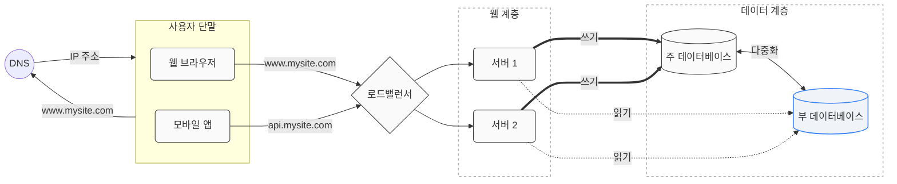

1. 사용자는 DNS로부터 로드밸런서의 공개 IP 주소를 받는다.
2. 사용자는 해당 IP 주소로 로드밸런서에 접속한다.
3. HTTP 요청은 서버1 또는 서버2로 전달된다.
4. 웹 서버는 사용자의 데이터를 slave db 서버(부db)에서 읽는다. 데이터 변경 연산은 master slave(주db)로 전달한다.

## 캐시

<b>캐시 계층(cache tier)</b> 은 데이터가 잠시 보관되는 곳으로, DB에 접근하는 것보다 훨씬 빠르다. 별도의 캐시 계층을 두어 성능을 개선하고, DB의 부하를 줄이며, 캐시 계층의 규모를 독립적으로 확장시키는 것도 가능해진다.

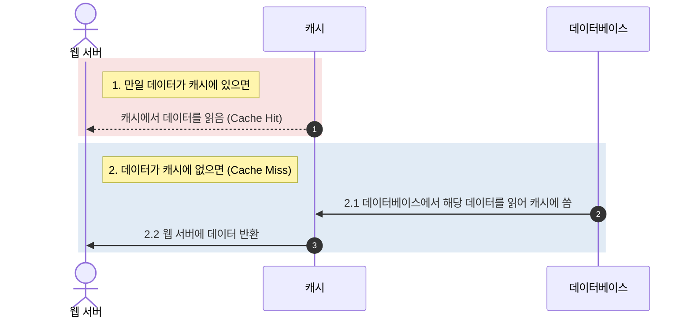

요청을 받은 웹 서버는 먼저 캐시에 찾고자 하는 응답이 저장되어 있는지 확인한 후, 저장되어 있다면 해당 데이터를 반환하고 없는 경우에는 DB 질의를 통해 데이터를 찾아 캐시에 저장한 후 클라이언트에 반환한다. 이를 <b>주도형 캐시 전략(read-through caching strategy)</b>라고 한다. 이 외에도 다양한 캐시 전략이 있는데, 캐시할 데이터의 종류와 크기, 액세스 패턴에 맞는 전략을 선택해야 한다.

캐시 사용 시 고려할 점들은 다음과 같다.

| 고려 요소 | 핵심 검토 기준 | 대응 및 관리 전략 |
| :--- | :--- | :--- |
| **1. 캐시는 언제 필요한가?** | 데이터 갱신이 자주 일어나지 않지만, 참조가 빈번하게 일어나는가? | 데이터 변경 주기가 길고 조회 빈도가 높은 워크로드에 캐시 계층 추가를 적극 고려함. |
| **2. 어떤 데이터를 캐시에 두어야 하는가?** | 영속적으로 보관해야 하는 마스터 데이터인가? | 캐시는 휘발성 메모리에 두므로, 영속성이 필요한 데이터 배치에는 부적절함. 유실되어도 DB에서 복구 가능한 사본만 둠. |
| **3. 데이터의 만료(expire) 기한은?** | 캐시 데이터의 원본 불일치 및 DB 부하 균형이 맞는가? | 적절한 만료 정책이 필수적임.<br>• **너무 짧음**: DB 조회가 잦아져 효율 저하<br>• **너무 긺**: 원본 데이터와의 불일치 가능성 상승 |
| **4. 데이터 저장소 원본과의 일관성** | 원본(DB)과 사본(캐시)의 동기화가 유지되는가? | 두 저장소의 갱신 연산이 단일 트랜잭션으로 처리되지 않으면 일관성이 깨질 수 있음. 여러 지역(멀티 리전) 확장 시 유지 난이도가 더욱 증가함. |
| **5. 장애 대처는 어떻게?** | 캐시 서버 다운 시 시스템 마비를 방지할 수 있는가? | 단일 캐시 서버는 **SPOF(단일 장애 지점)**가 될 위험이 큼. 이를 피하기 위해 여러 지역에 걸쳐 캐시 서버를 분산시켜야 함. |
| **6. 캐시 메모리의 크기는?** | 용량 부족으로 인해 성능 저하가 발생하지 않는가? | 메모리가 너무 작으면 데이터가 자주 밀려나 캐시 미스가 잦아짐. 이를 막기 위해 캐시 메모리를 과할당(overprovision)하는 전략이 필요함. |
| **7. 데이터 방출 정책은?** | 캐시가 가득 찼을 때 어떤 기준으로 데이터를 내보낼 것인가? | 용량 한도 도달 시 새 데이터를 넣기 위한 제거 규칙을 정의함.<br>• **LRU(Least Recently Used)**: 가장 오랫동안 참조되지 않은 것 삭제<br>• **FIFO(First In First Out)**: 가장 먼저 들어온 것 삭제 |

## 콘텐츠 전송 네트워크 (CDN)

<b>CDN</b>은 이미지, 비디오, CSS, JS 파일 등의 정적 콘텐츠를 전송하고 캐싱하는데 쓰이는, 지리적으로 분산된 서버의 네트워크이다. 정적 컨텐츠를 캐싱한다는 것은, 요청 경로(request path), 질의 문자열(query string), 쿠키(cookie), 요청 헤더(request heaer) 등의 정보에 기반하여 HTML 페이지를 캐시하는 것이다.

아래 그림을 통해 CDN의 동작 과정을 볼 수 있다.

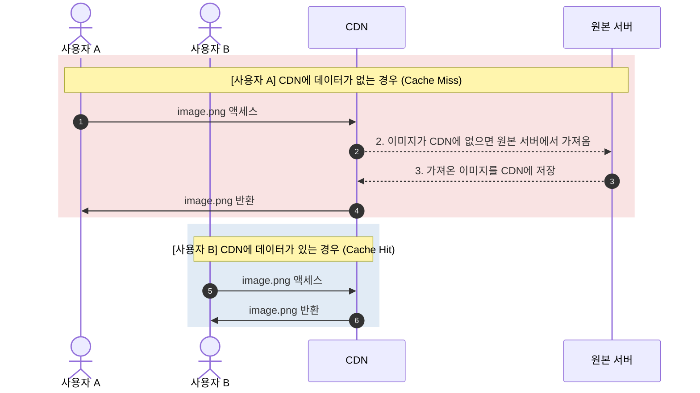

1. 사용자가 이미지 URL을 이용해 image.png에 접근한다. (URL의 도메인은 CDN 서비스 사업자가 제공)
2. CDN 서버의 캐시에 해당 이미지가 없는 경우, 서버는 원본 서버(웹 서버 또는 AWS S3와 같은 클라우드 저장소)에 요청하여 파일을 가져온다.
3. 원본 서버가 파일을 CDN 서버에 반환한다. 응답의 HTTP 헤더에는 해당 파일이 얼마나 오래 캐시될 수 있는지 설명하는 TTL(Time-to-live) 값이 들어있다.
4. CDN 서버는 파일을 캐시하고 사용자 A에게 반환한다. 이미지는 TTL에 명시된 시간이 끝날 때까지 캐시된다.
5. 다른 사용자 B가 같은 이미지에 대한 요청을 CDN 서버에 전송하면
6. 만료되지 않았다면 이미지 요청은 캐시를 통해 처리된다.

사용자가 웹 사이트 방문 시, 그 사용자에게 가장 가까운 CDN 서버가 정적 콘텐츠를 전달하게 된다. 당연히 CDN 서버로부터 사용자가 물리적, 지역적으로 가까울 수록 더 빠르게 로드된다.

### CDN 사용 시 고려해야 할 사항

- 비용: CDN은 보통 제 3 사업자(third-party providers)에 운영되며, CDN으로 들어가고 나가는 데이터 전송 양에 따라 비용이 청구된다. 자주 사용하지 않는 콘텐츠를 캐싱하지 않는 것은 이득이 크지 않으므로, CDN에서 빼는 것을 고려해야 한다.
- 적절한 만료 시한 설정: 시의성이 중요한(time-sensitive) 콘텐츠의 경우 만료 시점을 잘 정해야 한다. 긴 경우 콘텐츠의 신선도는 떨어지고, 짧은 경우 원본 서버에 빈번히 접속하게 되어 비효율적이다.
- CDN 장애에 대한 대처 방안: CDN 자체가 죽었을 경우 웹사이트/애플리케이션이 어떻게 동작해야 하는지 잘 고려해야 한다. 일시적으로 CDN이 응답하지 않는 경우, 해당 문제를 감지하여 원본 서버로부터 직접 콘텐츠를 가져오도록 클라이언트를 구성하는 것이 필요할 수도 있다.
- 콘텐츠 무효화(invalidation) : 아직 만료되지 않은 콘텐츠라 하더라도 아래의 방법으로 CDN에서 제거 할 수 있다.
    - CDN 서비스 사업자가 제공하는 API로 콘텐츠 무효화
    - 콘텐츠의 다른 버전을 서비스하도록 오브젝트 버저닝(object versioning) 이용 (URL의 마지막에 버전 번호를 인자로 주면 된다.)

CDN과 캐시가 추가된 설계는 다음과 같다.

1. 더이상 정적 콘텐츠는 웹 서버가가 아닌, CDN을 통해 제공하여 더 나은 성능을 보장한다.
2. 캐시가 데이터베이스 부하를 줄여준다.

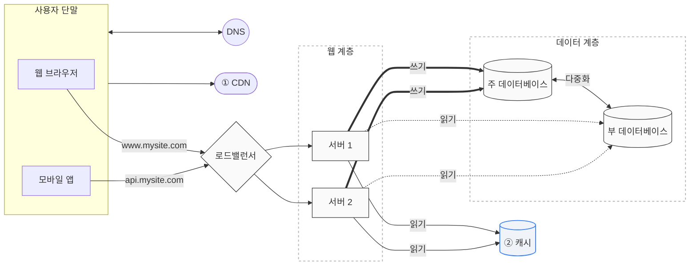

## 웹 계층의 수평적 확장, 무상태(stateless) 웹 계층

웹 계층의 수평적 확장을 위해서 사용자 세션 데이터와 같은 상태 정보를 웹 계층에서 제거해야 한다. 바람직한 전략은 상태 정보를 RDB이나 NoSQL같은 지속성 저장소에 보관하고 필요할 때 가져오도록 하는 것이다. 이렇게 수성된 웹 계층을 <b>무상태 웹 계층</b>이라 부른다.

### 상태 정보 의존적인 아키텍처

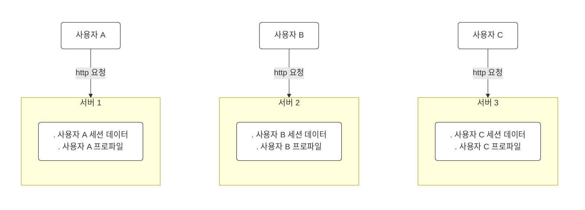

각 서버에서 서로 다른 클라이언트의 상태 정보를 보관하는 경우, 상태 정보 의존적인 아키텍처는 다음과 같이 표현할 수 있다. 사용자 A, B, C는 각각 서버 1, 2, 3에 세션 데이터와 사용자 상태 정보를 갖고 있으므로, HTTP 요청을 각각의 서버에 전송해야 인증 절차를 무사히 거칠 수 있게 된다.

문제는 같은 클라이언트로부터의 요청이 항상 같은 서버로만 전송되어야 한다는 점이다. 대부분의 로드밸런서가 이를 지원하기 위해 <b>고정 세션(sticky session)</b>이라는 기능을 제공하고 있지만, 이는 로드밸런서에 부담을 준다.

### 무상태 아키텍처

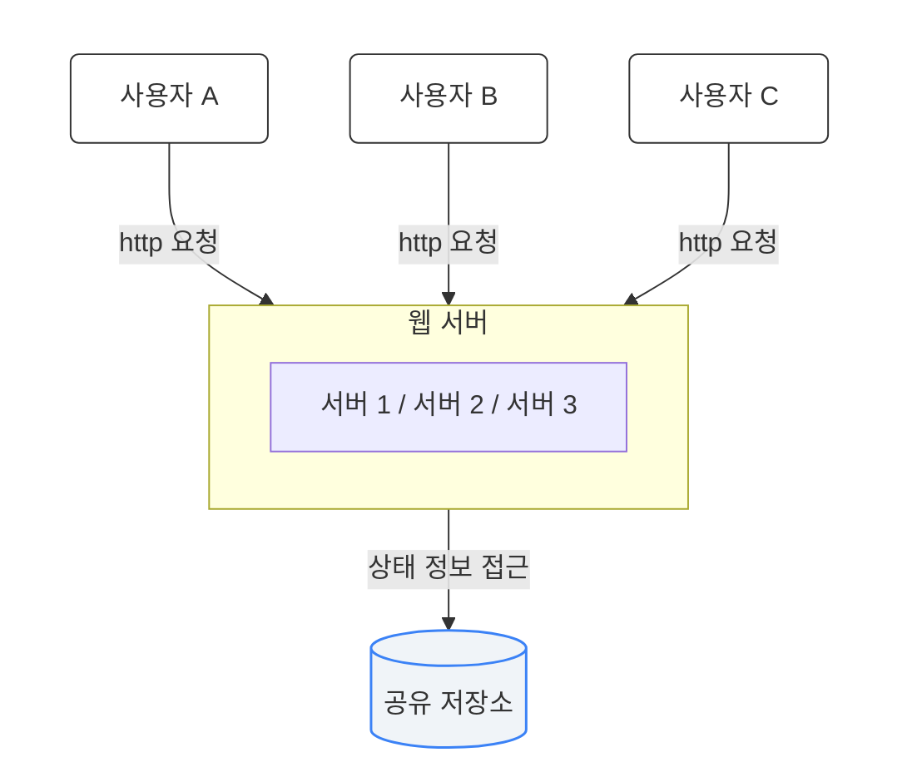
상태 정보에 의존적이지 않은 무상태 아키텍처의 경우 사용자로부터의 HTTP 요청은 어떠한 웹 서버로도 전달 가능하며, 웹 서버는 상태 정보가 필요한 경우 공유 저장소(shared storage)로부터 데이터를 가져온다. 따라서 <b>상태 정보는 웹 서버로부터 물리적으로 분리되어 있는 상태이다.</b>

무상태 웹 계층을 갖도록 기존 설계를 변경하면 다음과 같다.

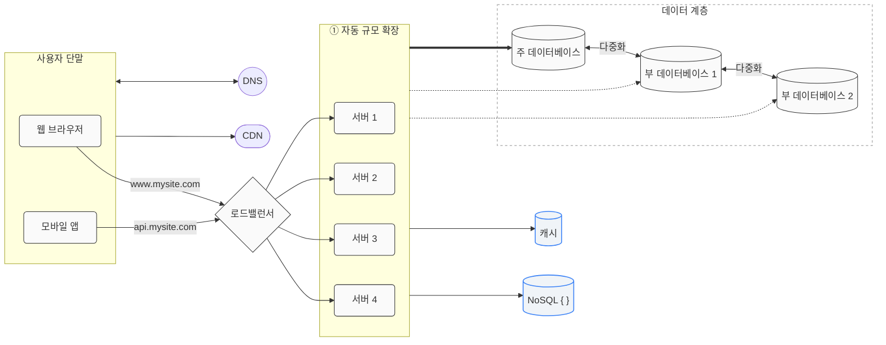

세션 데이터를 웹 계층에서 분리하고, 지속성 데이터 보관소에 저장하도록 하였다. 이 공유 저장소는 위 그림과 같이 NoSQL, 또는 Redis 같은 캐시 시스템이나 RDB일 수도 있다.

<b>자동 규모 확장(autoscaling)</b>은 트래픽 양에 따라 웹 서버를 자동으로 추가하거나 삭제하는 기능을 말한다. 상태 정보가 웹 서버들로부터 제거되었으므로, 트래픽 양에 따라 웹 서버를 넣거나 빼기만 하면 자동으로 규모를 확장할 수 있는 용이한 구조를 띄게 된다.

## 데이터 센터

이제 더 나아가, 전 세계 사용자의 이목을 받는 시스템으로 확장된 경우이다. 가용성을 높이고 어떤 지역에서든 쾌적하게 사용할 수 있도록 설계하기 위해서는 여러 데이터 센터(data center)을 지원하는 것이 필수적이다.

다음은 두 개의 데이터 센터를 이용하는 경우의 구조도이다. 장애가 없는 상황에서 사용자의 요청은 가장 가까운 데이터 센터로 안내되는데, 이 절차는 지리적 라우팅(geoDNS-routing, geo-routing)이라 부른다. geoDNS는 DNS 서비스의 종류 중 하나로, 사용자의 위치에 따라 도메인 이름을 어떠한 IP 주소로 변환할지 결정할 수 있도록 해준다. (예를 들면 x% 사용자는 US-East 센터로, 그리고 (100-x)% 의 사용자는 US-West 센터로 안내된다.)

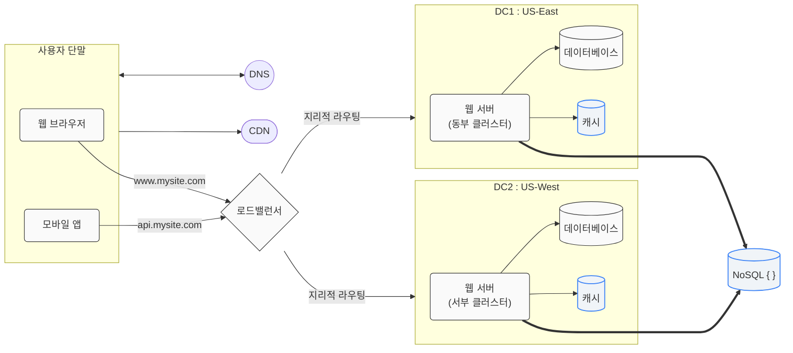

### 데이터 센터에 장애 발생 시

모든 트래픽은 장애가 없는 데이터 센터로 전송된다. 아래는 데이터 센터2에 장애가 발생하여 모든 트래픽이 데이터 센터1로 전송되는 상황이다.

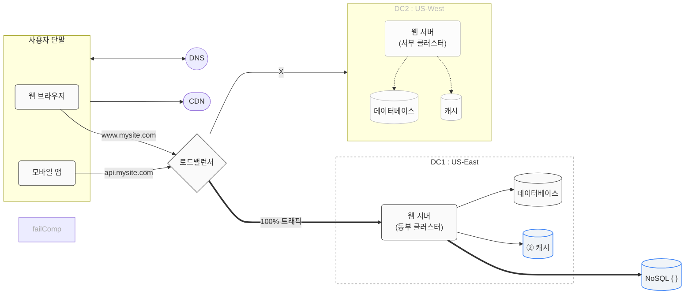

### 다중 데이터 센터 아키텍처 설계 시 해결해야 하는 기술적 난제

- 트래픽 우회: 올바른 데이터 센터로 트래픽을 보내는 효과적인 방법을 찾아야 한다. 예로 GeoDNS는 가장 가까운 데이터센터로 트래픽을 보낸다.
- 데이터 동기화(synchronization): 각 데이터 센터마다 별도의 DB를 사용하는 경우, 장애가 자동으로 복구되어(failover) 트래픽이 다른 DB로 우회된다 하더라도 해당 데이터센터에 찾는 데이터가 없는 경우가 발생한다. 이를 막는 보편적 전략은 데이터를 여러 데이터센터에 걸쳐 다중화하는 것이다.(넷플릭스의 데이터센터 다중화 참고)

## 메시지 큐 

시스템을 더 큰 규모로 확장하기 위해서는 시스템의 컴포넌트를 분리하여, 각기 독립적으로 확장될 수 있도록 해야 하는데 <b>메시지 큐(message queue)</b>는 많은 실제 분산 시스템이 이 문제를 해결하기 위해 채용하고 있는 핵심적 전략 기술이다.

메시지 큐는 메시지의 무손실(durability 즉, 메세지 큐에 일단 보관된 메시지는 소비자가 꺼낼 때까지 안전히 보관되는 특성)을 보장하는, 비동기 통신(asynchronous communication)을 지원하는 컴포넌트다. 메시지의 버퍼 역할을 하며, 비동기적으로 전송한다.

생산자 또는 발행자(producer, publisher)라고 불리는 입력 서비스가 메시지를 만들어 메시지 큐에 발행(publish) 한다. 큐에는 보통 소비자 혹은 구독자(consumer, subscriber)라 불리는 서비스 혹은 서버가 연결되어 있는데, 메시지를 받아 그에 맞는 동작을 수행하는 역할을 한다.

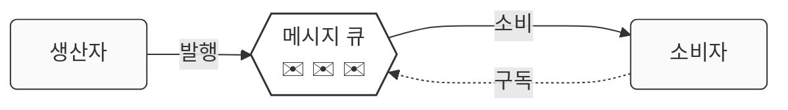

메시지 큐를 이용해 서비스 또는 서버 간 결합이 느슨해져, 규모 확장성이 보장되어야 하는 애플리케이션을 구성하기 좋다. 생산자는 소비자가 프로세스가 다운되어 있어도, 메시지를 발행할 수 있고, 소비자는 생산자 서비스가 가용한 상태가 아니더라도 메시지를 수신할 수 있다.

한 예로, 이미지 크롭, 샤프닝, 블러링 등의 기능을 지원하는 사진 보정 앱의 경우, 보정 작업은 시간이 오래 걸리는 프로세스이므로 비동기적으로 처리하면 편리하다.

아래 그림과 같이, 웹 서버는 사진 작업(job)을 메시지 큐에 넣고, 사진 보정 작업(worker) 프로세스들은 이 작업을 메시지 큐에서 꺼내어 비동기적으로 완료한다. 생산자와 서비스의 규모는 각기 독립적으로 확장될 수 있으며, 크기가 커지면 더 많은 job들을 추가하 처리 시간을 줄일 수 있다.

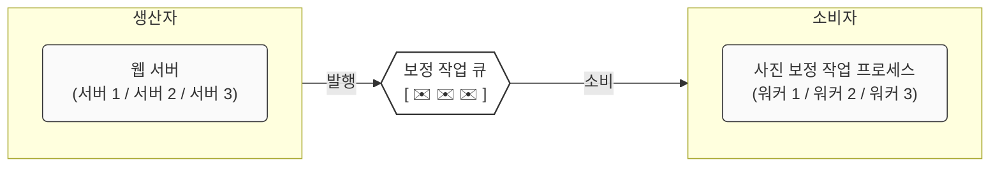

### 메시지 큐의 사용 예

<b>이메일 전송</b>

어떤 웹 사이트에 회원가입을 하기 위해 인증코드를 받는 경우, 우리는 이메일이 즉각적으로 수신되기를 기대하지 않는다.(보통 10분 내로 입력하면 된다고 명시적으로 표기) 어느 정도의 응답 지연이 허용되며 애플리케이션의 핵심 기능이 아닌 경우이므로, 메시지 큐는 이런 기능에 사용될 수 있다.

- 비밀번호 재설정 또는 회원가입을 위해 이메일을 발급하는 서비스를 메시지 큐에 넣을 수 있다.
- 이메일 전송 전용 서비스는 이메일이 어느 서비스로부터 생산되었는지와는 관계없이, 메시지 큐의 메시지를 하나씩 소비하고, 그저 이메일이 전송되어야 할 곳으로 이메일을 전송한다.

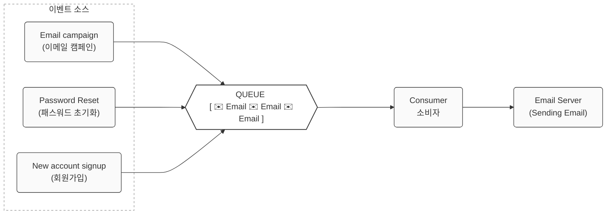

<b>블로그 포스팅</b>

블로그 서비스를 운영하다 보면 사용자가 해상도가 아주 높거나 용량이 큰 이미지를 게시글에 첨부하기도 한다. 이때 고용량 이미지를 게시글 저장과 동시에 즉시 압축하고 리사이징(동기식 처리)하려고 하면, 웹 서버가 무거운 변환 작업을 처리하느라 응답이 한참 동안 지연된다.

메시지 큐(Message Queue)를 활용한 비동기 사후 처리 방식은 이러한 서비스 응답 시간 저하를 해결하는 유연한 방법이다. 이미지 최적화는 포스팅 완료 순간에 실시간으로 끝내야 하는 작업이 아니므로, 사후에 백그라운드에서 처리해도 무방하다. 메시지 큐를 도입하면 웹 서버는 무거운 이미지 변환 부담을 백그라운드로 넘겨버리고, 사용자에게는 포스팅이 완료되었다는 응답을 즉시 돌려줄 수 있게 된다.

```mermaid
flowchart LR
    %% 1. 일관된 스타일 세팅 (디자인 시스템 완벽 유지)
    classDef layer fill:none,stroke:#b5b5b5,stroke-width:1.5px,stroke-dasharray: 4 4;
    classDef component fill:#fafafa,stroke:#333,stroke-width:1px,rx:5,ry:5;
    classDef highlight fill:#f0f4f8,stroke:#3b82f6,stroke-width:1.5px,rx:5,ry:5;
    classDef queueStyle fill:#ffffff,stroke:#333,stroke-width:1.5px;

    %% 2. 사용자 및 웹 서버 계층 (좌측)
    subgraph ClientLayer [사용자 영역]
        User[사용자<br>블로그 포스팅]:::component
    end
    class ClientLayer layer;

    Web["웹 서버<br>(애플리케이션)"]:::component

    %% 3. 중간 메시지 큐 및 저장소 계층 (중앙)
    Storage[("대용량 저장소<br>(Object Storage)")]:::highlight
    MQ{{"① 이미지 최적화 큐 <br> [ ✉️ 메타데이터 ]"}}:::queueStyle

    %% 4. 백그라운드 최적화 서비스 계층 (우측)
    subgraph WorkerLayer [백그라운드 처리]
        Worker["이미지 최적화 서비스<br>(Worker)"]:::component
    end
    class WorkerLayer layer;

    %% --- 데이터 흐름 연결 (시나리오 순서 매핑) ---

    %% 1단계: 사용자가 고용량 이미지가 포함된 포스팅을 요청
    User ==> |"1. 블로그 포스팅 (고용량 이미지)"| Web

    %% 2단계: 이미지는 원본 그대로 저장소에 먼저 전송
    Web ---> |"2. 원본 이미지 업로드"| Storage

    %% 3단계: 업로드된 이미지 정보(경로, ID 등)를 메시지 큐에 발행
    Web ===> |"3. 최적화 요청 메시지 발행"| MQ

    %% 4단계: 최적화 서비스가 큐에서 메시지를 가져옴 (폴링)
    MQ ----> |"메시지 소비"| Worker

    %% 4단계 사후 처리: 저장소에서 이미지를 가져와 최적화 후 대체
    Worker -.-> |"4. 원본 다운로드"| Storage
    Worker ==> |"5. 최적화된 이미지로 대체"| Storage
```

1. 포스팅 및 요청 수신: 사용자가 고용량 이미지가 포함된 블로그 게시글을 작성하여 업로드(포스팅) 요청을 보냅니다.
2. 원본 이미지 스토리지 저장: 웹 서버는 전달받은 고용량 원본 이미지를 애플리케이션 메모리에 오래 들고 있지 않고, 대용량 외부 저장소(Object Storage)로 즉시 전송하여 안전하게 보관합니다.
3. 최적화 큐 메시지 발행: 업로드된 이미지의 저장 경로와 파일 ID 등 최소한의 정보(메타데이터)만 담은 메시지를 생성하여 이미지 최적화 서비스 전용 메시지 큐에 넣습니다. 이 작업이 끝나면 웹 서버는 이미지 처리가 완료될 때까지 기다리지 않고 유저에게 즉시 포스팅 완료 화면을 보여줍니다.
4. 백그라운드 사후 처리 및 대체: 독립적으로 구동되는 이미지 최적화 서비스(Worker)가 메시지 큐에서 대기 중인 메시지를 가져옵니다. 워커는 메시지에 적힌 경로를 찾아 저장소에서 원본 이미지를 다운로드한 뒤 웹에 최적화된 형태로 압축하고, 기존에 저장되어 있던 고용량 원본 이미지를 이 최적화된 이미지로 대체(덮어쓰기)하여 프로세스를 마무리합니다.

## 로그, 메트릭 그리고 자동화

웹 사이트의 규모가 커지고 나면, 로그나 메트릭, 자동화 도구를 필수적으로 포함시켜야 한다.

- <b>로그</b>: 시스템의 오류와 문제들을 쉽게 찾아낼 수 있도록 하는 에러 로그를 서버 단위, 또는 단일 서비스로 모아주는 도구를 활용하여 더 편리하게 검색하고 조회 가능
- <b>메트릭(metric)</b>: 메트릭 수집을 통해 사업 현황에 관햔 유용한 정보를 얻을 수 있고, 시스템의 현재 상테를 손쉽게 파악 가능하다.
    - 호스트 단위 메트릭: CPU, 메모리, 디스크 I/O 관련 메트릭
    - 종합 메트릭: DB 계층의 성능, 캐시 계층의 성능
    - 핵심 비즈니스 메트릭: 일별 능동 사용자(daily active user), 수익(revenue), 재방문(retention) 기록
- <b>자동화(automation)</b> : 지속적 통합, 배포(CI/CD) 도구를 사용하는 경우 개발 생산성을 크게 향산시킬 수 있다.

아래는 각 컴포넌트의 느슨한 결합(loosely coupled)을 가능하게 하는 메시지 큐, 로그와 모니터링, 메트릭, 자동화 지원 장치를 추가하여 수정한 설계안의 구조도이다.

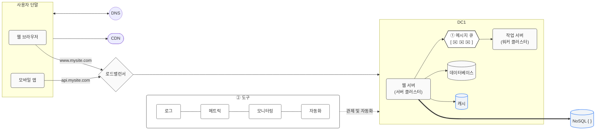

1. 메시지 큐 : 각 컴포넌트가 보다 느슨히 결합될 수 있도록 하고, 결함에 대한 내성을 높인다.
2. 도구 : 로그, 모니터링, 메트릭, 자동화 등을 지원하기 위한 장치를 추가.

## 데이터베이스의 규모 확장

데이터베이스를 증설하는 데는 두 가지 접근법으로 수직적 규모 확장법, 수평적 규모 확장법이 있다.

### 수직적 확장 (scale-up)

기존 DB 서버에서 더 많은, 또는 고성능의 자원(CPU, RAM, 디스크 등)을 증설하는 방법이다.

<b>예시</b>
- AWS RDS : 24TB RAM을 갖춘 고성능 DB 서버를 상품으로 제공
- StackOverflow : 2013년 한 해 동안 방문한 천만 명의 사용자 전부를 단 한 대의 master DB로 처리

<b>수직적 확장의 심각한 약점</b>
- DB 서버 HW에는 한계가 있으므로, CPU, RAM등을 무한 증설할 수 없다.
- SPOF(Single Point Of Failure)로 인한 위험성
- 비용

### 수평적 확장 (scale-out)

데이터베이스의 수평적 확장은 <b>샤딩(sharding)</b> 이라고도 부른다. 수평적 확장이란 더 많은 db 서버를 추가함으로써 성능을 향상시키는 방법이다. 샤딩은 대규모 DB를 샤드(shard)라고 부르는 작은 단위로 분할하는 기술이다. 모든 샤드는 같은 스키마를 쓰지만, 샤드에 보관되는 데이터 사이에는 중복이 없다.

아래의 경우, user_id에 따라 샤드에 데이터를 넣는 기준을 정한다.

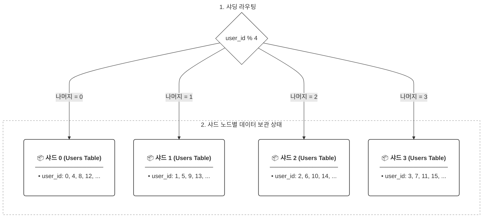

1. 샤딩 라우팅 : 사용자가 요청을 보낼 때 포함된 user_id를 기준으로 user_id % 4 연산을 수행한다. 이 연산 결과(나머지 0, 1, 2, 3)는 데이터를 어느 저장소로 보낼지 결정하는 기준점이 된다.
2. 샤드 노드별 데이터 보관 상태 : 라우터가 계산한 나머지 값에 따라 트래픽과 데이터가 각 샤드 노드로 정확하게 매핑된다. (user_id=4or8인 유저 → 나머지가 0이므로 샤드 0에 저장)

<b>샤딩 전략 구현 시 고려해야 할 점</b>

데이터 분산 기준이 되는 <b>하나 이상의 컬럼, 즉 샤딩 키(sharding key, partition key)</b>를 어떻게 선정하느냐는 샤딩 전략의 핵심이다. 적절한 샤딩 키를 통해 대상 데이터베이스를 정확히 찾아 질의를 보내면, 불필요한 스캔을 줄여 데이터 조회 및 변경 성능을 획기적으로 높일 수 있다. 따라서 샤딩 키를 선정할 때는 특정 노드에 트래픽이 몰리지 않도록 데이터를 모든 샤드 노드에 고르게 분산시키는 것을 최우선으로 고려해야 한다.

<b>샤딩 도입 시 풀어야 할 문제들</b>

- 데이터의 재 샤딩 (resharding) : 데이터가 너무 많아져서 하나의 샤드로는 더이상 감당하기 어려워, 새로운 샤드를 추가해야 하는 경우, 또는 샤드 간 데이터 분포가 균등하지 못하여 샤드 소진(shard exhaustion)이 발생하는 경우 샤드 키를 계산하는 함수를 변경하고 데이터를 재배치해야 한다. (이는 안정 해시 기법을 활용하여 해결할 수 있다.)
- 유명인사(celebrity) 문제 : 핫스팟 키(hotspot key) 문제라고도 불리는데, 특정 샤드에 질의가 집중되어 서버에 과부하가 걸리는 문제이다. 사람들이 구글에 많이 검색하는 단어의 경우(Justin Beiber, Lady Gaga 등) 전부 같은 샤드에 저장하여 SNS 어플리케이션을 구축하는 경우, 해당 샤드는 read 연산의으로 인해 과부하가 걸리게 될 것이다.
- 조인과 비정규화 (join, denormalization) : 하나의 DB를 여러 샤드로 분할한 경우, 여러 샤드에 걸친 데이터를 조인하기 힘들어진다. 이를 위해 DB를 비정규화하여 하나의 테이블에서 질의가 수행될 수 있도록 하는 방법이 있다.

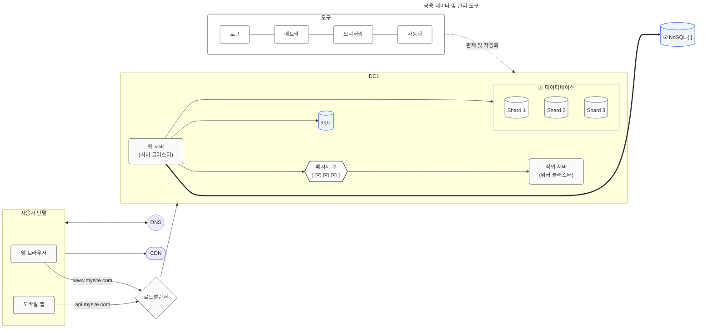